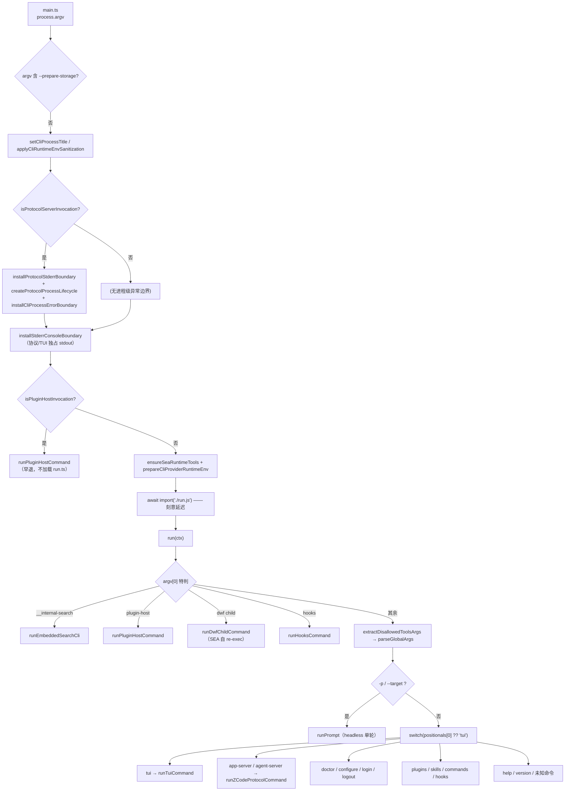
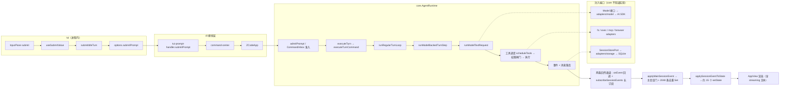
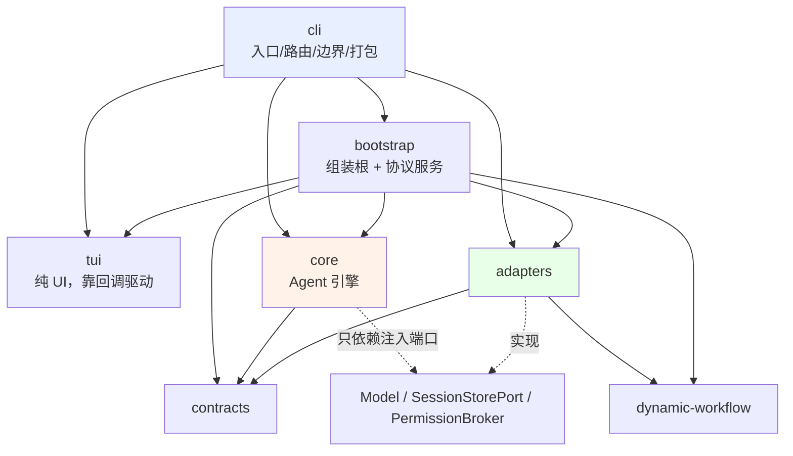

# Know Everything: ZCode CLI (`apps/zcode-cli`)

> 分析时间：2026-09-22 ｜ 项目路径：`/Users/doing/Desktop/zcode-tui/apps/zcode-cli`
> 基线：`feat/offline-vendoring` @ `32b3ee8`（工作区有未提交改动）
> 范围说明：本报告只覆盖 Agent CLI / TUI 子树。整仓（含已移除的桌面/Web/后端）见 `docs/know-everything-zcode.md`。

---

## 1. 项目轮廓

`apps/zcode-cli` 是这个精简仓库的**唯一交付物**，本身是一个嵌套 pnpm workspace（16 个包，约 **28.9 万行** TypeScript），最终产出一个名为 `zcode` 的可执行文件（esbuild 打成 CJS bundle，SEA 单文件打包为可选形态）。它同时提供**四种运行形态**：进程内 React TUI（OpenTUI 渲染器）、headless 单轮执行（`-p/--prompt`、`--target`）、stdout 独占的**协议服务进程**（`app-server` / `agent-server`，NDJSON 帧），以及若干子命令（`doctor`/`configure`/`login`/`plugins`/`skills`/`commands`/`hooks`）。核心是 `packages/core` 里的 `AgentRuntime`——接收提示 → 准入排队 → 组装 provider 请求 → 流式解析模型输出 → 调度并执行工具（带权限闸门）→ 事件持久化到 SQLite；它通过**注入端口**（`Model`、`SessionStorePort`、`PermissionBroker`）与外界解耦，因此 core 里没有一行 AI SDK 或 SQLite 代码。上下游分别是：`adapters`（AI SDK / MCP / 文件 / 执行 / 存储 / 插件 / 配置的**具体实现**）、`bootstrap`（组装根 + 协议服务 + 会话/技能/子代理/插件业务）、`tui`（纯 UI，通过回调被 CLI 反向驱动）、`cli`（进程入口、参数路由、退出/错误边界、SEA 打包）。仓库自带一套**架构治理机制**（`architecture-policy.yaml` + `scripts/architecture/`），但按当前配置它**一个文件都不检查**（见 5.5-A-gov）。

---

## 2. 技术栈

| 层级              | 技术                                                          | 版本/备注                                                                                          |
| ----------------- | ------------------------------------------------------------- | -------------------------------------------------------------------------------------------------- |
| Runtime           | Node.js                                                      | `engines: >=22.13.0`（有意放宽）；`mise.toml` 钉 24.14.0 为**发布工具链**；本机实测 `v22.23.2` 低于两者 |
| 包管理 / 构建编排 | pnpm 10.33.2 + Turborepo 2.4                                 | `node-linker=hoisted`；`turbo run build\|typecheck\|lint`                                           |
| 语言 / 类型       | TypeScript 5.9（子包）/ 6.0.2（根）                          | `strict` + `skipLibCheck`；**无 `noUncheckedIndexedAccess`**                                       |
| UI                | **OpenTUI**（`@mbears/opentui-core|react@0.2.15`）+ React 19.2.5 | 不是 Ink，也不是手写 ANSI；`targetFps: 30` 原生渲染循环                                            |
| 语法高亮          | shiki 4 + web-tree-sitter 0.25.10                            | `app-shiki-diff-view.tsx` 382 行是 TUI 里的重头                                                  |
| Agent / 模型 I/O  | Vercel AI SDK（`@ai-sdk/anthropic`、`@ai-sdk/openai-compatible`） | **已打补丁**：`pnpm.patchedDependencies` 对两个包做 patch（见根 `package.json`）                 |
| 协议              | Zod 4.6.5，**两代并存**：v1（单文件）+ v4（47 文件）           | v1 `ZCODE_PROTOCOL_VERSION=1`；v4 `..._WIRE_VERSION=3`（物理分帧 + 分片重组）                      |
| 传输              | stdio + NDJSON（自研，非 JSON-RPC 2.0）                       | `ZCodeProtocolNdjsonConnection`；stdout 严格独占，三方 SDK 的 `console.*` 被强制改道 stderr         |
| 数据              | SQLite（`node:sqlite` 的 `DatabaseSync`）                     | `~/.zcode/cli/db/db.sqlite`；`migrations/` 仅存 `0020`–`0022`（历史被 squash）                     |
| 凭据              | 自研加密凭据文件（**无 OS keychain**）                        | `~/.zcode/v2/credentials.json`，实测权限 `0600` ✓                                                   |
| 浏览器自动化      | Playwright-core 1.59.1（SEA 下外置）                          | `playwright-core`、`koffi`、`@zcode/tui` 是 bundle 的 externals                                    |
| Lint / 格式       | oxlint + oxfmt（Rust）                                        | 唯一 error 级规则 `max-lines: 400`；**但对 `apps/zcode-cli` 整体失效**（见 5.1-A-lint）                 |
| 测试              | **无**                                                        | 全仓 **0 个测试文件**、无 vitest/jest/playwright 配置、无 `test` script，但 `c8` 与 `ZCODE_E2E_COVERAGE` 钩子仍在 |
| 架构治理          | 自研 `scripts/architecture/`                                  | `forbidCycles: true` + `managedOnly: true`，但 4 个模块**全部** `managed: false` → 空转（见 5.5-A-gov） |
| 发布 / 打包       | esbuild CJS bundle + 可选 SEA（`postject`）                   | SEA 下载 Node 基座；`third-party/vendored/` 是进行中的离线化落点                                    |
| 离线化（进行中）  | `third-party/resources.json` 台账 + `scripts/vendor-resources.mjs` | 15 条资源，当前 **9 就绪 / 6 缺失**；已落盘 344 MiB，**尚未 git 跟踪**                             |

---

## 3. 项目结构

```
apps/zcode-cli/                      # 嵌套 workspace（~28.9 万行 TS）
├── packages/
│   ├── cli/         11.8k 行  进程入口、参数路由、退出/错误边界、TUI 接线、SEA 打包
│   ├── core/        95.6k 行  Agent 引擎：runtime/ tool/ permission/ agent/ subagent/ mcp/ compact/
│   ├── bootstrap/   63.5k 行  组装根 create-app + 协议服务 + 会话/技能/插件/子代理业务
│   ├── adapters/    51.6k 行  AI SDK、MCP、fs、exec、storage(SQLite)、plugins、auth、config
│   ├── contracts/   21.4k 行  端口接口与事件契约（session-store.port 1261 行、session.events 1234 行）
│   ├── dynamic-workflow/ 19.9k 行  DWF 引擎（analysis/ engine/ …）
│   ├── tui/         13.7k 行  OpenTUI + React 界面（91 个 app-* 文件平铺，无子目录）
│   ├── telemetry/    3.9k 行  agent-trace-runtime
│   ├── debug/        4.8k 行  本地调试服务器 + React 面板
│   ├── i18n/ node-repl-host/ dynamic-workflow-runtime/ shared-types/ swift-bridge/ *
├── tools/prompt-trajectory/
├── dependencies/native-search/      # 19 个预编译包入库 + SHA256SUMS（已离线化的正确先例）
└── scripts/                         # build / build-sea / generate-bash-command-registry
```

嵌套关系：`apps/zcode-cli/packages/*` 通过 `workspace:*` 依赖**外层**仓库的 `packages/shared`、`packages/provider`、`packages/provider-node`、`packages/model-option-map`。

---

## 4. 主干逻辑

### 4.1 调用路径（入口 → 路由 → 四个形态）



**四个形态的差异只有一个开关**：`tui` 走进程内回调，`app-server`/`agent-server` 走 stdio 协议，`-p` 走 headless。三者最终都组装同一个 `createZCodeApp`。

### 4.2 数据流（一次提示的完整往返）



**值得单独指出的数据流事实**：回传是**两条并行通道**，同一条事件会被投递两次，靠 TUI 侧一个 2048 容量的 `Set` 去重。这是"双写"而非"单一事件源"。

### 4.3 核心模块关系与词汇表



| 模块             | 职责                                                  | 依赖谁                   | 谁依赖它               |
| ---------------- | ----------------------------------------------------- | ------------------------ | ---------------------- |
| `cli`            | 进程入口、参数解析、退出/错误/日志边界、TUI 接线、SEA  | 其余全部                 | 无（顶层）             |
| `core`           | Agent 循环、工具、权限、子代理、压缩、记忆            | `contracts`              | `bootstrap`            |
| `adapters`       | AI SDK、MCP、fs、exec、SQLite、插件市场、凭据、配置   | `contracts`、`dynamic-workflow` | `cli`、`bootstrap`     |
| `bootstrap`      | 组装根、协议服务（v1/v4）、会话/技能/插件业务         | `core`、`adapters`、`tui` | `cli`                  |
| `tui`            | React 界面；**不知道协议存在**（除 DWF 部分，见 5.5-M2） | `contracts`              | `cli`、`bootstrap`     |
| `contracts`      | 端口接口 + 事件契约（事件溯源的事实来源）             | 无                       | 全部                   |

**领域词汇表**（出现 ≥3 次、构成共享语言的词）：

| 词                         | 含义                                                                 |
| -------------------------- | -------------------------------------------------------------------- |
| **Workspace Identity / Path** | 身份隔离用 `workspaceIdentity`，文件/cwd/git/展示用 `workspacePath`（`AGENTS.md` 明确区分） |
| **Surface**                | 呈现面：`terminal` / `zcode_desktop`；由 `--surface` 指定            |
| **CommandInbox**           | busy/running 期间输入的串行准入队列                                  |
| **Vendor**                 | `.env` 四字段（VENDOR/BASE_URL/API_KEY/MODEL）解析出的厂商事实       |
| **Coding Plan vs Api Key** | 两类厂商；前者走加密凭据库，后者内联在个人 Provider 配置             |
| **Broker（Permission）**   | 权限询问的应答方：`ManualPermissionBroker` / `DenyPermissionBroker`   |
| **Runtime Task**           | 后台任务注册表 + 通知策略                                            |
| **DWF**                    | Dynamic Workflow（动态工作流）                                       |

---

## 5. 隐藏短板

> 每条均为本次实测，命令与输出见括注。**严重度**按 skill 定义：Critical=数据丢失/安全突破/功能完全失效；High=部分失效/重大回归/架构僵局；Medium=可重构修正；Low=外观/约定。

### 5.1 逻辑混乱

| 位置                                                      | 问题                                                                                                                                                                                                 | 严重度 | 发现路径           | Next Skill             |
| --------------------------------------------------------- | ---------------------------------------------------------------------------------------------------------------------------------------------------------------------------------------------------- | ------ | ------------------ | ---------------------- |
| `.oxlintrc.json:47` ←→ `apps/zcode-cli/**`                 | **A-lint｜Lint 对主要代码库整体失明。** 根配置 `ignorePatterns` 含 `"apps/zcode-cli"`，`pnpm lint` 只扫 **425 个文件**、报 **0 errors、exit 0**；而在各子包内跑 `oxlint src` 会报 **84 个 error**（core 29 / adapters 25 / bootstrap 20 / contracts 6 / cli 2 / telemetry 2，全部是 `max-lines`）。`AGENTS.md` 指定的 `pnpm lint` 与 `pnpm verify:pre-push` 因此**永远是绿的**。 | High   | 约定漂移 / 无测试表面 | `/planning`            |
| `packages/adapters/src/plugins/marketplace.ts:1` (2724 行) | **M1｜插件市场逻辑三份。** `marketplace.ts`（source 解析 + 版本解析 + 安装 + listing 解析）、`adapters/src/plugins/index.ts`（991 行，重叠的 manifest/root 解析）、`bootstrap/src/plugins.ts`（1457 行，第三份 selector/诊断翻译 `toPluginDiagnostic:1359`）。同一子系统的三套选择器与三套诊断。                                               | Medium | 浅模块 / 双份维护     | `/improve-architecture` |
| `adapters/src/plugins/index.ts` ←→ `marketplace.ts`        | **M2｜同一子系统两套错误模型。** `index.ts` 用 diagnostics 数组旁路 + 返回值；`marketplace.ts` 抛类型化错误（`MarketplaceSourceRepointError:1357`、`source-errors.ts`）。                                                                                                       | Medium | 错误处理不一致        | `/improve-architecture` |
| `packages/bootstrap/src/mcp-config.ts:28`                  | **L1｜CUA broker token 恒为 `undefined`。** `resolveZCodeCuaBrokerToken()` 无条件 `return undefined`，但仍作为参数传入 `injectZCodeCuaBrokerMcpServers`；下游 `injectCuaCredentialsIntoNodeRepl` **声明了 `token` 参数却从未使用**。属存量脚手架：读起来像"broker 鉴权已生效"，实际该路径既无 token 也不消费 token。`AGENTS.md` 说明本构建不提供 CUA，所以不是安全漏洞，但是**误导性死代码**。                    | Low    | 死代码 / 隐性依赖     | `/improve-architecture` |
| `packages/shared/src/zcode-protocol/index.ts:75` vs `zcode-protocol-v4/core.ts:7` | **L2｜同一个 wire version 两个常量。** `ZCODE_PROTOCOL_V4_WIRE_VERSION = 3` 与 `V4_WIRE_PROTOCOL_VERSION = 3`，分叉时静默。                                                                    | Low    | 双份维护              | `/improve-architecture` |

### 5.2 数据流缺陷

| 位置                                                                                                            | 问题                                                                                                                                                                                                                                       | 严重度 | 发现路径       | Next Skill |
| --------------------------------------------------------------------------------------------------------------- | ---------------------------------------------------------------------------------------------------------------------------------------------------------------------------------------------------------------------------------------- | ------ | -------------- | ---------- |
| `third-party/resources.json:4` ←→ `scripts/native-search-tools-config.mjs:47-89`、`apps/zcode-cli/packages/cli/scripts/sea-node-download.mjs:90,121`、`scripts/.../sea-targets.mjs:67` | **A-ledger｜台账自称"唯一真源"，但没有一个消费方读它。** 台账原文写着"这是唯一真源——消费方脚本不得再内联 URL 与 sha256"；实测 `resources.json` 的消费者只有 `scripts/clean.mjs`（只读 `protectedRoot`）与 `scripts/remote-resources.mjs`（扫描器自身）。8 个上游源码 URL 仍内联在 `native-search-tools-config.mjs`，`nodejs.org` 仍硬编码在两处 SEA 脚本里。**F-001 的"对账通过"只证明台账与源码一致，不证明链路已改读台账**；Step 3（本地优先解析）尚未落地。                                                                 | High   | 未验证假设 / 双份维护 | `/planning` |
| `packages/cli/src/run.ts:686` vs `:703`                                                                          | **M3｜两个 headless 入口默认权限姿态相反。** `-p/--prompt` 传 `mode ?? DEFAULT_HEADLESS_PROMPT_MODE`（`"yolo"`，绕过全部权限询问，`run.ts:60`）；`--target` 传**裸 `mode`**（可能 `undefined` → 下游回退 `"build"`），而 headless 只有 `createHeadlessPermissionBroker()`（deny broker，`prompt-command.ts:215-219`）。同一 `runPrompt` 函数、同一用户意图，两条路径的默认安全姿态不一致，且**没有任何文档说明**。 | Medium | 双份维护 / 隐式输入 | `/post-mortem` |
| `packages/tui/src/app.tsx:91`、`app-model-streaming.ts:55-64`、`app-view.tsx:113-121`、`app-subagent-transcript.ts:75-112` | **M4｜流式文本三份并行状态。** assistant 作用域内的 `parts`、全局 `liveModelText`、子代理私有一份；渲染层再从 `liveModelText` **合成第二条** streaming 消息，于是同一像素有两个竞争来源，靠"有没有 `assistantMessageId`"决定谁赢。                                                                 | Medium | 隐藏状态       | `/improve-architecture` |
| `scripts/vendor-resources.mjs:97`                                                                                | **M5｜校验工具的判定文案会误导。** `status` 硬编码 `withHash: true`，只要 `s.actual` 存在就无条件打印 `(本地 xxx… != 台账)` —— **在 `state === "ok"`（哈希确实匹配）的行上同样打印**。实测输出 9 行"已就绪"全部带 `!= 台账` 后缀，摘要却是"校验不过 0"。这正是为防"静默假通过"而建的工具，却制造了反向误判。                                                       | Medium | 输出误导       | `/diagnose` |
| `packages/tui/src/app.tsx:170-222`                                                                              | **M6｜两个 applier 写同一份 state。** `useSessionEventApplier` 与 `useTuiApplyResult` 被传入**重叠**的 ~25 个 setter（`setMessages`/`setModel`/`setTodos`/…），二者可对同一 `useState` 竞态；`app.tsx:60-64` 又用 `initialResult` 初始化 `messages`。                                      | Medium | 重复状态       | `/improve-architecture` |

### 5.3 控制流缺陷

| 位置                                       | 问题                                                                                                                                                                                                                     | 严重度 | 发现路径  | Next Skill       |
| ------------------------------------------ | ------------------------------------------------------------------------------------------------------------------------------------------------------------------------------------------------------------------------ | ------ | --------- | ---------------- |
| `packages/cli/src/main.ts:39-48`            | **M7｜进程级异常边界只给协议形态装。** `installCliProcessErrorBoundary`（`uncaughtException` + `unhandledRejection`）在 `isProtocol ? … : undefined` 下**仅协议路径安装**；TUI 与 headless 路径没有任何兜底，一次未捕获的 rejection 会绕过 `process-errors.ts` 的诊断采集直接终止。全仓 grep 确认无第二处安装点。 | Medium | 异步失控  | `/diagnose`      |
| `bootstrap`/`adapters`/`core`/`tui`/`cli`   | **M8｜298 处静默 `catch {`。** 实测：adapters 127、core 72、bootstrap 63、cli 26、tui 10。最典型的是 `adapters/src/plugins/official-marketplace.ts` 的 `readJsonRecord`——**JSON 损坏与文件不存在返回同一个 `undefined`**，官方清单损坏会静默降级成"没有插件"。                                                       | Medium | 异常吞噬  | `/diagnose`      |
| `packages/tui/src/app-submit.ts:181-188` vs `:265-269` | **L3｜取消语义不一致。** `submitIdleTurn` 显式处理 `signal.aborted`；`submitDuringActiveTurn` 没有该分支，被取消的排队输入落进通用 `catch` 并追加一条系统错误行。                                              | Low    | 异常吞噬  | `/diagnose`      |
| `third-party/vendored/native-search-src/oniguruma-6.9.10.tar.gz.download` | **L4｜原子落盘留下残骸。** 下载器的"临时文件 → 校验 → rename"设计正确，但中断后 `.download` 残片无人清理，且 `status`/`verify` 也不报告它。属清理边界漏洞。                                                                        | Low    | 埋藏副作用 | `/planning`      |

### 5.4 安全弱点

| 位置                                 | 问题                                                                                                                                                                                                       | 严重度 | 发现路径      | Next Skill  |
| ------------------------------------ | ---------------------------------------------------------------------------------------------------------------------------------------------------------------------------------------------------------- | ------ | ------------- | ----------- |
| `packages/cli/src/run.ts:60,236,686`  | **M9｜默认 `yolo` 是显式设计但未在用户可见面声明。** `DEFAULT_HEADLESS_PROMPT_MODE = "yolo"`，`permission/service.ts:136-137` 在 `mode === "yolo"` 时直接 `allow(... "Yolo mode bypasses permission prompts")`。`zcode -p "<任意文本>"` 的开箱行为是**不询问即执行工具**；`--help` 文案未见提示（`help.ts` 仅 268 字节转发）。与 5.2-M3 叠加后，"哪个入口会问我"对用户不可预测。 | Medium | 缺授权边界    | `/planning`  |
| `packages/cli/src/env.ts`（`applyCliRuntimeEnvSanitization`） | **L5｜进程 env 清洗是全局改写 `process.env`。** 入口对 `NODE_ENV`/代理/证书变量做原地删除并"封存"给子进程恢复。若将来出现第二条读取路径，会被静默影响；该函数在 `main.ts`、`run.ts:432,673` 共 3 处调用，缺少幂等性断言。                            | Low    | 隐式输入      | `/diagnose`  |
| `~/.zcode/v2/credentials.json`        | **✓ 已确认良好**：实测权限 `-rw-------`（0600），`provider_config.json` 同为 0600；`personal-vendor.ts:156` 走 `atomicWritePrivateTextFile`。无 OS keychain 是**有意的**实现选择，非缺陷。                    | —      | —             | —           |

### 5.5 架构弱点

| 位置                                                        | 问题                                                                                                                                                                                                                                                                                                                   | 严重度 | 发现路径           | Next Skill             |
| ----------------------------------------------------------- | ---------------------------------------------------------------------------------------------------------------------------------------------------------------------------------------------------------------------------------------------------------------------------------------------------------------------- | ------ | ------------------ | ---------------------- |
| `architecture-policy.yaml:8-19` ←→ `scripts/architecture/index.mjs:44` | **A-gov｜架构治理机制空转。** 4 个模块（shared / provider / provider-node / zcode-cli）**全部** `managed: false`，而 `global.managedOnly: true`；`index.mjs:44` 对非 managed 模块直接 `continue`。实测 `pnpm architecture:check` → **violations: 0 / baseline: 0 / new: 0**，且 `pnpm verify:pre-push` 因此恒过。**`forbidCycles: true`、`maxFileLines: 400`、`forbidDeepImports: true` 全部无人执行。** | High   | 无测试表面 / 架构僵局 | `/improve-architecture` |
| `apps/zcode-cli/packages/core/src/runtime/{methods,runtime-task}`、`bootstrap/src/zcode-protocol-v4/commands/handlers`、`dynamic-workflow/src/analysis` | **A-cycles｜5 个真实（值级）循环依赖。** 用 Tarjan 对**非 type-only import** 建图实测：core 2 个（`methods/subagent.ts ↔ methods/index.ts ↔ agent-runtime.ts` 3 环；`runtime-task/notification.ts ↔ workflow-notification-copy.ts`）、bootstrap 1 个（**11 文件 SCC**）、dynamic-workflow 2 个（8 文件 + 2 文件）。adapters / tui / cli / contracts 为 0。注意：另有若干**仅类型**的 SCC（如 `tool/types.ts ↔ read-file-state.ts` 链、35 文件运行时 barrel 环），因 `import type` 被擦除，不构成运行时环。 | High   | 循环依赖           | `/improve-architecture` |
| 全仓（`find` 实测）                                          | **A-tests｜零测试。** 全仓 **0 个** `*.test.ts`/`*.spec.ts`、无 `test/`、无 vitest/jest 配置、无 `test` script；`AGENTS.md` 自认"不假定存在统一的单测或 E2E 命令"。与此同时 `c8` 仍是 devDep、`shutdown.ts:77-91` 的 `flushE2ECoverage()` 与 `ZCODE_E2E_COVERAGE`/`NODE_V8_COVERAGE` 钩子仍在生产代码里。**没有任何改动能在提交前被自动证伪。** | High   | 无测试表面         | `/planning`             |
| 157 个文件 > 400 行（最大 `bootstrap/src/zcode-protocol-v4/product-projection.ts` **5459 行**） | **A-files｜行数策略在最大的代码库里失效。** 实测超出 400 行的文件：bootstrap/product-projection 5459、protocol/server-operations 4049、protocol-v4/v4-gateway 3436、adapters/plugins/marketplace 2724、core/subagent/runner 2142、bootstrap/protocol-v4/transcript-hydration 1953、adapters/mcp/index 1950…… 另有 **14 处** in-file `eslint-disable max-lines` 豁免，其中 `core/src/tool/handlers/generated/bash-command-registry.ts:1` 是**无理由的 `/* eslint-disable */` 全文件豁免**。         | Medium | 神文件             | `/improve-architecture` |
| `.git/objects`                                              | **M10｜仓库被 347 MiB 松散对象撑大，其中大头已不可达。** 实测 `git count-objects -vH` → 2704 个松散对象 / **347.24 MiB** / **0 个 pack**；最大的三个 blob（49/48/32 MiB）与 `third-party/vendored/` 的 Node 归档体积吻合，且 `git rev-list --objects --all` 判定为 **unreachable**（当前 `third-party/vendored/` 整体 `??` 未跟踪）。来源是先 `git add` 又撤销的那次本地化尝试。`git gc --prune=now` 可回收绝大部分。注意：**这不是删代码就能解决的**，且大文件一旦真正入库将长期驻留历史。 | Medium | 数据流缺陷         | `/planning`             |
| `packages/cli/src/run.ts:717-725`                            | **M11｜`app-server` 与 `agent-server` 是一个东西两个名字。** `case "agent-server": case "app-server":` 直接 fall-through 到同一个 `runZCodeProtocolCommand`，下游无任何一处据此分支；但两个名字同时出现在 `arguments.ts:129,133`、`provider-runtime-env.ts:126`、`model-config.ts:76`。是 CLI 表面上未收敛的分叉。 | Medium | 通过式模块         | `/improve-architecture` |
| `packages/core/src/runtime/agent-runtime.ts:337`             | **M12｜原型猴补丁 + 声明合并隐藏运行时 API。** 类体只放字段，390 行 `interface AgentRuntime` 合并进去，再由 `methods/index.ts:199-390` 手工 `proto.x = y` 挂约 200 个方法。**没有任何编译期检查**把挂载列表与接口绑定；"方法 X 定义在哪"无法靠搜类体回答。 | Medium | 隐藏状态           | `/improve-architecture` |
| `core/src/permission/*` + `tool/executor/permission-*` + `runtime/helpers/permission-*` | **M13｜权限没有单一所有者。** 约 2000 行散在 5 处：`permission/`（1017 行）、`tool/executor/permission-*.ts` + `approval-gate.ts`（约 920 行）、`runtime/helpers/permission-*`、`runtime/permission-full-access.ts`、`runtime/methods/permission-grant-recovery.ts`，另有 `bash-command-permission-policy.ts`。ask/allow 判定在多层被重新推导（`service.ts:203` 的 `isPreapprovedWorkflowDraftWrite` 只在 `executor/permission-flow.ts:59` 被**注释**引用）。 | Medium | 隐式耦合           | `/improve-architecture` |
| `packages/core/src/runtime/deps.ts`（322 行纯 re-export）    | **L6｜Barrel 成了事实上的耦合中枢。** 实测被 **132** 个文件导入（`runtime/internal.ts` 92、`tool/types.ts` 91）。因为它跨 `tool/`、`permission/`、`hooks/`、`compact/`、`subagent/` 转发，任意两文件都可能"看起来耦合"，也是 5.5-A-cycles 里类型级 SCC 的直接成因。 | Low    | 浅模块             | `/improve-architecture` |
| `core/src/model/`（1 个 14 行文件）、`core/src/embedded-search/`（69 行）、`adapters/src/provider/index.ts`（`export {};` 但被 `package.json` 的 `exports` 广告为 `./provider`） | **L7｜空壳目录/包。** `adapters/src/index.ts` 的 `export *` 列表又漏掉 `mailbox`/`tools`/`device`/`network`（`package.json` 却暴露它们），公共面自相矛盾。 | Low    | 通过式模块         | `/improve-architecture` |

**另有两条非缺陷但必须记录的现状**（影响后续判断）：

- **错误处理双轨制（Medium，暂计为约定而非缺陷）**：`core` 里 `createCoreError` 用了 **209** 次，但裸 `throw new Error` 仍有 **140** 次（集中在 `browser-client/playwright.ts` 33 处、`workflow/lifecycle.ts` 14 处）。core 内只有 2 个本地错误类，错误身份实际靠字符串匹配。
- **本机 Node 版本低于工具链**：`.nvmrc`=24、`mise.toml`=24.14.0，实测 `node -v` = **v22.23.2**。这与 `docs/plan-offline-vendoring.md` Step 1.5 直接相关——`build-sea.mjs:301` 按 `process.versions.node` 选归档，用非 24.14.0 构建 SEA 找不到本地副本。

---

## 6. 总结

**项目健康度判断**（按 skill 判定标准）：

- 无 Critical 问题 ✓
- High 问题 **5 个**（5.5-A-gov 治理空转、5.5-A-cycles 值级循环、5.5-A-tests 零测试、5.2-A-ledger 台账未接线、5.1-A-lint lint 失明）—— 落在"High 3–5"区间
- 核心模块关系图可绘制 ✓

**项目健康度：Moderate**

代码本身的分层是**真实且被遵守的**——`adapters` 不 import `bootstrap`/`core`（grep 零命中），`core` 只依赖注入端口而不碰 AI SDK 与 SQLite，`process-provider-registry-runtime.ts` 是教科书级的显式所有者也。问题不在"设计错了"，而在**约束没有被执行**：策略文件写了 `forbidCycles`，模块却全标 `managed: false`；lint 配了 `max-lines: 400`，主要代码库却被 `ignorePatterns` 排除；`AGENTS.md` 要求"改动必须有测试"，全仓却一个测试文件都没有。三条防线同时是纸糊的，这才是最值得处理的事。

**三个最关键的发现**：

1. **5.5-A-gov｜架构治理机制完全空转**（`architecture-policy.yaml` + `scripts/architecture/index.mjs:44`）。`managedOnly: true` × 4 个模块全部 `managed: false` = 检查器一个文件都不看，输出恒为 `violations: 0`，`pnpm verify:pre-push` 恒过。**这是所有其他架构问题的放大器**——5 个值级循环依赖、157 个超限文件之所以能存在，正是因为守门人是空的。

2. **5.5-A-tests + 5.1-A-lint｜零测试 + lint 失明 = 没有任何自动证伪手段**。全仓 0 个测试文件；`pnpm lint` 因 `ignorePatterns` 排除 `apps/zcode-cli` 而只扫 425 个文件、报 0 error；`pnpm typecheck` 只覆盖外层 3 个包（实测 `tsc -b packages/provider packages/provider-node packages/shared`），**CLI 子树不在其中**（我逐包实测 10 个包 `tsc --noEmit` 均 0 error，但那是手工跑的，不是 `AGENTS.md` 指定的命令）。当前"验证通过"的真实含义比字面小得多。

3. **5.2-A-ledger｜`third-party/resources.json` 自称唯一真源，但零消费方**。台账原文禁止"消费方脚本内联 URL 与 sha256"，实测 8 个上游 URL 仍内联在 `native-search-tools-config.mjs:47-89`、`nodejs.org` 仍硬编码在 `sea-node-download.mjs:90,121` 与 `sea-targets.mjs:67`；`resources.json` 的消费者只有 `clean.mjs`（只读 `protectedRoot`）与扫描器自身。`remote-resources.mjs check` 报"✓ 对账通过"是**真的**（台账与源码确实一致，self-test 也有牙齿，能对未登记获取点失败），但它证明的是"描述一致"，**不是"链路已改读台账"**——Step 3 尚未落地。叠加 5.2-M5 的误导文案与 5.5-M10 的 347 MiB 无主对象，这条离线化链路当前离"可交付"还有距离。

**Next step**：

- 用 `/planning` 制定**治理机制启用计划**（把 `zcode-cli` 标 `managed: true` + 建 baseline + 接进 `verify:pre-push`），这是解锁其余一切的前置动作
- 用 `/improve-architecture` 逐个处理架构弱点，优先级：值级循环依赖（5.5-A-cycles）→ 权限单一所有者（M13）→ 插件市场三份合一（5.1-M1）
- 用 `/post-mortem` 深度审计当前分支正在做的离线化链路（`scripts/vendor-resources.mjs` + `docs/plan-offline-vendoring.md` Step 3），重点验证"断网真的构建得起来吗"
