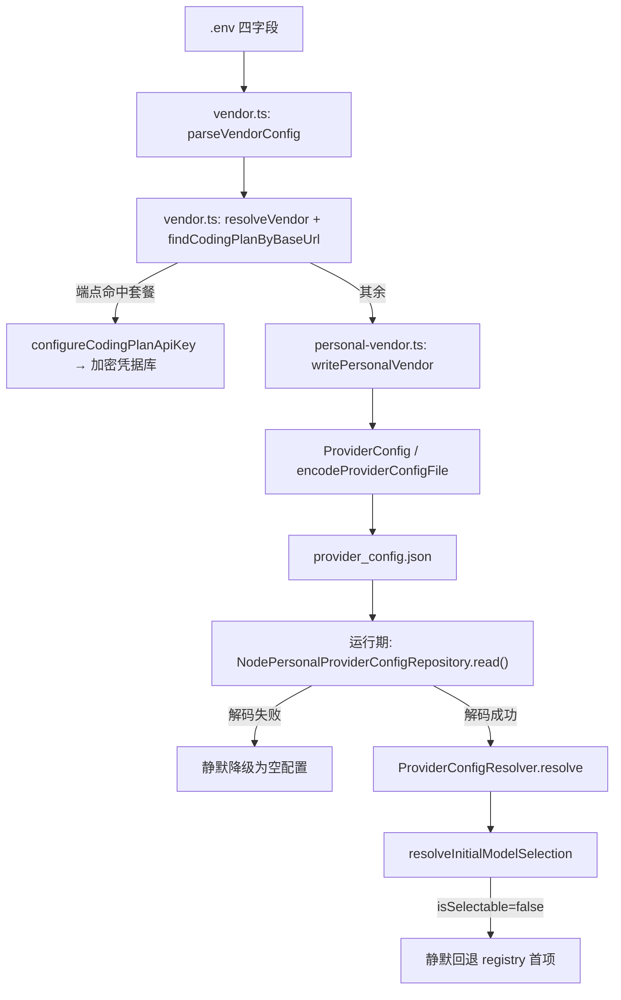

# Know Everything: .env 与 Provider 改造

> 分析时间：2026-09-22 ｜ 项目路径：`/Users/doing/Desktop/zcode-tui`

## 1. 项目轮廓

本次分析范围是「把厂商配置从散落的内部结构收敛到 `.env` 四字段」这一改造。改造横跨三层：**CLI 层**（`apps/zcode-cli/packages/cli/src/`：`vendor.ts` 解析与校验、`personal-vendor.ts` 个人厂商写入、`doctor.ts` 自检、`run.ts` 的 `configure` 子命令）、**领域层**（`packages/provider`：`ProviderConfigResolver`、`resolveInitialModelSelection`、`ConfigService`）、**持久化层**（`packages/provider-node`：`NodePersonalProviderConfigRepository` + 文件 codec）。

数据从 `.env` 进入，经解析 → 厂商解析 → 按链路分流（套餐走加密凭据库 / 其余写个人 Provider 配置）→ 落盘 → 由运行期 registry 加载并选型。改造过程中暴露的四个缺陷全部集中在**「CLI 层自己拼装领域对象」**这个接缝上。

## 2. 技术栈

| 层级 | 技术 | 版本/备注 |
|------|------|----------|
| Runtime | Node.js | `engines: >=22.13.0`；仓库 pin 24.14.0；实机默认 v26 |
| Language | TypeScript | 5.9（CLI 包）/ 6.0（根） |
| 包管理 | pnpm workspace | monorepo，含嵌套 workspace `apps/zcode-cli` |
| Build | esbuild（CLI bundle）+ tsc（各包）+ turbo | `dist/zcode.cjs` 单文件 ~30MB |
| Framework | Ink（TUI） | TUI 与 CLI 同 bundle |
| Persistence | JSON 文件 | `~/.zcode/v2/{provider_config,credentials}.json` |
| 凭据 | 自研 cipher | `createZCodeCredentialCipher`，权限 0600 |
| Type System | TypeScript + Zod | provider 配置用 Zod 严格校验 |
| Test | **无** | CLI 包零测试文件 |
| Deployment | `make install`（自建） | 软链到 `~/.local/bin` |

## 3. 项目结构

```
apps/zcode-cli/packages/
  cli/src/
    vendor.ts            厂商索引 / 四字段解析 / 端点分流       [本轮新增]
    personal-vendor.ts   个人厂商写入（直接拼领域对象）          [本轮新增]
    doctor.ts            安装自检（含厂商声明一致性）            [本轮改]
    run.ts               configure 子命令                       [本轮改]
    provider-runtime-env.ts  Provider 运行时路径解析            [原有]
  bootstrap/src/app/
    process-provider-registry-runtime.ts  启动 provider registry [原有]
    runtime-config.ts                     选型解析              [本轮改]
packages/provider/src/
  resolver.ts                     builtin+personal 叠加         [原有]
  model-selection-config.ts       isSelectable / 初始选型       [本轮改]
  config-service.ts               createPersonalProvider 等     [原有，未被本轮使用]
packages/provider-node/src/
  personal-provider-config-repository.ts  读文件 + 静默降级
  provider-config-file-codec.ts           decode / encode
scripts/install/                 make install 编排
```

## 4. 主干逻辑

### 4.1 调用路径



### 4.2 数据流


### 4.3 核心模块关系（词汇表）

| 术语 | 含义 | 出处 |
|------|------|------|
| **厂商（Vendor）** | 一家模型服务商，来自内置 `templateRules` 或 `providerRules` | `vendor.ts` |
| **套餐（Coding Plan）** | `zhipu-account` 型，凭据走加密库 | `resolver.ts` |
| **个人厂商（Personal Provider）** | 其余厂商，key 明文内联在个人配置 | `provider-node` |
| **生效指针** | `defaultModelSelection`，决定实际使用哪家 | `model-selection-config.ts` |
| **可选择性（isSelectable）** | 指针能否被采纳；false 即静默回退 | `model-selection-config.ts:96` |

## 5. 隐藏短板

### 5.1 逻辑混乱

| 位置 | 问题 | 严重度 | 发现路径 | Next Skill |
|------|------|--------|----------|-----------|
| `cli/src/personal-vendor.ts:112-150` | **同一条写路径有两份实现**：本文件直接 `new ProviderConfig` + `encodeProviderConfigFile` 拼装并写盘，而领域层已有 `ConfigService.savePersonalProviderOverlay`（`config-service.ts:144`）负责同一件事。两者对幂等、`providerOrder`、档位补全的理解不同，本轮的 3 个缺陷全部出自这份「影子实现」 | **High** | 隐式耦合 / 双重维护 | `/improve-architecture` |
| `cli/src/doctor.ts:243` vs `personal-vendor.ts:50` vs `provider-runtime-env.ts:76` | **个人配置路径解析有三份**，都是 `join(dataBaseDir, ".zcode", "v2", NAME)`。任一处规则变化（如引入新的数据根）都会分叉 | **Medium** | 双重维护 | `/improve-architecture` |
| `cli/src/vendor.ts:233` vs `scripts/install/env-config.mjs:22` | **`.env` 格式解析有两份**（TS 一份、安装脚本一份），注释里已自认「刻意不做完整解析」，但边界处理（引号、注释、空值）并未统一 | **Medium** | 双重维护 | `/planning` |
| `cli/src/personal-vendor.ts:59-64` | **档位取值写死**：`DEFAULT_REASONING_LEVEL = "enabled"` 硬编码，注释里说明依据是「内置 modelConfigRules 的 `["disabled","enabled"]` 取 `.at(-1)`」。这个推导正确，但**没有从配置读取**——内置清单变化时会静默错 | **Medium** | Magic string | `/planning` |
| `cli/src/personal-vendor.ts:112-117` | **抽象泄漏**：CLI 直接 `new ApiKeyAccessConfig` / `new ProviderApiConfig` 构造领域对象，绕开领域层公开 API。这正是前一条「影子实现」的成因 | **High** | 隐式耦合 | `/improve-architecture` |

### 5.2 数据流缺陷

| 位置 | 问题 | 严重度 | 发现路径 | Next Skill |
|------|------|--------|----------|-----------|
| `provider-node/src/personal-provider-config-repository.ts:159-164` | **解码失败静默降级为空配置**：`#recoverInvalidFile` 只在 `onRecovery` 回调里上报，默认调用方不传该回调（`writePersonalVendor` 传的 `pollingIntervalMs:false` 且无 `onRecovery`）。后果是整份用户配置（含其它厂商、生效指针）被无声丢弃，表现为「写入成功但运行期看不到」 | **Critical** | 异常吞噬 | `/diagnose` |
| `cli/src/personal-vendor.ts:77-82` | 文件不存在时用 `encodeProviderConfigFile` 生成空文档 —— 这是对的；但**文件存在且损坏**时直接 `JSON.parse` 会抛异常，没有与「空文档」路径一致的容错 | **Medium** | 边界条件 | `/diagnose` |
| `scripts/install/install.mjs:hasVendorConfig` 等 | 安装脚本读 `.env` 只取 `ZCODE_VENDOR` / `ZCODE_VENDOR_BASE_URL` 判「是否配置」，完整解析在 CLI 侧 —— 两侧对「已配置」的判定口径没有共享定义 | **Low** | 未验证假设 | `/planning` |

### 5.3 控制流缺陷

| 位置 | 问题 | 严重度 | 发现路径 | Next Skill |
|------|------|--------|----------|-----------|
| `provider/src/model-selection-config.ts:48-79` | **选型失效静默回退**：`configuredDefault` 不可选时按 registry 顺序兜底，不产生任何用户可见信号。本轮 4 个缺陷里 3 个都是被它掩盖的（配置写完但没生效 → 悄悄换一家 → 看起来一切正常）。已在本轮加 `registry-fallback-after-rejected-default` 区分，但**消费方 `facades.ts` / `runtime-config.ts` 仍未就该状态发出告警** | **High** | 异常吞噬 | `/planning` |
| `provider/src/registry.ts:140-147` | **`isSelectable` 对缺失档位一律拒绝**：`reasoningLevel === undefined` 直接 `ok:false`。运行期有 `completeNewModelSelection` 补全，但任何第三方写入方（含本轮的 `personal-vendor.ts`）都必须知道要补档位，否则写出永远不可选的 selection。这是**契约靠约定而非类型保证** | **High** | 契约违反 | `/improve-architecture` |
| `cli/src/personal-vendor.ts:103-150` | 写入与「切指针」在同一函数内串行完成，但**没有事务**：`encode` 成功、`decode` 自检成功、然后写盘；若写盘失败则指针与记录都不更新（尚可接受），但没有回滚语义的说明 | **Low** | 隐藏副作用 | `/post-mortem` |

### 5.4 安全弱点

| 位置 | 问题 | 严重度 | 发现路径 | Next Skill |
|------|------|--------|----------|-----------|
| `cli/src/personal-vendor.ts:128-131` | 普通厂商的 **api key 以明文**内联写入 `provider_config.json`（权限已收紧到 0600，且 `configure` 输出有提示）。与共享凭据库的加密存储形成**两套安全等级**，用户不易察觉差异 | **Medium** | 敏感数据 | `/planning` |
| `cli/src/personal-vendor.ts:55-68` | `providerIdFromBaseUrl` 用 URL 主机名派生 id，主机名来自 `.env` 且未过滤 —— 已做 `[^a-z0-9.-]` 替换，但派生结果会进入文件名相邻的配置与日志，建议在 `doctor` 输出中确认不泄露内网主机名以外的信息 | **Low** | 注入向量 | `/diagnose` |
| 全链路 | key 在日志/错误信息中的回显已做约束（`configure` 只回显落点与模型），`doctor` 只列键名。此项**已达标** | — | 敏感数据 | — |

### 5.5 架构弱点

| 位置 | 问题 | 严重度 | 发现路径 | Next Skill |
|------|------|--------|----------|-----------|
| `cli/src/` 整体 | **无测试接缝**：CLI 包零测试文件。`vendor.ts` / `personal-vendor.ts` 的核心逻辑（解析、分流、写入）本可纯函数级单测，但实际只能靠「改真实配置 + 跑真实 CLI」验证——本轮为此两次改坏用户真实配置 | **Critical** | 无测试面 | `/improve-architecture` |
| `cli/src/personal-vendor.ts` | **接缝选错**：写入逻辑放在 CLI 层而非领域层，导致它必须重新实现 `ConfigService` 已有的幂等、成员基线、档位补全等语义。**删除测试**：删掉 `personal-vendor.ts` 的写入部分、改为调用 `ConfigService`，复杂度消失而非转移 —— 说明它目前是重复实现 | **High** | 浅模块 / 删除测试 | `/improve-architecture` |
| `packages/provider-node` | `NodeProviderConfigRuntime` 已封装完整的读写事务（`provider-config-runtime.ts:41`），但 CLI 侧未使用，直接操作 codec + 文件。**项目已有正确抽象，改造绕过了它** | **High** | 紧耦合 | `/improve-architecture` |
| `cli/package.json` | 本轮新增 `@zcode/provider` 依赖，而它此前被「手拼 JSON」意外绕过 —— 说明依赖声明与真实耦合长期不一致 | **Low** | 约定漂移 | `/planning` |

## 6. 总结

**项目健康度判断**:

- **Critical**: 2（静默降级丢配置、无测试接缝）
- **High**: 6
- **Medium**: 6 ｜ **Low**: 4

按判定标准（存在 ≥1 个 Critical）→ **Concerning**

**项目健康度**: **Concerning**

### 最关键的三个发现

1. **`personal-vendor.ts` 是一份绕过领域层的影子实现**（Critical 后果链）。项目里早有 `ConfigService.savePersonalProviderOverlay` 与 `NodeProviderConfigRuntime` 两处正确抽象，改造却选择在 CLI 层手搓 JSON 与领域对象。本轮 4 个缺陷（不可解码文件、缺 `providerOrder`、缺档位、依赖缺失被掩盖）**全部是这一个决策的下游后果**。删除测试明确指向「应合并到领域层」。

2. **写入失败与选型失败都是静默的**（`personal-provider-config-repository.ts:159` + `model-selection-config.ts:48`）。前者把用户整份配置悄悄置空，后者悄悄换一家厂商。两者叠加的净效果是：**用户改了配置、命令报成功、实际完全没生效，且没有任何一处提示**。这是本改造最难排查的一类问题的共同来源。

3. **无测试接缝导致验证只能动真实凭据**（`cli/` 零测试）。`isSelectable` 这类纯函数级缺陷本可被 20 行单测挡住（本轮诊断时已写出等价回路），却只能靠端到端实验发现；而端到端实验每次都要改写 `~/.zcode/` 下的真实文件——本轮为此两次改坏用户配置。**这是让前两条得以长期存活的根本原因。**

**Next step**:
- 用 `/improve-architecture` 处理 5.5 的接缝问题：把 `personal-vendor.ts` 的写入合并进 `ConfigService`，消除影子实现
- 用 `/planning` 制定「消除静默失败」计划：`provider_config.json` 解码失败必须可见、选型回退必须告警
- 用 `/diagnose` 或直接补测：为 `vendor.ts` / `model-selection-config.ts` 建立纯函数级测试接缝（本轮诊断用的回路可直接转化）
