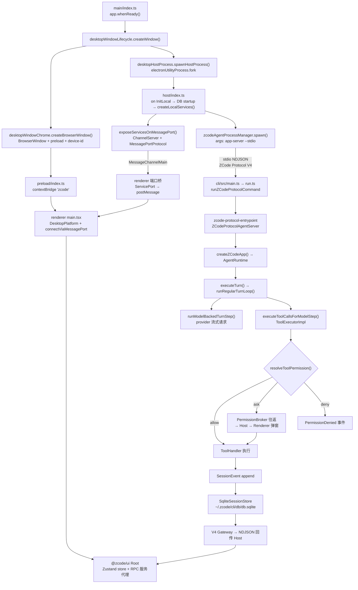
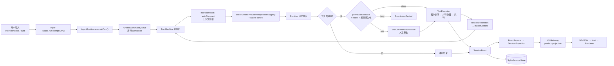
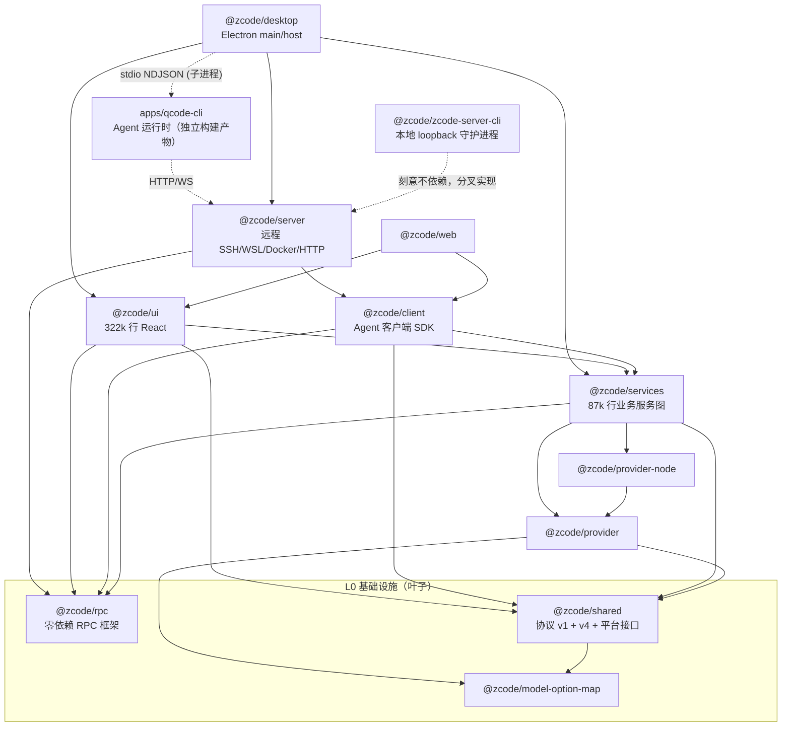

# Know Everything: ZCode

> 分析时间：2026-09-22 ｜ 项目路径：`/Users/doing/Desktop/ZCode`

## 1. 项目轮廓

ZCode 是一个 **AI 编程工作台**的 pnpm monorepo（约 86 万行 TS/TSX，15 个 workspace 包 + 1 个嵌套 workspace），同时交付三种形态：**Electron 桌面应用**（`packages/desktop` + `packages/ui`）、**浏览器/手机工作台**（`packages/web` + `packages/server`）、**终端 Agent CLI**（`apps/qcode-cli`，自身又是一个含 15 个子包的嵌套 workspace）。核心是 Agent 运行时 —— `apps/qcode-cli/packages/core` 里的 `AgentRuntime`：接收用户输入 → 组装 provider 请求 → 流式解析模型输出 → 调度并执行工具（带权限/审批闸门）→ 事件溯源落库（SQLite）。桌面端用 Electron **utilityProcess** 为每个窗口 fork 一个「Local Host」，Host 内装配 `@zcode/services` 全量业务服务并以自定义 RPC over MessagePort 暴露给渲染进程；同时用 stdio + NDJSON 协议（ZCode Protocol V4）拉起 `zcode app-server` 子进程作为实际 Agent 引擎。远程 workspace（SSH/WSL/Docker）由 `packages/server` 构建单文件 bundle 上传到远端执行。仓库自带一套**架构治理机制**（`architecture-policy.yaml` + `scripts/architecture/` + `pnpm architecture:check`），但从执行结果看它目前只覆盖 15 个模块中的 1 个。

---

## 2. 技术栈

| 层级              | 技术                                                               | 版本/备注                                                                                                       |
| ----------------- | ------------------------------------------------------------------ | --------------------------------------------------------------------------------------------------------------- |
| Runtime           | Node.js                                                            | `>=24.0.0`（`.nvmrc` = 24 ／ `mise.toml` 锁 24.14.0）。**本机实测 `v22.23.2`，pnpm 已警告 engine 不满足**       |
| 包管理 / 构建编排 | pnpm 10.33.2 + Turborepo 2.4                                       | `node-linker=hoisted`；`pnpm -r build` / `turbo`                                                                |
| 语言 / 类型       | TypeScript 6.0.2                                                   | `tsc -b` 项目引用；`verbatimModuleSyntax`、`noUncheckedIndexedAccess`、`strict` 家族                            |
| 桌面              | Electron 41.0.3                                                    | main / host(utilityProcess) / preload / renderer 四进程；tsup + vite                                            |
| 前端              | React 19.2.7 + Zustand 5 + Tailwind 4                              | Lexical、xterm、streamdown、shiki、radix、recharts、pdf/docx/xlsx/pptx 渲染器                                   |
| 后端              | Hono 4 + `@hono/node-ws` + `ws`                                    | `packages/server`（远程，SSH/WSL/Docker/HTTP）；`packages/zcode-server-cli`（本地 loopback 守护进程，独立分叉） |
| RPC               | **自研**（VS Code IPC 栈的零依赖重写）                             | `packages/rpc`，7 层：foundation → serialization → protocol → channel → ipc → proxy → remote                    |
| 协议              | ZCode Protocol **v1**（3717 行单文件）+ **v4**（47 文件 ~8600 行） | 均用 **Zod v4.6.5**；v1 与 v4 符号无重叠，是两代并行                                                            |
| 数据              | SQLite（`node:sqlite` 系）                                         | `~/.zcode/cli/db/db.sqlite`；迁移器 + repositories                                                              |
| 进程/终端         | node-pty、ssh2、undici、node-forge                                 | PTY、SSH/WSL/Docker、代理、加密                                                                                 |
| Lint / 格式       | oxlint 1.57 + oxfmt                                                | Rust 工具链；`max-lines: 400` 为唯一 error 级规则                                                               |
| 测试              | **无框架配置**                                                     | 全仓仅 4 个 `*.test.ts`，无 vitest/jest/playwright 配置，无 `test` script                                       |
| 架构治理          | 自研 `scripts/architecture/`                                       | `managedOnly: true`，当前仅 `storage` 一个模块受管                                                              |
| 发布              | release-it + esbuild SEA（Node 单可执行）                          | `apps/qcode-cli` 有 SEA 打包链；native-search 二进制按平台预置并校验 sha256                                     |

---

## 3. 项目结构

```
ZCode/
├── apps/
│   └── zcode-cli/                    # Agent CLI + 运行时（嵌套 workspace：packages/*, tools/*）
│       ├── packages/
│       │   ├── cli/                  # 进程入口、参数路由、TUI/headless/protocol 启动、SEA 打包
│       │   ├── core/                 # Agent 引擎：runtime/ tool/ permission/ agent/ subagent/ mcp/ compact/
│       │   ├── bootstrap/            # 装配 config+adapters+core；zcode-protocol(-v4) 服务端
│       │   ├── contracts/            # 纯接口/端口/schema
│       │   ├── adapters/             # I/O 边界：fs/exec/http/storage(sqlite)/mcp/provider/plugins
│       │   ├── tui/                  # React + opentui 终端 UI（仅消费 port 面）
│       │   ├── dynamic-workflow*/    # 工作流 DSL + 沙箱子进程运行时
│       │   ├── node-repl-host/       # node_repl MCP host（browser/cua/runtime 桥）
│       │   └── browser-use-plugin/ superpowers-plugin/ swift-bridge/ debug/
│       ├── tools/prompt-trajectory/  # 离线 prompt/响应录制与回放
│       └── dependencies/native-search/  # 预置 ripgrep/ugrep/bfs 二进制（带 SHA256SUMS）
├── packages/
│   ├── rpc/          # 零依赖自研 RPC 框架（唯一叶子包）
│   ├── shared/       # 协议 v1 + v4、平台接口、校验、channels
│   ├── model-option-map/ provider/ provider-node/   # 模型能力与 provider 抽象
│   ├── services/     # 业务服务（87k 行）：zcode-agent/ session/ git/ settings-sync/ storage/ …
│   ├── client/       # Agent 客户端 SDK（纯传输，无 UI）
│   ├── server/       # 远程服务端（SSH/WSL/Docker/HTTP + 远端资产部署）
│   ├── zcode-server-cli/  # 本地 loopback 守护进程（Supervisor + 版本管理），刻意不依赖 server
│   ├── ui/           # 共享 React 组件/hooks/Zustand store（322k 行，最大包）
│   ├── web/          # 浏览器/手机客户端入口
│   ├── desktop/      # Electron main / host / preload / renderer / scheduler
│   ├── zcode-cua/    # Computer-Use 权限代理（独立发布，0.6.3）
│   └── formal-proof/ # 独立的 d3 可视化小工具（已被 lint ignore）
├── scripts/          # 构建、治理、打包、原生工具链（64 个脚本）
├── .agents/skills/   # 仓库内 Agent 技能（architecture-governance 等 8 个）
├── config/ third-party/ public/ patches/ harness/
├── AGENTS.md         # 仓库级 Agent 行为契约（实现/验证/进程/日志规则）
├── CONTEXT.md        # 插件商店领域词汇表
├── DESIGN.md         # UI 设计系统（颜色/排版/间距/组件规范）
└── architecture-policy.yaml + .architecture-baseline.json   # 架构治理策略与基线
```

---

## 4. 主干逻辑

### 4.1 调用路径（桌面主链路：窗口 → Host → Agent 子进程）



**关键接缝**：桌面与 Agent 之间**没有直接调用**，只有一条 stdio NDJSON 协议；渲染进程也**不直连 Agent**，而是拿一个 MessagePort 与 Host 上的 `ChannelServer` 对话。这条"两跳"设计是整个项目的承重结构。

### 4.2 数据流（一轮对话）



**校验边界**：入口侧 `validateInitialModelToolInput` + `entry.validateInput` + `entry.resolveInput`（先归一化再走 hooks/权限，保证策略看到真实字节）；协议侧 `zcodeProtocolMessageSchema`（Zod）；HTTP 侧 `remoteTargetSchema.safeParse`。三个边界都有运行时校验 —— 这是该仓库做得扎实的一环。

### 4.3 核心模块关系（含词汇表）

**领域词汇表**（出现 ≥3 次且高度承重的术语，`CONTEXT.md` 只覆盖"插件商店"子域，其余从代码提取）：

| 术语                           | 含义                                                                                               | 主要位置                               |
| ------------------------------ | -------------------------------------------------------------------------------------------------- | -------------------------------------- |
| **Local Host**                 | 每个窗口一个 `electronUtilityProcess`，持有 `@zcode/services` 服务图与 Agent 子进程                | `desktop/src/host/index.ts`            |
| **Attachment**                 | 一个交予消费者（渲染进程/手机）的 `MessagePort`，作用域为 `{local}` 或 `{remote, remoteSessionId}` | `host/windowHostAttachmentRegistry.ts` |
| **Session / Task**             | 会话；`IZCodeTaskService` 是对外任务门面                                                           | `services/src/session/`                |
| **Turn**                       | 一次"模型请求 + 工具执行"的完整循环单元                                                            | `core/src/runtime/methods/turn*.ts`    |
| **Run / Workflow Run**         | 动态工作流（DWF）的运行实例                                                                        | `dynamic-workflow*/`                   |
| **workspaceIdentity**          | 身份隔离 key，`identity?.trim() \|\| workspacePath`                                                | 跨全链路                               |
| **Surface / Delivery Profile** | `desktop-continuous`（实时流）vs `web-remote-replayable`（快照+补洞）                              | `v4/core.ts` `DELIVERY_PROFILES`       |
| **Owner / Lease / Generation** | Host owner、租约与 stale run 防护（代际号）                                                        | `windowRemoteConnectionRegistry.ts`    |
| **Module / Contract**          | 架构治理单元与公开入口                                                                             | `architecture-policy.yaml`             |



**包级依赖图无环**（`rpc`/`model-option-map` 为纯叶子），这是该仓库架构上最扎实的一点。

---

## 5. 隐藏短板

> 说明：所有条目均已在本次分析中**实际执行命令验证**，不是静态推测。验证证据列于"发现路径"。

### 5.1 逻辑混乱

| 位置                                                                     | 问题                                                                                                                                                                                                                                     | 严重度     | 发现路径                      | Next Skill              |
| ------------------------------------------------------------------------ | ---------------------------------------------------------------------------------------------------------------------------------------------------------------------------------------------------------------------------------------- | ---------- | ----------------------------- | ----------------------- |
| `architecture-policy.yaml:20-25`                                         | 声明 `session` 模块 `publicEntrypoints: [packages/services/src/session/contract.ts]`、`owner: conversation`，但**该文件不存在**，`session/` 下也无 `index.ts`。实测 `ls` 报 No such file                                                 | **High**   | 4.1 传递模块 / 4.5 紧耦合接缝 | `/improve-architecture` |
| `packages/services/src/zcode-agent/*`（4 文件 13 处）                    | `zcodeTaskServiceAdapter.ts` / `zcodeAgentService.ts` 等直接 `import { TaskIndexRepo } from "#src/session/taskIndexRepo.js"`、构造具体 Repo 而非接口 —— 因为上一条没有合法入口，深导入成为唯一可行路径                                   | **High**   | 4.1 隐式耦合                  | `/improve-architecture` |
| `packages/ui/src`（187 个引用 services 的文件中 162 个在 `hooks/` 之外） | `AGENTS.md` 规定"组件通过 `packages/ui/src/hooks/` 访问服务"，实际 26 个文件在组件内直接 `useServices()`（`v4/SessionPane.tsx:557`、`GitActionMenu.tsx:833`、`settings/AutomationsSection.tsx:530` …）；9 处是**值导入**服务代码而非类型 | **Medium** | 4.1 约定漂移                  | `/improve-architecture` |
| `packages/services/src/storage/`                                         | 唯一受管模块缺少自身治理技能要求的 `contract.example.ts` 与 `CONTRACT.md`（`.agents/skills/architecture-governance/SKILL.md` 明文要求四件套），实测两者均不存在                                                                          | **Medium** | 4.1 约定漂移                  | `/improve-architecture` |
| `packages/rpc/src/remote.ts`、`persistent-protocol.ts`                   | Layer 6（`RemoteAgentConnection`、`PersistentProtocol`、`RemoteAuthorityResolverService`）在 `examples/` 之外**零生产消费者**；全仓仅 2 处注释提及                                                                                       | **Low**    | 4.1 传递模块（删除测试）      | `/improve-architecture` |
| `packages/shared/src/zcode-protocol/index.ts:75`                         | `ZCODE_PROTOCOL_V4_WIRE_VERSION = 3` 重复定义 `v4/core.ts:7` 的 `V4_WIRE_PROTOCOL_VERSION`，双份事实源                                                                                                                                   | **Low**    | 4.1 隐式耦合                  | `/improve-architecture` |

### 5.2 数据流缺陷

| 位置                                                                    | 问题                                                                                                                                                                                                                                                                                                                                                                                                                                        | 严重度     | 发现路径       | Next Skill              |
| ----------------------------------------------------------------------- | ------------------------------------------------------------------------------------------------------------------------------------------------------------------------------------------------------------------------------------------------------------------------------------------------------------------------------------------------------------------------------------------------------------------------------------------- | ---------- | -------------- | ----------------------- |
| `architecture-policy.yaml:20-25`                                        | `session` 声明 `requires: [shared]`，实际导入 `services`（logger/descriptors）与 `model-provider`；`zcode-agent` 依赖亦未声明。若该模块受管，`module-dependency` 规则（`scripts/architecture/index.mjs:241`）会直接报错                                                                                                                                                                                                                     | **High**   | 4.5 紧耦合接缝 | `/improve-architecture` |
| `package.json:82-92`                                                    | `pnpm.overrides`（react/react-dom 锁 19.2.7）与 `pnpm.patchedDependencies`（3 个补丁，含 Anthropic `video/*` content block 支持）**放在 pnpm 10.33.2 已不读取的位置** —— `pnpm typecheck` 实测输出 `WARN The "pnpm" field in package.json is no longer read`。当前 `pnpm-lock.yaml:9-21` 仍记录着这两项，故 `node_modules` 状态正确（已验证补丁标记存在于 `@ai-sdk/anthropic/dist/index.js`），但**下一次重新生成 lockfile 会静默丢弃它们** | **Medium** | 4.2 双重维护   | `/planning`             |
| `packages/services/src/zcode-agent/zcodeAgentProcessManager.ts:356,379` | 以**路径字符串**硬编码 Runtime 产物：`findUpward("apps/qcode-cli/packages/cli/dist/zcode.cjs")` 与 `.../src/main.ts`，并特判 bytecode 产物名。无编译期依赖（零 `import` 自 `apps/qcode-cli`），但布局一变即静默失败                                                                                                                                                                                                                         | **Medium** | 4.2 未校验假设 | `/planning`             |
| `packages/services/src/skills/skillsService.ts:61,137`                  | 注释自承"对齐" `apps/qcode-cli/packages/adapters/src/skills/index.ts:19` 与 `roots.ts:60-72` —— 同一份逻辑在两侧各实现一遍，靠注释维持同步                                                                                                                                                                                                                                                                                                  | **Medium** | 4.2 双重维护   | `/planning`             |
| `packages/ui/test/nonCliAcpRetirement.test.ts:6-7`                      | 唯一真正跨包深导入 `../../shared/src/validation.js`，绕过 `@zcode/shared` 的 export map；文件移动即静默失效                                                                                                                                                                                                                                                                                                                                 | **Low**    | 4.2 未校验假设 | `/planning`             |

### 5.3 控制流缺陷

| 位置                                                               | 问题                                                                                                                                                                                                                                   | 严重度   | 发现路径                    | Next Skill  |
| ------------------------------------------------------------------ | -------------------------------------------------------------------------------------------------------------------------------------------------------------------------------------------------------------------------------------- | -------- | --------------------------- | ----------- |
| `apps/qcode-cli/.husky/pre-commit`                                 | Hook 内容为 `pnpm lint` + **`pnpm test`**，但仓库**任何 `package.json` 都没有 `test` script**（根与 `apps/qcode-cli` 均已核实）。即 hook 必然失败；且 `git config core.hooksPath` 为空、根目录无 `.husky/`，该 hook 当前**完全未接线** | **High** | 4.3 异常吞噬 / 4.5 无测试面 | `/diagnose` |
| `package.json:19` vs 文件系统                                      | `verify:pre-push`（= `lint` + `architecture:check --changed`）已定义，但**不存在 `.husky/pre-push`**（`find -name pre-push` 全仓零结果），也无 CI 可调用它                                                                             | **High** | 4.3 未接线的闸门            | `/planning` |
| 全仓                                                               | **不存在 `.github/` 目录，零 CI**。`.agents/skills/architecture-governance/SKILL.md` 声称 "CI never refreshes baseline automatically"，但当前没有 CI 会跑任何检查                                                                      | **High** | 4.5 无测试面                | `/planning` |
| `apps/qcode-cli/packages/core/src/runtime/methods/turn-loop.ts:43` | `runRegularTurnLoop` 的 `while(true)` 是承重循环，终止条件分散在 `turnMachine` / `turnControl.stopTurnAfterResult` / `compact` 多处；无状态机层面的显式终止不变量文档。**未发现 actual bug，属风险面**                                 | **Low**  | 4.3 无限循环风险            | `/diagnose` |

### 5.4 安全弱点

| 位置                                                                                                                                                                                                                      | 问题                                                                                                                                                                                                                   | 严重度     | 发现路径                      | Next Skill              |
| ------------------------------------------------------------------------------------------------------------------------------------------------------------------------------------------------------------------------- | ---------------------------------------------------------------------------------------------------------------------------------------------------------------------------------------------------------------------- | ---------- | ----------------------------- | ----------------------- |
| `packages/server/src/hostCapability.ts` vs `packages/zcode-server-cli/src/server-core/hostCapability.ts`；`packages/server/src/http.ts`（426 行）vs `.../zcode-server-cli/src/server-core/http.ts`（195 行，517 行 diff） | **安全边界被复制成两份**：`hostCapability` 除日志串外逐字等价；`http.ts` 一份带 token 中间件 + 静态托管，另一份改用 loopback 硬校验。两份各自演化时，鉴权/来源校验会出现不一致 —— 这正是 security 场景最危险的漂移形态 | **High**   | 4.4 边界校验 / 4.5 跨接缝耦合 | `/improve-architecture` |
| `packages/ui/src/components/ai-elements/mermaid-block.tsx:320`、`diagram-preview-dialog.tsx:676`                                                                                                                          | `dangerouslySetInnerHTML={{ __html: renderState.svg }}` 注入**模型生成**的 SVG。若渲染链未做 sanitize，属 XSS 面。（本次未追踪到 sanitizer，需人工确认 mermaid/渲染器配置）                                            | **Medium** | 4.4 注入载体                  | `/diagnose`             |
| `packages/desktop/src/host/remoteMediaPreviewProxy.ts:147`                                                                                                                                                                | 远程媒体代理把 token 拼进 loopback URL 查询串（`http://127.0.0.1:${port}${PREFIX}${token}`）；token 可能进入日志/Referer                                                                                               | **Low**    | 4.4 敏感数据入日志            | `/diagnose`             |
| 全仓 grep                                                                                                                                                                                                                 | **未发现硬编码凭据**（无 `sk-*`/`AKIA*`/`ghp_*`/私钥块）；`.env.development`/`.env.production` 仅含注释，`.env.example` 中 `ZAI_OAUTH_CLIENT_ID` 标注"线上公开 OAuth client id，不是 secret"。这一项 **无问题**        | —          | 4.4 敏感数据                  | —                       |

### 5.5 架构弱点

| 位置                                                                 | 问题                                                                                                                                                                                                                                                                                                                                                                                                                                                                                                                      | 严重度       | 发现路径         | Next Skill              |
| -------------------------------------------------------------------- | ------------------------------------------------------------------------------------------------------------------------------------------------------------------------------------------------------------------------------------------------------------------------------------------------------------------------------------------------------------------------------------------------------------------------------------------------------------------------------------------------------------------------- | ------------ | ---------------- | ----------------------- |
| 全仓（**最高优先级**）                                               | **验证闸门整体失效**：全仓 86 万行仅 **4 个测试文件**（`packages/ui/test/` 1 个、`packages/services/test/` 3 个），无任何测试框架配置（vitest/jest/playwright config 零结果），无测试脚本，无 CI。`AGENTS.md` 明文要求"有行为改动时先补充对应测试；交互改动需要 E2E 场景"——**该要求当前无任何可执行的承载路径**                                                                                                                                                                                                           | **Critical** | 4.5 无测试面     | `/planning`             |
| `scripts/architecture/index.mjs:132` + `architecture-policy.yaml:65` | `managedOnly: true` 使第 132 行 `if (!module \|\| (managedOnly && !module.managed)) continue;` 跳过**所有**未受管模块。15 个模块中仅 `storage` 受管，于是 `max-file-lines` / `disable-count` / `layer-direction` / `deep-import` / `module-dependency` / `ui-implementation-import` 六条规则对 14/15 的代码**完全不生效**；`forbidCycles` 的 cycle 检测（第 44 行）也只遍历受管节点，同样形同虚设。**实测 `node scripts/architecture/architecture-check.mjs` 输出 `architecture: OK / violations: 0 / new: 0`，退出码 0** | **High**     | 4.5 架构治理     | `/improve-architecture` |
| `packages/server/package.json` exports `"./remote/*.js"`             | 通配导出把 `src/remote/` 下**所有**文件变成永久公开 API。实测 **98 处**深导入（`packages/server` 自身 94 处 + `packages/desktop` 4 处，如 `desktop/src/main/openInEditor.ts:5` → `@zcode/server/remote/wsl-detect.js`）。`packages/server/src/remote/index.ts` 并未导出这些符号，意味着该 barrel 已名存实亡，远程子系统无法自由重构                                                                                                                                                                                       | **High**     | 4.5 紧耦合接缝   | `/improve-architecture` |
| `packages/rpc/src/*` 5 份 `ISocket` 适配器                           | `packages/server/src/stdio.ts:14`（`wrapStdio`）、`server/src/http.ts:41`（`wrapWebSocket`）、`server/src/remote/stdio-socket.ts:11`（`wrapStdioStream`）、`client/src/websocket.ts:23`（`wrapBrowserWebSocket`）、`zcode-server-cli/src/server-core/http.ts:61`（`wrapWebSocket`）——同一接口 5 次手写；`stdio-socket.ts` 的注释甚至点名"跟随另两处写法"而非提取共享 helper                                                                                                                                               | **Medium**   | 4.5 重复实现     | `/improve-architecture` |
| `packages/rpc/package.json` exports                                  | `"types": "./dist/index.d.ts"` 而 `"default": "./src/index.ts"` —— 类型读 `dist/`、运行时读 `src/`。消费者（server / zcode-server-cli）均把 `@zcode/rpc` 列入 tsup `noExternal` 自行编译源码，`dist/index.d.ts` 必须靠人工保持不过期；`packages/rpc` 的 `build` 不在任何消费者的构建链上                                                                                                                                                                                                                                  | **Medium**   | 4.2 双重维护     | `/planning`             |
| `zcode-protocol/index.ts` ↔ `zcode-protocol-v4/`                     | 两代协议文件级**双向依赖**：`zcode-protocol-v4/command.ts:22-25` 反向导入 v1 的 schema；而 v1 的 `index.ts:25,70` 深导入 `v4/snapshot.js` + `v4/rows.js`。当前无严格环（已验证 v1 不传递可达 `command.ts`），但"删除旧协议树"的目标被 `command.ts` 卡死                                                                                                                                                                                                                                                                   | **Medium**   | 4.5 循环依赖风险 | `/planning`             |
| 全仓 204 处 `eslint-disable max-lines`                               | `max-file-lines` 虽是唯一 lint error 级规则（`.oxlintrc.json`），但 204 个文件就地关闭；另有 83 个 >400 行文件靠 `ignorePatterns`（`apps/qcode-cli`、`components/ui`、`ai-elements`、`formal-proof`）豁免。实际结果是 6485 / 6190 / 5737 / 5646 / 5459 / 4834 行级别的文件可以长期存在（`zcodeTaskServiceAdapter.ts` 5737 行、`zcodeAgentService.ts` 5646 行）                                                                                                                                                            | **Medium**   | 4.5 约束失效     | `/improve-architecture` |

---

## 6. 总结

**项目健康度判断**：

- Good：无 Critical，High ≤ 2 且均有修复计划
- Moderate：无 Critical，High 3–5
- **Concerning**：存在 ≥ 1 个 Critical，或 High > 5，或核心模块关系图无法绘制

**项目健康度**: **Concerning**

依据：存在 1 个 Critical（验证闸门整体失效），且 High 级问题达 6 个（`session` 契约缺失与深导入、`session` 未声明依赖、架构检查器形同虚设、pre-commit hook 调用不存在的脚本、无 CI / 无 pre-push 接线、安全边界双份实现、server 通配深导入）。核心模块关系图绘制成功，包级依赖无环 —— 架构的**意图**是清晰的，问题在于**约束与验证没有落地**。

**最重要的三个发现**：

1. **「验证」在本仓库不可执行。** `AGENTS.md` 定义了严格的 Definition of Done（构建通过 / 静态检查零错误 / 运行时验证 / 无遗留 TODO），配了 `verify:pre-push` 脚本，还写了 `architecture-governance` 技能要求每次改动先跑架构检查。但实现的是一套**空壳**：全仓 4 个测试文件、无测试框架、无 `test` script、pre-commit hook 调用了不存在的 `pnpm test`、无 `.husky/pre-push`、无 `.github/` CI、git 仓库当前 0 提交 0 跟踪文件。`pnpm typecheck` 与 `pnpm lint` 单独跑是**通过**的（实测 typecheck 退出 0；oxlint 0 error / 70 warning / 84ms / 2556 文件），所以问题不是代码质量差，而是**没有任何机制在改动发生时自动执行它们**。

2. **架构治理策略是装饰性的 —— 而且它以「OK」的假象掩盖了这一点。** `managedOnly: true` 让检查器在扫描 15 个模块中的 14 个之前就 `continue`。实测命令输出 `architecture: OK / violations: 0`，退出码 0，基线文件 `.architecture-baseline.json` 内容为 `{"version":1,"violations":[]}`。同时 `session` 这个被显式声明为 `owner: conversation` 的模块，其唯一公开入口 `session/contract.ts` **根本不存在** —— 于是上游只能深导入 `#src/session/taskIndexRepo.js` 这类实现细节。治理规则写了，violation 类型实现了（`deep-import`、`layer-direction`、`domain-io`、`ui-implementation-import`…），唯一缺的是把它们对准代码。

3. **同一件事在仓库里有 2–5 份实现，且分叉处恰好是安全边界。** `packages/server`（远程，带 token 中间件 + 静态托管）与 `packages/zcode-server-cli`（本地，loopback 硬校验）各自持有一份 `hostCapability.ts`（除日志串外逐字相同）和一份 `http.ts`（517 行 diff）；`ISocket` 适配器在 5 个位置手写；`skillsService` 注释自承与 CLI adapters 里的技能路径解析"对齐"维护。依赖图无环说明**包级**边界是清醒的，但**文件级**边界正在复制。

**Next step**：

- 用 `/planning` 制定「验证闸门落地」计划（先修 `test` script 与 husky 接线，再引入最小测试框架，最后接 CI）—— 这是唯一能同时降低其余所有风险的动作
- 用 `/improve-architecture` 处理架构治理：先补 `session/contract.ts` 并回填 `requires`，再逐个把模块从 `managed: false` 迁到 `true`，让 `architecture:check` 真正开始报错
- 用 `/improve-architecture` 消除 `@zcode/server/remote/*` 通配导出与 `hostCapability`/`http` 双份实现，把远程边界收敛回单一 barrel
- 用 `/diagnose` 逐一确认 5.1 / 5.4 中标记为「需人工确认」的项（mermaid SVG sanitize、turn loop 终止不变量）
