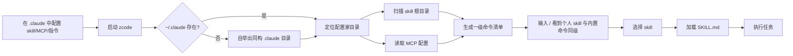

# 痛点拆解：让 zcode 直接认 `.claude` 作为配置家目录，skill 升到一级命令

> **文档层级**：本文是**痛点分析**（问题是什么），不描述最终实现形态。
>
> 核心痛点（一句话）：**已经在 Claude Code 里积累了 skills / MCP / 个人指令的使用者** 在 **同一个仓库里换用 zcode** 时，因为 **zcode 的配置家目录是 `~/.zcode`、skill 根目录只扫 `~/.zcode/skills` 与 `~/.agents/skills`、MCP 只从插件包内解析**，导致 **两套配置要在两个目录里各维护一份，且个人 skill 在 zcode 里不是一级命令、必须经 `/skill <name>` 这个中间层才能触达**。
>
> 来源：`painpoints/pp6.md` ｜ 拆解时间：2026-09-22
>
> 已确认前提：**zcode 全面接受 `~/.claude` 中的配置** ｜ `~/.claude` **不存在时允许 zcode 自行创建**，创建出的结构与现有 `.claude` 一致 ｜ 个人 skill 应**默认出现在与内置命令同一级**，因此**原生 `/skill` 可以去掉**。

## 1. 痛点分支

- 痛点 A：**配置家目录不一致**——zcode 的一切落在 `~/.zcode`（`contracts/src/config/index.ts:303` 的 `storage.dir`），用户在 Claude Code 侧积累的配置在 zcode 侧完全不可见，必须重配一份。
- 痛点 B：**skill 根目录不含 `.claude/skills`**——`adapters/src/skills/roots.ts:88-95` 的 `skillRootsForBase` 只产出 `<base>/.zcode/skills` 与 `<base>/.agents/skills` 两个根。用户 `~/.claude/skills/` 下已有的 15 个 skill（`pain-decomposition`、`planning`、`pre-mortem`…）在 zcode 里一个都扫不到。
- 痛点 C：**skill 不是一级命令**——`command-center/slash-commands.ts:236-249` 的 `listSlashCommandSuggestions` 只把 `SLASH_COMMAND_HELP_ENTRIES`（内置命令）与 **custom commands** 拼在一起。skill 不在这个清单里，触达路径被强制为 `/skill <name>` 的间接层（`prompt-command.ts:86-88` 分发、`:106` 经 `buildManualSkillPrompt` 改写本回合 prompt）。
- 痛点 D：**MCP 配置面缺失**——当前 MCP server 只从插件包内解析（`adapters/src/plugins/mcp.ts:26-27`：插件根下的 `.mcp.json` 或 `manifest.mcpServers`），**没有用户级 MCP 配置文件这一档**，用户在其他客户端里配置好的 MCP server 无处可落。
- 痛点 E：**个人指令文件名不一致**——用户级指令读取的是 `~/.zcode/AGENTS.md`（`adapters/src/context/index.ts:237`），而非 `~/.claude/CLAUDE.md`；用户在 `.claude` 里写好的全局指令对 zcode 不可见。

## 2. 词性拆解

### 2.1 名词（Entities）

| 实体 | 含义 | 角色 | 状态 |
|------|------|------|------|
| 使用者 | 同时使用 Claude Code 与 zcode 的人 | 主体 | 持久 |
| 配置家目录 | `~/.claude` ｜ `~/.zcode` | 客体 | 持久 |
| skill 根目录 | `skills/` 目录（用户级 / 项目级） | 客体 | 持久 |
| Skill | 一个带 `SKILL.md` 的能力单元 | 客体 | 持久 |
| MCP 配置 | MCP server 的定义（名称 / 命令 / 参数 / 环境） | 客体 | 持久 |
| 个人指令文件 | 用户级全局指令（`CLAUDE.md` / `AGENTS.md`） | 客体 | 持久 |
| 一级命令清单 | `/` 触发后呈现的候选命令集合 | 客体 | **临时**（进程内投影） |
| 代理配置文件 | `~/.claude.json`（含 `mcpServers` / `projects`） | 客体 | 持久（**外围**） |

> 保留 7 个业务核心实体。`代理配置文件` 记为关键外围实体——它是 MCP 现状的真实载体，但格式最复杂、兼容风险最高，是否纳入范围需在 §9 澄清。

### 2.2 动词（Actions）

| 动作 | 触发 | 终结状态 | 时序 |
|------|------|----------|------|
| 在 `.claude` 中配置 | 用户主动 | `.claude` 下存在 skill / MCP / 指令 | #1（前置，发生在 zcode 之外） |
| 定位配置家目录 | 系统被动 | 确定本次启动以哪个目录为准 | #2 |
| 扫描 skill 根目录 | 系统被动 | 得到可发现的 Skill 集合 | #3 |
| 读取 MCP 配置 | 系统被动 | 得到可连接的 MCP server 集合 | #4（与 #3 并行） |
| 生成一级命令清单 | 系统被动 | `/` 候选里出现个人 skill | #5 |
| 选择 skill | 用户主动 | 本回合目标 skill 确定 | #6 |
| 加载 SKILL.md | 系统被动 | skill 指令进入本轮上下文 | #7 |
| 执行任务 | 系统被动 | 按 skill 指令产出结果 | #8 |
| 回退到内置命令 | 用户主动 | 重名时仍能用回内置语义 | 旁路（反向） |

### 2.3 形容词 / 副词（Rules）

| 限定词 | 含义 | 限定对象 |
|--------|------|----------|
| **全面接受（原话）** | 不止 skill，还有 MCP、指令等一并接轨 | 配置家目录（最关键规则） |
| **"不需要去所谓的 `~/.zcode`"** | `~/.zcode` 不再作为用户需要关心的配置源 | 配置家目录 |
| **"默认显示在和 `/skill` 同一级"** | skill 与内置命令同层可见 | 一级命令清单 |
| **"默认作为 zcode 的根指令"** | 个人 skill 具备与内置命令同等的触达优先级 | 一级命令清单 |
| **"甚至你可以去掉原生的 `/skill`"** | 允许移除中间层命令 | 一级命令清单 |
| **不存在时可自行创建** | 首次运行要能自举出 `.claude` | 配置家目录 |
| **"配置和现在的 `.claude` 一致就可以"** | 自举产物必须与既有结构同构，不另造格式 | 配置家目录 |
| 同一级不重名（隐含） | 个人 skill 与内置命令同名时的处置需要规则 | 一级命令清单 |
| 与 Claude Code 的现有内容共存（隐含） | 不能破坏用户在 Claude Code 侧的既有配置 | 配置家目录 |

> 2.3 是本次差异化的核心：**"全面接受"** 决定了范围不止 skill 一条线（还含 MCP 与指令文件）；**"与现有 `.claude` 一致"** 决定了自举不是新建一套 zcode 自有格式，而是产出同构目录；**"同一级"** 则把 skill 从"被引用的资源"重新定性为"被直接触达的命令"。

## 3. 名词衍生：核心指标 & 数据结构

### 3.1 核心指标

| 指标 | 计算方式 | 业务意义 | 度量频率 |
|------|----------|----------|----------|
| 双配置重合率 | 两套配置中同名 skill / 同名 MCP server 的数量 ÷ 总数 | 衡量"重复维护"的规模；反向测试：若为 0，说明用户根本没在两边都配，本痛点不成立 | 每次发布 |
| 重复维护目录数 | 用户为同一能力必须维护的配置副本数 | 核心诉求的直接量化；目标从 2 降到 1 | 每次发布 |
| skill 触达层级 | 从输入 `/` 到选中个人 skill 需要的中间命令层数 | 痛点 C 的量化；目标为 0（直接出现在同一级） | 每次发布 |
| 一级清单 skill 覆盖率 | 一级命令清单中出现的个人 skill 数 ÷ 可发现 skill 总数 | 痛点 C 的验收面；目标 100%（受重名规则限制的除外） | 每次发布 |
| 自举成功率 | `~/.claude` 不存在时，首次运行后目录结构完整的比例 | 痛点 A 的边界保障；不得失败后留下半成品目录 | 每次冷启动 |
| MCP 可用来源数 | 可解析出 MCP server 的配置来源档位数 | 痛点 D 的量化；当前为 1（仅插件包内），目标 ≥ 2（含用户级） | 每次发布 |
| 指令文件命中率 | 用户级指令实际被加载的比例 | 痛点 E 的量化；反向测试：若加载了但内容不是用户写的那份，说明文件名对不上 | 每次启动 |

### 3.2 数据结构

```yaml
# 配置家目录定位结果（本次新增的解析层产物）
ConfigHome:
  path: string              # ~/.claude
  source: enum              # existing | self-bootstrapped
  bootstrappedAt: string?   # 仅在自举时写入，用于区分"用户建的"与"zcode 建的"

# skill 根目录（在既有 SkillRoot 上扩展 source 取值）
SkillRoot:
  path: string              # <base>/skills
  scope: enum               # user | project
  source: enum              # 既有: zcode | agents ；本次新增: claude
  priority: number          # 决定同名 skill 的解析顺序

# 一级命令清单条目（既有结构，本次新增来源）
CommandEntry:
  name: string              # 命令名，不含前导斜杠
  summary: string
  usage: string
  source: enum              # builtin | custom | skill   ← skill 为新来源
  skillName: string?        # source=skill 时指向具体 skill

# MCP server 定义（既有结构，本次新增携带来源档位）
McpServerEntry:
  name: string
  command: string
  args: [string]
  env: {string: string}
  origin: enum              # plugin | user   ← user 为新档位
  # 注意：与插件来源的同名 server 的覆盖规则必须在实现前定死（见 §9）

# 个人指令文件（既有结构，本次扩展候选名）
InstructionFile:
  filePath: string
  fileName: enum            # 既有: AGENTS.md ；本次候选: CLAUDE.md
  scope: enum               # user | project
```

> 说明：`一级命令清单` 为临时实体（进程内投影），不落盘、无 TTL 需求。逐字段迁移 `~/.claude.json` 的 `projects` / `mcpServers` 映射**不在本次数据结构内**——见 §9 待澄清。

## 4. 动词衍生：业务流程

### 4.1 主流程



### 4.2 异常流程

| 触发点 | 失败场景 | 系统响应 |
|--------|----------|----------|
| 定位配置家目录 | `~/.claude` 不存在 | 自举同构目录；不得静默跳过导致"配置了但没生效" |
| 定位配置家目录 | `~/.claude` 存在但权限不可读 | 明确报路径与权限问题，不静默回退到 `~/.zcode`（会让用户以为接轨成功） |
| 自举 `.claude` | 写到一半中断 | 不得留半成品目录；失败要让下次启动能重试 |
| 扫描 skill 根目录 | 某 skill 的 `SKILL.md` frontmatter 不合法 | 跳过该 skill 并计入告警，不阻塞其余 skill 的发现 |
| 生成一级命令清单 | 个人 skill 与内置命令**重名** | 必须给出确定规则（内置优先 / 改名 / 报冲突）；**绝不能静默覆盖内置语义** |
| 生成一级命令清单 | 个人 skill 与自定义命令重名 | 同上，需要有明确优先级 |
| 选择 skill | 用户选的 skill 在扫描后被删除 | 报出该 skill 不可用，不把空指令当成功执行 |
| 读取 MCP 配置 | 用户级与插件级存在同名 server | 需要确定覆盖规则；静默二选一会让用户无法判断连的是哪个 |
| 读取 MCP 配置 | 用户级 MCP 条目字段非法 | 跳过该条目并报出条目名，不因一条坏配置丢掉整份配置 |
| 读个人指令文件 | `CLAUDE.md` 与 `AGENTS.md` 同时存在 | 需要确定合并或优先规则，避免出现两份互相矛盾的全局指令 |
| 回退到内置命令 | 移除了原生 `/skill` 后，用户仍习惯性敲 `/skill` | 需要给出可理解的提示（指向新用法），而不是"未知命令" |

### 4.3 决策分支

- `if ~/.claude 不存在` → 自举同构目录后继续
- `if ~/.claude 存在` → 直接以其为配置家目录
- `if 个人 skill 名与内置命令同名` → 按 §9 定死的规则处置（倾向内置优先 + 提示个人 skill 的替代触达方式）
- `if 用户级与插件级 MCP 同名` → 按 §9 定死的规则处置
- `if 同时存在 CLAUDE.md 与 AGENTS.md` → 按 §9 定死的规则处置
- `if 原生 /skill 被移除` → `/skill` 输入需给出迁移提示，不落入 unknown

## 5. 形容词 / 副词衍生：潜在需求

### 5.1 隐含约束

- **"全面接受"** → 隐含**这不是单点改造**：只改 skill 根目录而不同时接 MCP 与指令文件，用户依然要维护两套，核心痛点不解除。
- **"不需要去所谓的 `~/.zcode`"** → 隐含**用户心智模型里只能有一个配置家目录**。若最终是"两个都读、合并生效"，必须让"当前生效来源"可见，否则"不需要去"只是口头成立。
- **"默认显示在同一级"** → 隐含**命名空间冲突必须有规则**。把 15 个个人 skill 提升到一级，与现有内置命令撞名的概率不再是理论问题。
- **"去掉原生 `/skill`"** → 隐含**兼容性处置**：这是一个用户可见的命令移除，需要迁移提示与回归检查（符合"安全改动需带回滚路径"的约束）。
- **"配置一致就可以"** → 隐含**自举产物必须是同构的**，不能是"看起来像"的近似物；否则用户无法用既有工具去管理它。
- **"可以自己创建"** → 隐含**自举是幂等的**：反复启动不能覆盖或重复创建。

### 5.2 边界场景

- **重名边界（最高频）**：个人 skill / 自定义命令 / 内置命令三者同名。这是最可能反复出问题的地方。
- **两级范围边界**：用户级（`~/.claude/skills`）与项目级（`<repo>/.claude/skills`）都要覆盖，且优先级要与既有 `user` / `project` scope 语义对齐。
- **MCP 覆盖边界**：用户级、插件级、项目级三层同名 server 的优先级。
- **指令文件并存边界**：`CLAUDE.md` 与 `AGENTS.md` 同时存在。
- **迁移边界**：既有 `~/.zcode` 下已配的 skill / MCP 在切换后如何处理——是保留兼容、还是只认 `.claude`、还是合并。
- **自举边界**：`.claude` 不存在但 `.claude.json` 存在（或反之）——两个实体的存在性不总是一致。

### 5.3 非功能性需求

- **性能**：启动时多扫一个 skill 根目录不应显著拖慢冷启动；扫描需可缓存或惰性。
- **可用性**：任一步失败（尤其是自举与 MCP 解析）都不得留下半初始化状态；不得静默回退到 `~/.zcode` 而让用户误以为接轨成功。
- **安全 / 合规**：MCP 配置常含环境变量与密钥。读取用户级 MCP 配置时，日志与 `doctor` 输出一律只列 server 名，不回显 `env` 值；不在 Claude Code 与 zcode 之间复制或转存凭据。
- **可观测**：`doctor` 需要能报出"当前配置家目录路径 + 各来源档位扫到的 skill / MCP 数量 + 重名处置结果"，让"接轨了但没生效"当场可见。

## 6. 功能点拆解（Features）

### F-001: 定位配置家目录
| 字段 | 内容 |
|------|------|
| **功能描述** | 让 zcode 以 `~/.claude` 作为用户级配置家目录，并让所有派生路径（skill / 指令 / 日志之外的配置面）都从这一个来源推导 |
| **痛点溯源** | 痛点 A / 核心痛点 |
| **词性溯源** | 名词"配置家目录" + 动词"定位配置家目录" + 规则"不需要去所谓的 `~/.zcode`" |
| **依赖实体** | ConfigHome |
| **依赖功能** | 无 |
| **优先级** | P0 |
| **验证指标** | 重复维护目录数、双配置重合率（回 3.1） |

### F-002: 扫描 `.claude/skills` 根目录
| 字段 | 内容 |
|------|------|
| **功能描述** | 在既有 skill 根目录之外，新增用户级与项目级的 `<base>/skills` 扫描，使 `~/.claude/skills` 下的个人 skill 可被发现 |
| **痛点溯源** | 痛点 B |
| **词性溯源** | 名词"skill 根目录" + 动词"扫描 skill 根目录" + 规则"全面接受" |
| **依赖实体** | SkillRoot、Skill |
| **依赖功能** | F-001 |
| **优先级** | P0 |
| **验证指标** | 一级清单 skill 覆盖率、双配置重合率（回 3.1） |

### F-003: 提升个人 skill 到一级命令
| 字段 | 内容 |
|------|------|
| **功能描述** | 把扫描到的个人 skill 作为 `source: skill` 的条目并入一级命令清单，使其与内置命令同级呈现、直接触达 |
| **痛点溯源** | 痛点 C / 核心痛点（"默认显示在和 `/skill` 同一级"） |
| **词性溯源** | 名词"一级命令清单" + 动词"生成一级命令清单" + 规则"默认作为 zcode 的根指令" |
| **依赖实体** | CommandEntry、Skill |
| **依赖功能** | F-002 |
| **优先级** | P0 |
| **验证指标** | skill 触达层级、一级清单 skill 覆盖率（回 3.1） |

### F-004: 定重名处置规则
| 字段 | 内容 |
|------|------|
| **功能描述** | 为个人 skill、自定义命令、内置命令三者同名给出确定且可见的处置规则，杜绝静默覆盖内置语义 |
| **痛点溯源** | 痛点 C（提升到一级后暴露的必然冲突） |
| **词性溯源** | 名词"一级命令清单" + 规则"同一级不重名（隐含）" |
| **依赖实体** | CommandEntry |
| **依赖功能** | F-003 |
| **优先级** | P0 |
| **验证指标** | 一级清单 skill 覆盖率（回 3.1） |

### F-005: 接入用户级 MCP 配置
| 字段 | 内容 |
|------|------|
| **功能描述** | 在插件包之外新增用户级 MCP 配置来源，使用户在其他客户端已配好的 MCP server 在 zcode 中可直接连接 |
| **痛点溯源** | 痛点 D |
| **词性溯源** | 名词"MCP 配置" + 动词"读取 MCP 配置" + 规则"让当前 MCP 的配置也和 `.claude` 中的 MCP 接轨" |
| **依赖实体** | McpServerEntry |
| **依赖功能** | F-001 |
| **优先级** | P1 |
| **验证指标** | MCP 可用来源数（回 3.1） |

### F-006: 接入 `CLAUDE.md` 个人指令
| 字段 | 内容 |
|------|------|
| **功能描述** | 让用户级个人指令文件同时认 `CLAUDE.md`，并给出与 `AGENTS.md` 并存时的确定规则 |
| **痛点溯源** | 痛点 E |
| **词性溯源** | 名词"个人指令文件" + 动词"读取 MCP 配置"（同族：读取用户级配置） + 规则"全面接受" |
| **依赖实体** | InstructionFile |
| **依赖功能** | F-001 |
| **优先级** | P1 |
| **验证指标** | 指令文件命中率（回 3.1） |

### F-007: 自举 `.claude` 目录
| 字段 | 内容 |
|------|------|
| **功能描述** | `~/.claude` 不存在时，按与现有 `.claude` 同构的结构创建它，且失败不留半成品、重复执行幂等 |
| **痛点溯源** | 痛点 A（边界） / 核心痛点 |
| **词性溯源** | 名词"配置家目录" + 动词"定位配置家目录" + 规则"不存在时可自行创建"+"配置和现在的 `.claude` 一致" |
| **依赖实体** | ConfigHome |
| **依赖功能** | F-001 |
| **优先级** | P1 |
| **验证指标** | 自举成功率（回 3.1） |

### F-008: 移除原生 `/skill` 并给迁移提示
| 字段 | 内容 |
|------|------|
| **功能描述** | 在 skill 已升到一级后移除中间层命令，并对仍输入 `/skill` 的用户给出指向新用法的提示 |
| **痛点溯源** | 痛点 C |
| **词性溯源** | 动词"选择 skill" + 规则"甚至你可以去掉原生的 `/skill`" |
| **依赖实体** | CommandEntry |
| **依赖功能** | F-003、F-004 |
| **优先级** | P2 |
| **验证指标** | skill 触达层级（回 3.1） |

### F-009: 暴露生效配置来源
| 字段 | 内容 |
|------|------|
| **功能描述** | 在 `doctor` 中报出当前配置家目录、各来源档位扫到的 skill / MCP 数量与重名处置结果，使"接轨了但没生效"当场可见 |
| **痛点溯源** | 痛点 A / 痛点 D（可见性） |
| **词性溯源** | 名词"配置家目录" + 动词"定位配置家目录" + 规则"全面接受"（可见性诉求） |
| **依赖实体** | ConfigHome、SkillRoot、McpServerEntry |
| **依赖功能** | F-001、F-002、F-005 |
| **优先级** | P1 |
| **验证指标** | MCP 可用来源数、指令文件命中率、自举成功率（回 3.1） |

> 功能数量说明：9 个，略高于单痛点 3-8 的默认区间。超出原因是本痛点实为三条独立配置面（skill / MCP / 指令文件）的合并诉求，"全面接受"这一规则强制它们同时成立。其中 F-008 为 P2，可按资源裁剪。P0 为 4 个，在 ≤5 约束内。

## 7. MVP 启动路径

### Phase 1: MVP（建议 2-3 周）
- **目标**：验证"个人 skill 无需搬运即可作为一级命令使用"这条最小闭环成立
- **包含功能**：F-001, F-002, F-003, F-004
- **理由**：四个 P0 构成 skill 这一条线的最小完备集——能定位（F-001）、能发现（F-002）、能触达（F-003）、能在冲突时不踩内置（F-004）。先收口 skill 而非三线并进，是因为 skill 是用户明确点名的诉求，且它的改动面最小、可独立验证。
- **验证指标**：skill 触达层级、一级清单 skill 覆盖率、重复维护目录数（回 3.1）
- **退出条件**：`~/.claude/skills` 下的全部合法 skill 均出现在一级命令清单中；输入 `/<skill-name>` 可直接加载对应 `SKILL.md` 并按指令执行；构造一组与内置命令同名的个人 skill，行为符合 F-004 定死的规则且无静默覆盖

### Phase 2: 增强（建议 +2 周）
- **目标**：补齐"全面接受"的另外两条配置面，并让生效状态可见
- **包含功能**：F-005, F-006, F-009
- **理由**：均依赖 Phase 1 的 F-001 配置家目录层；F-005 / F-006 各自独立、可并行推进；F-009 收口"看不到生效状态"的问题
- **验证指标**：MCP 可用来源数、指令文件命中率（回 3.1）
- **退出条件**：用户级 MCP 配置能被解析并连接，且与插件级同名时行为符合定死的规则；`CLAUDE.md` 能被加载且与 `AGENTS.md` 并存时有确定结果；`doctor` 能报出配置家目录与各来源档位的扫描结果

### Phase 3: 完善（建议 +1 周）
- **目标**：补齐冷启动自举与命令移除的兼容路径
- **包含功能**：F-007, F-008
- **理由**：F-007 是边界保障（对已有 `.claude` 的用户不构成阻塞）；F-008 是用户可见的命令移除，风险高于收益，放到最后并带迁移提示
- **验证指标**：自举成功率、skill 触达层级（回 3.1）
- **退出条件**：`~/.claude` 不存在时首次运行能自举出同构目录且幂等；移除 `/skill` 后旧用法有可理解提示，无 unknown 命令

## 8. 衍生 Issue 建议

- [ ] Issue: 以 ~/.claude 作为用户级配置家目录并收敛派生路径（源自：第 6 章 / Feature F-001 / 第 1 章痛点 A）
- [ ] Issue: 在 skill 根目录解析中加入 .claude/skills（源自：第 6 章 / Feature F-002 / 第 3.2 节 SkillRoot）
- [ ] Issue: 把个人 skill 并入一级命令清单并可直接触达（源自：第 6 章 / Feature F-003 / 第 4.3 节决策分支）
- [ ] Issue: 定义并实现一级命令重名处置规则（源自：第 6 章 / Feature F-004 / 第 4.2 节异常流程·重名）
- [ ] Issue: 新增用户级 MCP 配置来源（源自：第 6 章 / Feature F-005 / 第 1 章痛点 D）
- [ ] Issue: 读取 CLAUDE.md 并与 AGENTS.md 定序（源自：第 6 章 / Feature F-006 / 第 1 章痛点 E）
- [ ] Issue: 在 doctor 中暴露配置家目录与各来源扫描结果（源自：第 6 章 / Feature F-009 / 第 5.3 节可观测）
- [ ] Issue: ~/.claude 不存在时自举同构目录（源自：第 6 章 / Feature F-007 / 第 5.2 节边界场景·自举）
- [ ] Issue: 移除原生 /skill 并提供迁移提示（源自：第 6 章 / Feature F-008 / 第 4.2 节异常流程·回退到内置命令）

## 9. 待澄清

- **`~/.zcode` 的存废**：是彻底改为只认 `~/.claude`，还是"`~/.claude` 优先、`~/.zcode` 兼容回退"？这决定 F-001 的实现边界，也决定既有 `~/.zcode` 用户的迁移路径。用户原话"不需要去所谓的 `~/.zcode`"倾向前者，但既有用户的数据（session db、凭据、provider 配置）不在此次诉求描述内，需确认是否同期迁移。
- **重名规则（F-004 的验收基准）**：内置命令与个人 skill 同名时，是内置优先、个人优先、还是报冲突要求改名？用户已积累的 15 个 skill 中，`planning` / `pre-mortem` 等名字与 zcode 内置的命令面是否有重叠需要先做一次实测盘点。
- **MCP 的落点格式**：用户在 Claude Code 侧的 MCP 配置主要落在 `~/.claude.json`（含 `mcpServers` 与按项目分的 `projects[*].mcpServers`），而非常见的 `.mcp.json`。该文件结构复杂且夹杂大量客户端本地状态。是只认 `.claude.json` 的 `mcpServers` 子集，还是同时引入 `~/.claude/mcp.json` 这一新档位？直接关系到 F-005 的范围与风险。
- **MCP 三层同名优先级**：用户级 / 插件级 / 项目级同名 server 的覆盖顺序需要定死，且与 Claude Code 侧的行为保持一致（否则"接轨"会带来行为差异）。
- **`CLAUDE.md` 与 `AGENTS.md` 并存语义**：合并、优先其一、还是报冲突？这决定 F-006 的验收基准。
- **P0 数量**：本次 P0 为 4 个（F-001~F-004），全部围绕 skill 这一条线。若澄清后确认"MCP 也必须进 MVP"，P0 会增至 5，仍在上限内，但 Phase 1 的周期需要重估。
- **原生 `/skill` 移除的时机**：用户说"甚至你可以去掉"属于可选项。移除是用户可见的破坏性变更，建议在 F-003/F-004 稳定一个版本后再执行（即本方案把它放在 Phase 3 的理由）。

> Next step:
> - 用 `/rice` 给第 6 章 Feature 打分排序（补齐 Effort 估时），据此复核第 7 章的 P0/P1/P2 是否站得住。
> - 对单个 P0 Feature（建议 F-001 或 F-003）用 `/planning` 写实现方案。
> - 整体路径用 `/pre-mortem` 做风险扫描——重点看 §9 的重名规则与 `~/.zcode` 存废两条。
