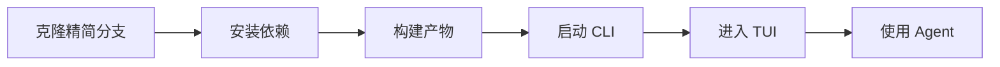
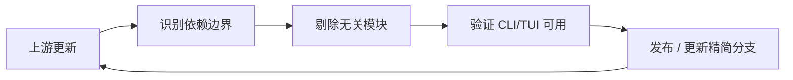

# 痛点拆解：从完整工作台仓库中剥离出纯净的 CLI / TUI

> 核心痛点（一句话）：**只用终端的开发者在「想获取并使用 ZCode 的 CLI / TUI」时，因为 CLI/TUI 与桌面端、Web、服务端及周边构建物被耦合在同一个 workspace 里、没有独立的获取路径，导致必须完整安装并构建一整套自己根本不需要的东西，才能拿到唯一想要的那部分。**
>
> 来源：`painpoints/pp1.md`（补全：精简分支形态 / 剔除范围为桌面端+Web+Server+周边构建物 / 动因是产品上不需要桌面端） ｜ 拆解时间：2026-09-22

## 1. 痛点分支

- **痛点 A：安装被无关依赖直接阻塞** —— electron 的 postinstall 需要从 GitHub 拉取二进制，当前网络下连接超时，整个 install 失败，CLI/TUI 一步都走不到。
- **痛点 B：代价与需求严重不匹配** —— 目标只是终端形态，却要承担整个工作台（桌面端 + Web + 服务端 + 周边资源）的体积、安装耗时与构建复杂度。
- **痛点 C：边界不可见** —— 不清楚哪些模块是 CLI/TUI 真正依赖的、哪些可以安全移除；凭感觉做减法会把 CLI 一起弄坏，且坏在运行时才发现。
- **痛点 D：保真诉求** —— 想要上游「原原本本」的 CLI/TUI 实现，不接受被二次封装与改造后的形态。
- **痛点 E：长期维护成本** —— 一旦做成精简分支，每次上游更新都要把减法重做一遍，冲突会持续累积。

## 2. 词性拆解

### 2.1 名词（Entities）

| 实体          | 含义                                               | 角色                      | 状态 |
| ------------- | -------------------------------------------------- | ------------------------- | ---- |
| CLI           | 终端命令行入口 `zcode`，以及它承载的 Agent 能力    | 客体（**保留**）          | 持久 |
| TUI           | 终端内的交互界面                                   | 客体（**保留**）          | 持久 |
| Agent Runtime | CLI 内嵌的 Agent 运行时与工具链                    | 客体（**保留**）          | 持久 |
| 桌面端模块    | Electron 桌面应用及其整条 electron 依赖链          | 客体（**剔除**）          | 持久 |
| Web 模块      | 浏览器工作台前端及其构建链                         | 客体（**剔除**）          | 持久 |
| Server 模块   | 后端服务（是否被 CLI/TUI 依赖尚未确认，见第 9 章） | 客体（**剔除 / 待确认**） | 持久 |
| 精简分支      | 做完减法后长期维护的那条分支                       | 主体（**产物**）          | 持久 |

> 「周边构建物」（remote assets / mock-cdn / native-search 预编译二进制 / SEA 与 bytecode 产物）不单列为业务实体：它们是**派生物**，随保留侧与剔除侧的边界变化而变化，故落在 3.2 的数据结构中单独表达。

### 2.2 动词（Actions）

| 动作         | 触发                     | 终结状态                                                     | 时序          |
| ------------ | ------------------------ | ------------------------------------------------------------ | ------------- |
| 克隆仓库     | 用户主动                 | 完整工作台落地到本地                                         | #1            |
| 识别依赖边界 | 用户主动（精简分支特有） | 得到「保留 / 剔除」清单                                      | #2            |
| 剔除无关模块 | 用户主动（精简分支特有） | 模块从 workspace 与依赖图中移除                              | #3            |
| 安装依赖     | 用户主动                 | 触发所有 workspace 的 install 脚本（含 electron 二进制拉取） | #4            |
| 构建产物     | 用户主动                 | 生成各包 dist 与运行资源                                     | #5            |
| 准备运行资源 | 系统被动                 | 生成 mock-cdn / remote assets                                | #6            |
| 启动 CLI     | 用户主动                 | 命令可用                                                     | #7            |
| 进入 TUI     | 用户主动                 | 交互界面就绪，Agent 可用                                     | #8            |
| 同步上游     | 用户主动（长期循环）     | 精简分支与上游重新对齐                                       | #9（回到 #2） |

### 2.3 形容词 / 副词（Rules）

| 限定词                 | 含义                                                     | 限定对象                       |
| ---------------------- | -------------------------------------------------------- | ------------------------------ |
| **都**（「都剔除掉」） | 全量性 —— 剔除必须是完整的、可验证的，不能只剔一部分     | 限定「剔除」这个动作的完备程度 |
| **只需要**             | 排他性 / 最小集 —— CLI + TUI 是唯一目标，其余皆非目标    | 限定保留侧的边界               |
| **原原本本**           | 保真性 —— 保留上游 CLI/TUI 的原始实现与行为，不做改造    | 限定保留侧的代码与行为         |
| **不要那么花里胡哨**   | 简洁性 —— 产物只保留终端形态，不接受 GUI 与冗余能力      | 限定最终产物的形态             |
| **乱七八糟**           | 边界模糊 —— 剔除对象**无法被枚举**，这是本痛点的关键歧义 | 限定剔除对象本身               |
| 精简分支（长期）       | 持续同步 —— 减法不是一次性动作，而是反复执行的过程       | 限定维护方式                   |

## 3. 名词衍生：核心指标 & 数据结构

### 3.1 核心指标

| 指标               | 计算方式                                                   | 业务意义                                                                  | 度量频率                |
| ------------------ | ---------------------------------------------------------- | ------------------------------------------------------------------------- | ----------------------- |
| **安装成功率**     | 成功完成的 install 次数 ÷ 尝试次数                         | 直接对应痛点 A：只要还有无关依赖参与安装，这个指标就会被外部网络/环境拖垮 | 每次安装                |
| **安装依赖体积**   | clone 后安装产物的总字节数，精简前后对比                   | 对应痛点 B：衡量「只需要 CLI/TUI」是否真的兑现为体积下降                  | 每次同步上游后          |
| **安装耗时**       | `clone → 可启动 CLI` 的墙钟时间中位数                      | 终端用户的真实等待成本，也是与完整工作台的对照基线                        | 每次同步上游后          |
| **构建耗时**       | 从零构建到 CLI/TUI 可用的总时长                            | 对应痛点 B：区分「安装瘦了但构建没瘦」的假性达标                          | 每次同步上游后          |
| **CLI/TUI 可用率** | 能够启动并完成一次基本会话的次数 ÷ 尝试次数                | 对应痛点 C：减法做错时，这个指标是唯一不会被静态检查骗过的信号            | 每次同步上游后 + 发布前 |
| **残留引用数**     | 保留侧代码中指向已剔除模块的 import / workspace 引用命中数 | 对应痛点 C：把「都剔除」从感觉变成可数的证据                              | 每次同步上游后          |
| **上游同步冲突数** | 一次同步中产生冲突的文件数                                 | 对应痛点 E：直接量化精简分支的长期维护成本                                | 每次同步上游            |

> 反向检验：**残留引用数**翻倍 → 说明上游引入了新的跨模块耦合，减法正在失效，必须立刻介入；**CLI/TUI 可用率**跌破 100% → 精简分支已不可发布，需回滚到上一个同步点。

### 3.2 数据结构

```yaml
CliEntry: # 保留侧的入口实体
  name: string # 命令名，如 zcode
  bin_path: string # 可执行入口
  runtime: ref(AgentRuntime)
  exposed_surfaces: ref(TuiSurface)[] # 该入口暴露的终端界面

TuiSurface: # 终端交互面
  id: string
  entry: ref(CliEntry)
  required_capabilities: string[] # 该界面运行所需的能力集

AgentRuntime: # CLI 内嵌运行时
  id: string
  module_refs: ref(Module)[] # 运行时真实依赖的模块集合（边界测绘的产出）
  optional_refs: ref(Module)[] # 仅远程/可选路径使用的模块

Module: # workspace 中的任意模块（保留或待剔除）
  path: string
  kind: keep | remove | pending # pending = 无法静态判定，需人工确认
  referenced_by: ref(Module)[] # 反向引用，判定能否安全剔除的依据
  is_derived_artifact: bool # 见下方 BuildArtifact

RemovedModule: # 剔除记录（可追溯、可回放）
  path: ref(Module)
  reason: string
  decided_at: date
  replaced_by: ref(Module) | null

BuildArtifact: # 派生物 / 临时实体 —— 隐含生成与清理逻辑
  path: string
  produced_by: string # 由哪个构建步骤产生
  required_at_runtime: bool # 是否为 CLI 启动路径所必需
  ttl: string # 生成时机与失效条件

UpstreamSyncPoint: # 精简分支的上游基线
  upstream_ref: string # 做减法所基于的 commit / tag
  synced_at: date
  conflict_files: string[] # 本次同步冲突文件
  boundary_changes: string[] # 上游引入的新跨模块耦合
```

> **临时/派生实体提示**：`BuildArtifact` 与 `UpstreamSyncPoint.boundary_changes` 都带时效性 —— 前者需要「什么时候重新生成 / 什么时候可以删」的清理规则，后者需要「同步后必须重跑边界测绘」的触发规则。这两处是最容易在长期维护中腐烂的地方。

## 4. 动词衍生：业务流程

### 4.1 主流程

获取路径（用户视角）：



维护路径（精简分支特有，长期循环）：



### 4.2 异常流程

| 触发点             | 失败场景                                                           | 系统响应                                                                                 |
| ------------------ | ------------------------------------------------------------------ | ---------------------------------------------------------------------------------------- |
| 安装依赖（#4）     | electron postinstall 从 GitHub 拉二进制超时，install 整体失败      | **当前实际发生**：安装中断，CLI/TUI 完全不可得。响应应为：无关依赖不得参与目标路径的安装 |
| 识别依赖边界（#2） | 把实际被 CLI 依赖的模块误判为「无关」                              | 安装与构建均通过，但 CLI 启动或使用中报模块缺失                                          |
| 识别依赖边界（#2） | 依赖是动态引用（字符串拼接的加载、运行时插件发现），静态分析看不到 | 静态检查全绿，运行时才崩 —— 响应：无法判定的模块必须标记为 pending，禁止静默剔除         |
| 剔除无关模块（#3） | `workspace:*` 协议引用未同步清理                                   | 安装阶段报无法解析依赖                                                                   |
| 剔除无关模块（#3） | 被剔除的构建产物其实是 CLI 启动路径的一部分                        | 启动失败，但源码层面看不出问题                                                           |
| 剔除 Server        | CLI/TUI 实际通过本地 Server 提供能力                               | 命令能跑，但功能残缺 —— 这是最隐蔽的失败模式                                             |
| 同步上游（#9）     | 上游重构目录结构或引入新的跨模块耦合                               | 减法大面积冲突，精简分支停滞                                                             |

### 4.3 决策分支

- `if 模块被 CLI/TUI 直接或间接引用` → **保留**
- `if 模块仅被 CLI 的可选 / 远程路径引用` → **保留但降级为可选依赖**，不进入默认安装路径
- `if 模块与 CLI/TUI 无任何引用关系` → **剔除**
- `if 模块无法静态判定（动态引用、运行时发现）` → **标记 pending 并人工确认**，禁止自动剔除
- `if 同步上游产生冲突且冲突落在保留侧` → **以上游行为为准**，不得为了减法便利而改动保留侧语义
- `if 残留引用数 > 0` → **阻断发布**，回到边界测绘

## 5. 形容词 / 副词衍生：潜在需求

### 5.1 隐含约束

- **「都」⇒ 需要一份可枚举、可验证的模块清单。** 没有清单，「都剔除干净」只是感觉，无法验收。这是先把边界测绘做出来的根本原因。
- **「只需要 CLI + TUI」⇒ 必须算出最小依赖闭包。** 这个集合是计算结果，不是拍脑袋的名单；它同时也是验收基线。
- **「原原本本」⇒ 减法必须发生在 workspace / 构建层，而不是改上游源码。** 一旦开始改保留侧代码，"原原本本" 就当场失效，且后续上游同步会持续冲突。
- **「精简分支」⇒ 减法必须可重复执行。** 一次性手工减法在第二次上游更新时就会失效；隐含需求是「把减法固化成流程」。
- **「不要花里胡哨」⇒ 产物不得残留 GUI 依赖与桌面/浏览器形态。** 隐含需求是产物形态的纯净度校验。
- **「乱七八糟」⇒ 剔除对象的枚举本身就是一项必须交付的工作产物。** 用户无法说出具体有哪些，说明这个清单在现状下并不存在。

### 5.2 边界场景

- **electron 二进制拉取边界** —— 当前网络（GitHub 不可达）下，任何涉及 electron 的安装路径都不可用；隐含「目标路径必须可离线安装」。
- **静态分析边界** —— 动态引用与运行时插件发现是自动测绘的盲区，必须有人工兜底。
- **workspace 协议边界** —— `workspace:*` 引用、catalog、overrides 等配置在剔除时需要同步收敛。
- **包管理器配置边界** —— 当前 `package.json` 中的 `pnpm` 字段（overrides / patchedDependencies）已被 pnpm 10 忽略；精简分支若照搬会继承一个「以为生效实则未生效」的坑。
- **二进制与预编译边界** —— native-search、prebuild、SEA、bytecode 等产物是否被 CLI 启动路径加载，需逐个确认。
- **上游结构变动边界** —— 减法补丁的可移植性上限，就是上游目录结构的稳定程度。

### 5.3 非功能性需求

- **性能**：安装体积、安装耗时、构建耗时相对完整工作台的下降幅度，需给出明确目标值。
- **可用性**：精简分支上 CLI/TUI 的**功能完整度必须与完整工作台一致**（零功能损失），这是「原原本本」的硬性下限。
- **安全 / 合规**：剔除第三方组件后，LICENSE 与 THIRD-PARTY-NOTICES 必须同步收敛 —— 否则精简分支会带着一份与实际依赖不符的声明发布，这是最容易遗漏的合规风险。
- **可观测**：安装失败必须能一眼定位到原因。当前 electron 的失败信息淹没在大量输出中，属于可观测性缺口。

## 6. 功能点拆解（Features）

### F-001: 依赖边界测绘

| 字段         | 内容                                                                      |
| ------------ | ------------------------------------------------------------------------- |
| **功能描述** | 产出 CLI / TUI 的最小依赖闭包，并给出每个模块的保留 / 剔除 / 待确认判定   |
| **痛点溯源** | 痛点 C（边界不可见）；第 1 章                                             |
| **词性溯源** | 名词「CLI / TUI」+ 动词「识别依赖边界」+ 规则「都」（必须可枚举、可验证） |
| **依赖实体** | CLI、TUI、Agent Runtime、各模块（回 3.2 `Module` / `AgentRuntime`）       |
| **依赖功能** | 无                                                                        |
| **优先级**   | P0                                                                        |
| **验证指标** | 残留引用数（回 3.1）                                                      |

### F-002: 剔除桌面端模块

| 字段         | 内容                                                               |
| ------------ | ------------------------------------------------------------------ |
| **功能描述** | 将 Electron 桌面端及其整条依赖链从 workspace 与依赖图中移除        |
| **痛点溯源** | 痛点 A、痛点 B；第 1 章                                            |
| **词性溯源** | 名词「桌面端模块」+ 动词「剔除无关模块」+ 规则「不要那么花里胡哨」 |
| **依赖实体** | 桌面端模块（回 3.2 `RemovedModule`）                               |
| **依赖功能** | F-001                                                              |
| **优先级**   | P0                                                                 |
| **验证指标** | 安装成功率、安装依赖体积（回 3.1）                                 |

### F-003: 剔除 Web 与 Server 模块

| 字段         | 内容                                                                         |
| ------------ | ---------------------------------------------------------------------------- |
| **功能描述** | 移除 Web 工作台与后端服务；若 CLI 对其存在引用，则降级为可选依赖而非直接删除 |
| **痛点溯源** | 痛点 B、痛点 C；第 4.2 节「剔除 Server」异常                                 |
| **词性溯源** | 名词「Web 模块 / Server 模块」+ 动词「剔除无关模块」                         |
| **依赖实体** | Web 模块、Server 模块（回 3.2 `RemovedModule`）                              |
| **依赖功能** | F-001                                                                        |
| **优先级**   | P0                                                                           |
| **验证指标** | CLI/TUI 可用率（回 3.1）                                                     |

### F-004: 剔除周边构建物与资源准备

| 字段         | 内容                                                                                          |
| ------------ | --------------------------------------------------------------------------------------------- |
| **功能描述** | 移除 remote assets、mock-cdn、native-search 预编译、SEA / bytecode 打包等非终端必需的构建环节 |
| **痛点溯源** | 痛点 B；第 5.2 节「二进制与预编译边界」                                                       |
| **词性溯源** | 名词「周边构建物」+ 动词「剔除无关模块」+ 规则「只需要」                                      |
| **依赖实体** | BuildArtifact（回 3.2）                                                                       |
| **依赖功能** | F-001                                                                                         |
| **优先级**   | P1                                                                                            |
| **验证指标** | 构建耗时（回 3.1）                                                                            |

### F-005: 保留侧最小安装路径

| 字段         | 内容                                                                |
| ------------ | ------------------------------------------------------------------- |
| **功能描述** | 提供一条只安装并构建 CLI + TUI 的单一入口，默认完全不触碰被剔除模块 |
| **痛点溯源** | 痛点 A、痛点 B；第 4.1 节「获取路径」                               |
| **词性溯源** | 动词「安装依赖 / 构建产物」+ 规则「只需要」                         |
| **依赖实体** | CLI、TUI、Agent Runtime（回 3.2 `CliEntry`）                        |
| **依赖功能** | F-002、F-003、F-004                                                 |
| **优先级**   | P0                                                                  |
| **验证指标** | 安装耗时、安装成功率（回 3.1）                                      |

### F-006: 上游同步流程

| 字段         | 内容                                                                     |
| ------------ | ------------------------------------------------------------------------ |
| **功能描述** | 把减法固化为可重复执行的流程，使上游更新后能按固定步骤重放并重新测绘边界 |
| **痛点溯源** | 痛点 E；第 4.1 节「维护路径」                                            |
| **词性溯源** | 规则「原原本本」（不改上游源码）+ 名词「精简分支」+ 动词「同步上游」     |
| **依赖实体** | UpstreamSyncPoint（回 3.2）                                              |
| **依赖功能** | F-001                                                                    |
| **优先级**   | P1                                                                       |
| **验证指标** | 上游同步冲突数（回 3.1）                                                 |

### F-007: 功能回归校验

| 字段         | 内容                                                               |
| ------------ | ------------------------------------------------------------------ |
| **功能描述** | 每次减法或同步后，校验 CLI / TUI 的核心路径仍然可用且功能未退化    |
| **痛点溯源** | 痛点 C；第 4.2 节「动态引用」「剔除 Server」异常                   |
| **词性溯源** | 规则「都」（保证剔除完整且无副作用）+ 规则「原原本本」（行为一致） |
| **依赖实体** | CliEntry、TuiSurface（回 3.2）                                     |
| **依赖功能** | F-005                                                              |
| **优先级**   | P0                                                                 |
| **验证指标** | CLI/TUI 可用率（回 3.1）                                           |

### F-008: 许可与声明收敛

| 字段         | 内容                                                                          |
| ------------ | ----------------------------------------------------------------------------- |
| **功能描述** | 剔除第三方组件后同步收敛 LICENSE 与 THIRD-PARTY-NOTICES，使声明与实际依赖一致 |
| **痛点溯源** | 第 5.3 节「安全 / 合规」                                                      |
| **词性溯源** | 规则「只需要」（依赖集缩小 ⇒ 声明集必须同步缩小）                             |
| **依赖实体** | Module（回 3.2）                                                              |
| **依赖功能** | F-002、F-003、F-004                                                           |
| **优先级**   | P2                                                                            |
| **验证指标** | 残留引用数（作为依赖集变化的输入）                                            |

## 7. MVP 启动路径

### Phase 1: MVP（建议 4-6 周）

- **目标**：得到一条不依赖桌面端 / Web / Server / 周边构建物的最小获取路径，且 CLI / TUI 功能零损失。
- **包含功能**：F-001、F-002、F-003、F-005、F-007
- **理由**：这 5 个是全部 P0。F-001 是其余一切的前置（没有边界清单，减法就是盲拆）；F-002 / F-003 直接消除痛点 A 的阻塞源；F-005 把「只需要 CLI/TUI」兑现为一条真实入口；F-007 是防止减法把 CLI 弄坏的唯一保险。
- **验证指标**（回 3.1）：安装成功率 100%、安装依赖体积与安装耗时相对完整工作台显著下降、CLI/TUI 可用率与完整工作台持平。
- **退出条件**：在一台干净环境上连续两次「从零到 CLI 可启动」全部成功，且 CLI/TUI 核心路径回归通过 —— 注意「连续两次」是为了排除缓存造成的假性成功。

### Phase 2: 增强（建议 +4 周）

- **目标**：继续瘦身构建环节，并把减法从一次性动作变成可重复流程。
- **包含功能**：F-004、F-006
- **理由**：两者都依赖 Phase 1 的边界测绘成果；F-006 是精简分支能长期存活的前提，但没有 Phase 1 的清单它无内容可固化。
- **验证指标**：构建耗时下降；上游同步冲突数收敛（回 3.1）。
- **退出条件**：一次完整的上游同步可以在无手工干预下完成，且残留引用数归零。

### Phase 3: 完善（建议 +6 周）

- **目标**：合规声明收敛与长期可维护性打磨。
- **包含功能**：F-008
- **理由**：属于剔除完成后的收尾动作，不影响终端可用性，但对公开发布是硬性要求。
- **验证指标**：声明文件与实际依赖集合的一致性（回 5.3）。
- **退出条件**：所有痛点分支均有对应功能覆盖。

> 阶段时长仅为参考。真正决定能否进入下一阶段的是 —— **P0 是否全部完成 + 验证指标是否达成**，而不是日历。

## 8. 衍生 Issue 建议

- [ ] Issue: **测绘** CLI/TUI 的最小依赖闭包并输出保留/剔除清单（源自：第 3 章 / Feature F-001 / 第 2.2 节动词链 #2）
- [ ] Issue: **移除** Electron 桌面端及其依赖链（源自：第 6 章 / Feature F-002 / 痛点 A / 第 4.2 节安装异常）
- [ ] Issue: **移除** Web 与 Server，或将 CLI 的引用降级为可选（源自：第 6 章 / Feature F-003 / 痛点 B）
- [ ] Issue: **提供** 仅安装并构建 CLI+TUI 的单一入口（源自：第 6 章 / Feature F-005 / 第 4.1 节获取路径）
- [ ] Issue: **建立** CLI/TUI 核心路径回归校验（源自：第 6 章 / Feature F-007 / 第 4.2 节异常流程）

## 9. 待澄清

**含义不清的名词**

- 「乱七八糟的东西」的完整枚举尚未落成清单。用户已确认的范围是「桌面端 + Web + Server + 周边构建物」，但仓库内是否还有未列出的周边模块，需要在 F-001 中一并确认。
- **Server 是否被 CLI/TUI 依赖** —— 这决定它是「可直接剔除」还是「必须保留 / 降级为可选」。这是当前最大的单点不确定性（第 2.1 章已标记为待确认）。
- native-search 预编译二进制、SEA / bytecode 产物是否在 CLI 启动路径上被加载。

**边界模糊的动词**

- 「剔除」的粒度尚未确定：是删掉目录、从 workspace 移除、还是仅从默认安装路径排除？三者的可回滚性差异很大。

**歧义大的限定词**

- **「原原本本」的验收标准** —— 是要求保留侧代码字节一致，还是行为一致？前者约束大得多，会直接决定 F-006 的可行空间。
- 「不要那么花里胡哨」是否也覆盖 CLI 自身的输出样式（即是否要求 TUI 比现状更朴素），还是仅指剔除 GUI 形态。当前按后者理解。

**优先级待确认**

- P0 已达 5 个上限。若 F-003 因 Server 存在依赖而被拆成「部分保留」，需要重新评估它与 F-004 的优先级归属。
- 精简分支的上游基线尚未确定（从哪个 commit / tag 开始做减法），这会影响 F-006 的实现范围。

**已发现的既有风险（与本次需求相邻）**

- 当前 `package.json` 的 `pnpm` 字段（overrides / patchedDependencies）已被 pnpm 10 忽略 —— 精简分支若照搬，会继承一个「补丁以为生效、实则未生效」的隐患。

> Next step:
>
> - 用 `/rice` 给第 6 章 Feature 打分排序（补齐 Effort 估时），据此复核第 7 章的 P0/P1/P2 是否站得住。
> - 对单个 P0 Feature 用 `/planning` 写实现方案 —— 建议从 **F-001（依赖边界测绘）** 开始，它是其余全部 P0 的前置。
> - 整体路径用 `/pre-mortem` 做风险扫描。
