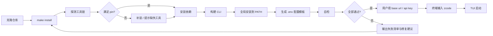

# 痛点拆解：一条命令完成安装，改 env 就能用 zcode

> 核心痛点（一句话）：**项目维护者/自建分支使用者** 在 **克隆仓库后要跑起 `zcode`** 时，因为 **安装过程由 `mise` / `pnpm bootstrap` / 全局链接 / `.env` 手工配置等分散步骤组成、且没有任何一步兜底校验**，导致 **每台机器都要重新摸索一遍、失败点（Node 版本、全局 bin 不在 PATH、配置缺失）只有到敲下 `zcode` 那一刻才暴露**。
>
> 来源：`painpoints/pp4.md` ｜ 拆解时间：2026-09-22
>
> 已确认前提：全局安装到 PATH ｜ `prune` 与 `clean` 拆成两个 target ｜ 服务地址与密钥配在项目根 `.env`。

## 1. 痛点分支

- 痛点 A：`make install` 不存在——安装口令分散在 `mise.toml`、`pnpm bootstrap`、README 三处，没有单一入口。
- 痛点 B：安装完 `zcode` 并没有出现在终端——`@zcode/cli` 的 `bin.zcode` 指向仓库内 `dist/zcode.cjs`，仓库外无法调用（当前环境实测 `zcode not found`）。
- 痛点 C：成功与否全靠自己发现——`zcode doctor`（`apps/zcode-cli/packages/cli/src/run.ts:188`）只打印 runtime/version/packaging，**不校验配置连不连得通、`.env` 到底有没有被读到、核心命令是否齐全**。
- 痛点 D：`.env` 全靠手抄 `.env.example`——漏配 `ZCODE_BASE_URL` 时静默回退到默认线上地址（`packages/shared/src/zcodeEndpoint.ts:132`），用户以为自己配了，实际没有。
- 痛点 E：工作区只有清空、没有裁剪——`pnpm clean`（`scripts/clean.mjs`）删的是 `node_modules` 与 `dist` 全量，`make clear` 想要的是"移除多余 npm 包但 `zcode` 仍能跑"。

## 2. 词性拆解

### 2.1 名词（Entities）

| 实体 | 含义 | 角色 | 状态 |
|------|------|------|------|
| 使用者 | 克隆仓库、要跑起 zcode 的人 | 主体 | 持久 |
| Makefile 入口 | 承载 `make install` / `make clear` 的统一入口 | 客体 | 持久 |
| 工具链（Toolchain） | 仓库声明的 Node 24.14.0 / pnpm 10.33.2 | 客体 | 持久 |
| CLI 产物（CliArtifact） | 构建后可供全局调用的 `zcode` 可执行 | 客体 | 持久 |
| 全局 bin 目录 | PATH 中承接 `zcode` 的目录 | 客体 | 持久 |
| 安装配置（InstallConfig） | 项目根 `.env` 中的 base url 与 api key | 客体 | 持久 |
| 工作区（Workspace） | 仓库依赖树（`node_modules` + workspace 包） | 客体 | 持久 |
| 安装自检结果 | 一次 `make install` / `zcode doctor` 产生的通过-失败结论 | 客体 | **临时**（进程级，不落盘） |
| 冗余 npm 包 | 只服务构建/发布/开发期、运行 `zcode` 不需要的包 | 客体 | 持久 |
| 工作区残留 | `node_modules`、`dist` 等可再生成的构建产物 | 客体 | 持久 |

> 保留 7 个业务核心实体（使用者 / Makefile 入口 / 工具链 / CLI 产物 / 安装配置 / 工作区 / 安装自检结果）；`全局 bin 目录`、`冗余 npm 包`、`工作区残留` 记为外围实体。

### 2.2 动词（Actions）

| 动作 | 触发 | 终结状态 | 时序 |
|------|------|----------|------|
| 克隆仓库 | 用户主动 | 工作区存在，依赖未装 | #1 |
| 执行 make install | 用户主动 | 进入安装流水线 | #2（总入口） |
| 探测工具链 | 系统被动 | 判定 Node/pnpm 是否满足 pin | #3 |
| 补装缺失工具 | 系统被动 | 工具链满足 pin | #4 |
| 安装依赖 | 系统被动 | workspace 依赖就位 | #5 |
| 构建 CLI | 系统被动 | 产出 `zcode.cjs` 等产物 | #6 |
| 全局安装 | 系统被动 | `zcode` 进入 PATH | #7 |
| 生成配置模板 | 系统被动 | 项目根存在 `.env`（含 base url / api key 占位） | #8 |
| 读取 env | 系统被动（每次启动） | 解析出 endpoint 与凭证 | #9 |
| 自检 | 系统被动 | 输出通过 / 失败清单 | #10 |
| 输入 zcode | 用户主动 | TUI 启动 | #11 |
| 裁剪依赖 | 用户主动（`make prune`） | 冗余包被移除，`zcode` 仍可运行 | 旁路 |
| 清空工作区 | 用户主动（`make clean`） | 依赖与构建产物清空，回到 #1 状态 | 旁路 |
| 卸载 | 用户主动 | 全局 `zcode` 撤销，回到未安装 | 旁路（反向） |

### 2.3 形容词 / 副词（Rules）

| 限定词 | 含义 | 限定对象 |
|--------|------|----------|
| 太复杂了 | 现有步骤数超出可接受范围 | 安装流程 |
| **之后所有的工作都做好** | 一次命令必须闭环，不能留手工步骤 | 安装流程（最关键规则） |
| 只需要在 env 中配置 | 用户侧唯一手工动作是改配置 | 安装配置 |
| base url 和 api key | 配置的最小必填集合 | 安装配置 |
| **直接在终端输入 zcode** | 任意 cwd 可调用，且不需要 `cd` 或加路径 | CLI 产物 + 全局 bin 目录 |
| 所有多余的 npm 包 | 冗余的判定基准是"运行 zcode 是否还需要" | 工作区 / 冗余 npm 包 |
| 缺失的命令你也可以加上 | 缺失外部命令由工具补齐，不留给用户 | 工具链 + CLI 产物 |
| 删掉 npm 包后仍可用（隐含） | `prune` 不得破坏运行态 | 工作区 |
| 可重复执行（隐含） | 安装/裁剪/清空都必须幂等 | 全部 target |
| 不写入仓库（隐含） | 密钥不进版本库 | 安装配置 |
| 离线可用（由 pp1 继承） | 除 npm 包外不依赖远程资源 | 工具链 + 安装流程 |

> 2.3 是本轮差异化最集中的地方：**"之后所有的工作都做好"** 与 **"直接在终端输入 zcode"** 两条规则，直接决定了后面必须把全局暴露与自检纳入 MVP，而不是当作可选打磨。

## 3. 名词衍生：核心指标 & 数据结构

### 3.1 核心指标

| 指标 | 计算方式 | 业务意义 | 度量频率 |
|------|----------|----------|----------|
| 安装成功率 | `make install` 退出码为 0 的次数 / 总执行次数 | 安装流程是否真的闭环；反向测试：若降到 50%，负责人第一反应是"哪台机器环境又不满足"，说明兜底缺失 | 每次执行 |
| 首次可用耗时 | 克隆完成 → 首次 `zcode` 成功启动 TUI 的墙钟时间 | 新人/新机器的上手成本；数值翻倍即代表新增了手工步骤 | 每次新机安装 |
| 手工步骤数 | 安装过程中需要人工干预的次数 | 核心诉求"所有的工作都做好"的量化对立面；目标恒为 0 | 每次执行 |
| 自检通过率 | 自检项通过数 / 自检项总数 | 失败被提前暴露的程度；反向测试：若恒为 100% 说明自检项太浅 | 每次 `make install` + `zcode doctor` |
| 裁剪释放量 | `make prune` 前后 `node_modules` 体积差与包数差 | `make clear` 的实际收益；若差值趋近 0，说明冗余判定口径失效 | 每次 `make prune` |
| 裁剪后可用性 | `make prune` 后 `zcode` 仍可启动的比例 | 防止裁剪把运行态必需包误删；必须恒为 100% | 每次 `make prune` |

### 3.2 数据结构

```yaml
# 工具链声明：安装前的环境前置条件（新实体，建议由 scripts/ 下单一来源导出）
ToolchainSpec:
  node: string              # "24.14.0"，与 mise.toml / .nvmrc / engines 对齐
  pnpm: string              # "10.33.2"，与 packageManager 对齐
  requiredCommands: [string] # 安装流程自身依赖的外部命令，如 sytem 上的 make、git

# 安装流水线单次执行的计划与结果（临时实体：进程级，不落盘，无 TTL 需求）
InstallPlan:
  steps: [InstallStep]      # 顺序执行的步骤
  mode: enum(install, prune, clean, doctor)  # 同一入口的不同 target
InstallStep:
  name: string              # 步骤名，如 "probe-toolchain"
  status: enum(pending, running, ok, failed, skipped)
  detail: string            # 失败时的原因；成功时可为空
  durationMs: number

# 全局暴露的产物（新实体）
CliArtifact:
  entry: string             # 仓库内绝对路径，如 apps/zcode-cli/packages/cli/dist/zcode.cjs
  version: string           # 来自 CLI 构建，对应 zcode --version
  linkedTarget: string      # 全局 bin 目录中的落点路径
  exposedAt: datetime

# 安装配置（新实体：项目根 .env，不进版本库）
InstallConfig:
  envFile: ref(File)        # 项目根 .env
  baseUrl: string           # ZCODE_BASE_URL
  apiKey: string            # 模型服务凭证；不落日志、不入库
  endpoints:                # 可选覆盖，缺省时回落到内置默认值
    bigModelApiBaseUrl: string   # BIGMODEL_API_BASE_URL
    zaiOAuthOrigin: string       # ZAI_OAUTH_ORIGIN

# 工作区与冗余包（复用现有 node_modules / pnpm 结构）
Workspace:
  root: path
  packages: [ref(Package)]
  prunedAt: datetime?
Package:
  name: string
  scope: enum(runtime, build, release, dev)  # runtime 保留；其余为 prune 候选
  sizeBytes: number
```

> 说明：`InstallPlan` 为临时实体（进程级），不落盘、无 TTL 需求；若后续要跨进程复用（例如 `make install` 失败后由 `zcode doctor` 复读），需要显式落盘并定义过期策略。

## 4. 动词衍生：业务流程

### 4.1 主流程



### 4.2 异常流程

| 触发点 | 失败场景 | 系统响应 |
|--------|----------|----------|
| 探测工具链 | 系统 Node 版本 ≠ pin（当前实测为 v22.23.2，仓库要求 24.14.0） | 明确报出版本期望与实际，给出补装命令；不进入构建 |
| 探测工具链 | 无 `mise`（当前环境实测 `no mise`） | 走纯 node/pnpm 路径继续，并提示版本自担风险 |
| 全局安装 | 全局 bin 目录不在 PATH（当前 `pnpm bin -g` 报错） | 报出目录路径 + 该加哪一行 shell 配置；仍尝试通过绝对路径自检 |
| 全局安装 | 目标目录无写权限 | 报出路径与权限，给出 `sudo` 或换目录选项；不静默失败 |
| 幂等重跑 | 已存在旧版 `zcode` 链接 | 覆盖并保留版本变更记录，不产生重复条目 |
| 安装依赖 | 网络/registry 不可达 | 输出可重试的失败点，已完成的步骤不重跑 |
| 构建 CLI | 构建失败 | 输出失败包名与原始错误；不进行全局安装（避免暴露半成品） |
| 生成配置模板 | 项目根已存在 `.env` | **不覆盖**，仅提示已存在与缺失的键名 |
| 读取 env | `ZCODE_BASE_URL` 缺失 | 当前实现静默回退默认线上地址（`zcodeEndpoint.ts:132`）→ 自检中改为显式提示 |
| 读取 env | api key 缺失或为空 | 自检标记失败，提示需要填写的键名；不落日志 |
| 自检 | 任一核心项失败 | 退出码非 0，输出"哪一项 / 期望什么 / 怎么修" |
| 裁剪依赖 | 误判 package 为冗余 | 裁剪后必须复跑自检；自检失败则回滚本次裁剪 |
| 清空工作区 | 有未提交的本地改动或未保存上下文 | 仅清 `node_modules` 与 `dist` 等产物目录，不触碰源码与 git 状态 |

### 4.3 决策分支

- `if 系统已安装 mise` → 用 mise 的 pin 版本执行；`else` → 用系统 node/pnpm 并提示版本差异
- `if 全局 bin 目录 ∈ PATH` → 直接全局安装；`else` → 安装后输出 PATH 配置指引，并把该目录加入自检项
- `if 项目根 .env 已存在` → 只校验不覆盖；`else` → 从 `.env.example` 生成
- `if target == prune` → 删构建/发布/开发期包，随后强制自检；`if target == clean` → 删 `node_modules` 与 `dist`，不做自检
- `if 自检发现 `.env` 未被读到` → 提示 CLI 的 `.env` 查找是从 cwd 逐级向上（`apps/zcode-cli/packages/cli/src/env.ts:50`），全局启动时不在仓库树内

## 5. 形容词 / 副词衍生：潜在需求

### 5.1 隐含约束

- "之后所有的工作都做好" → 隐含**幂等**：重复执行 `make install` 不能产生重复链接、重复写入、重复下载。
- "直接在终端输入 zcode" → 隐含**全局暴露 + PATH 可达**，并且隐含"不依赖当前 cwd 位于仓库内"。
- "只需要在 env 中配置" → 隐含**零交互**：安装过程不得弹出需要人工应答的提示，否则"只需改配置"不成立。
- "所有多余的 npm 包" → 隐含**冗余判定基准**是"运行 `zcode` 是否还需要"，而不是"开发者是否还想用"；这要求先有可用性自检，才能安全裁剪。
- "缺失的命令你也可以加上" → 隐含**工具补齐能力**，且补装动作必须可被拒绝（离线/受限环境不能硬失败）。

### 5.2 边界场景

- **首次安装 vs 重装 vs 升级**：三者共用同一入口，行为必须一致可预期。
- **Node 版本边界**：仓库 pin 24.14.0 与当前系统 v22.23.2 的差异（实测）是第一个会暴露的边界。
- **PATH 边界**：全局 bin 目录存在但与 PATH 不交集（实测 `pnpm bin -g` 直接报该错误）。
- **`.env` 边界（关键）**：CLI 从 cwd 向上寻找 `.env`（`env.ts:50`）。配在**项目根**的 `.env` 只有在 cwd 位于该项目树下时才被读到——这与"任意目录直接输入 zcode"存在张力，见第 9 章。
- **离线边界**：npm registry 之外的远程资源不可达时，安装仍应尽量闭环（承接 pp1 的"不依赖远程资源"）。
- **裁剪边界**：`apps/zcode-cli/pnpm-workspace.yaml` 的 `supportedArchitectures` 会为多平台拉取可选依赖，属于"看似冗余但可能是跨平台必需"的高风险裁剪区。

### 5.3 非功能性需求

- **性能**：`make install` 应可重复执行且第二次显著更快（缓存命中）；`make prune` / `make clean` 应在秒级完成。
- **可用性**：安装失败必须是非零退出码 + 可执行修复建议，不允许"看似成功但 `zcode` 不可用"。
- **安全 / 合规**：api key 只进项目根 `.env` 且必须被 `.gitignore` 覆盖；安装与自检日志不得回显 key；全局链接不得把密钥写入产物。
- **可观测**：每个步骤输出"开始 / 结果 / 耗时"；自检输出结构化结果，支持 `--json` 以复用现有 `zcode doctor --json` 形态。

## 6. 功能点拆解（Features）

### F-001: 统一 Makefile 入口
| 字段 | 内容 |
|------|------|
| **功能描述** | 提供 `make install` / `make prune` / `make clean` / `make doctor` 等目标，用户只需记一条命令（注：仓库当前无 Makefile） |
| **痛点溯源** | 痛点 A（第 1 章）/ 核心痛点 |
| **词性溯源** | 名词"Makefile 入口" + 动词"执行 make install" + 规则"太复杂了" |
| **依赖实体** | Makefile 入口、工具链、CLI 产物、安装配置 |
| **依赖功能** | 无（编排层，F-002 ~ F-006 均挂在其下） |
| **优先级** | P0 |
| **验证指标** | 手工步骤数（回 3.1） |

### F-002: 收敛环境前置
| 字段 | 内容 |
|------|------|
| **功能描述** | 探测 Node/pnpm/必需外部命令是否满足 pin，缺失或版本不符时补装或给出明确补装指令 |
| **痛点溯源** | 痛点 A / 痛点 C |
| **词性溯源** | 名词"工具链" + 动词"探测工具链""补装缺失工具" + 规则"缺失的命令你也可以加上" |
| **依赖实体** | 工具链 |
| **依赖功能** | F-001 |
| **优先级** | P0 |
| **验证指标** | 安装成功率、手工步骤数（回 3.1） |

### F-003: 一键构建并全局暴露
| 字段 | 内容 |
|------|------|
| **功能描述** | 构建 `@zcode/cli` 产出可执行产物，并安装到全局 bin 目录，使任意 cwd 下输入 `zcode` 可用；重复执行幂等覆盖 |
| **痛点溯源** | 痛点 B / 核心痛点 |
| **词性溯源** | 名词"CLI 产物"+"全局 bin 目录" + 动词"构建 CLI""全局安装" + 规则"直接在终端输入 zcode" |
| **依赖实体** | CliArtifact、全局 bin 目录、工作区 |
| **依赖功能** | F-002 |
| **优先级** | P0 |
| **验证指标** | 首次可用耗时、手工步骤数（回 3.1） |

### F-004: 生成并校验安装配置
| 字段 | 内容 |
|------|------|
| **功能描述** | 从 `.env.example` 生成项目根 `.env`（已存在则不覆盖），校验 `ZCODE_BASE_URL` 与 api key 是否填写、是否能被 CLI 真正读到 |
| **痛点溯源** | 痛点 D / 核心痛点 |
| **词性溯源** | 名词"安装配置" + 动词"生成配置模板""读取 env" + 规则"只需要在 env 中配置 base url 和 api key" |
| **依赖实体** | InstallConfig |
| **依赖功能** | F-001 |
| **优先级** | P0 |
| **验证指标** | 自检通过率（回 3.1） |

### F-005: 安装自检
| 字段 | 内容 |
|------|------|
| **功能描述** | 把现有 `zcode doctor`（`run.ts:188`，当前只报 runtime/version/packaging）扩展为安装自检：工具链版本、全局命令可达性、`.env` 是否被解析、端点解析结果、必需命令齐备性；失败时给修复建议并返回非零退出码 |
| **痛点溯源** | 痛点 C / 核心痛点 |
| **词性溯源** | 名词"安装自检结果" + 动词"自检" |
| **依赖实体** | 安装自检结果、工具链、CliArtifact、InstallConfig |
| **依赖功能** | F-002、F-003、F-004 |
| **优先级** | P0 |
| **验证指标** | 自检通过率、安装成功率（回 3.1） |

### F-006: 裁剪冗余依赖
| 字段 | 内容 |
|------|------|
| **功能描述** | `make prune`：移除只服务构建/发布/开发期的 npm 包，保留运行 `zcode` 所需闭包；裁剪后强制复跑自检，失败即回滚 |
| **痛点溯源** | 痛点 E / 核心痛点（用户明确要求 `make clear` 的这一半语义） |
| **词性溯源** | 名词"工作区"+"冗余 npm 包" + 动词"裁剪依赖" + 规则"所有多余的 npm 包" |
| **依赖实体** | Workspace、Package、冗余 npm 包 |
| **依赖功能** | F-005（无自检则不敢裁） |
| **优先级** | P1 |
| **验证指标** | 裁剪释放量、裁剪后可用性（回 3.1） |

### F-007: 清空工作区
| 字段 | 内容 |
|------|------|
| **功能描述** | `make clean`：清空 `node_modules` 与 `dist` 等产物目录，回到可重新安装的干净状态；只删产物，不动源码与 git 状态 |
| **痛点溯源** | 痛点 E / 核心痛点（`make clear` 的另一半语义） |
| **词性溯源** | 名词"工作区残留" + 动词"清空工作区" + 规则"删掉 npm 包后仍可用"的反向 |
| **依赖实体** | Workspace、工作区残留 |
| **依赖功能** | F-001 |
| **优先级** | P1 |
| **验证指标** | 裁剪释放量、安装成功率（回 3.1） |

### F-008: 缺失命令兜底清单
| 字段 | 内容 |
|------|------|
| **功能描述** | 安装过程中发现其他必需外部命令缺失（如 `make`、`git`）时，统一收集并在一次安装结束时给出补齐指令，而不是逐个中断 |
| **痛点溯源** | 核心痛点（"所有的工作都做好"） |
| **词性溯源** | 动词"补装缺失工具" + 规则"如果有其他缺失的命令你也可以加上" |
| **依赖实体** | ToolchainSpec.requiredCommands |
| **依赖功能** | F-002 |
| **优先级** | P1 |
| **验证指标** | 手工步骤数、安装成功率（回 3.1） |

### F-009: 离线 / 受限网络降级
| 字段 | 内容 |
|------|------|
| **功能描述** | registry 或远程资源不可达时，安装流程给出可重试的失败点、跳过非必需步骤并明确告知哪些能力将不可用 |
| **痛点溯源** | 核心痛点（继承 pp1 的"除 npm 包外不依赖远程资源"） |
| **词性溯源** | 规则"离线可用"+"缺失的命令你也可以加上"的受限形态 |
| **依赖实体** | ToolchainSpec、Workspace |
| **依赖功能** | F-002 |
| **优先级** | P2 |
| **验证指标** | 安装成功率（回 3.1） |

### F-010: 卸载全局安装
| 字段 | 内容 |
|------|------|
| **功能描述** | 撤销全局 `zcode` 链接与生成产物，回到未安装状态，便于验证"从零安装"路径 |
| **痛点溯源** | 痛点 B（反向路径） |
| **词性溯源** | 动词"卸载"（反向动作） |
| **依赖实体** | CliArtifact、全局 bin 目录 |
| **依赖功能** | F-003 |
| **优先级** | P2 |
| **验证指标** | 首次可用耗时（回 3.1） |

> 功能数量说明：10 个 Feature，超出"单痛点默认 3-8"的上限。理由见第 9 章。

## 7. MVP 启动路径

### Phase 1: MVP（建议 2-3 周）
- **目标**：验证"克隆 → `make install` → 填 `.env` → 终端输入 `zcode` 可用"这条最小闭环成立
- **包含功能**：F-001, F-002, F-003, F-004, F-005
- **理由**：五个 P0 共同构成"一条命令把所有工作做好"的最小完备集——编排（F-001）没有环境前置会失败、没有构建暴露则 `zcode` 不可用、没有配置校验则用户以为配好了、没有自检则失败无法归因。任何一项缺失，"直接在终端输入 zcode"这条核心规则都不成立。
- **验证指标**：手工步骤数 = 0、安装成功率、首次可用耗时、自检通过率（回 3.1）
- **退出条件**：连续 3 台不同机器（含 macOS 与 Linux）执行 `make install` 均以退出码 0 结束，且安装后 `zcode doctor` 自检项全部通过；首次可用耗时进入可接受区间且波动 < 20%

### Phase 2: 增强（建议 +2 周）
- **目标**：补齐用户明确要求的"清理"能力与缺失命令兜底
- **包含功能**：F-006, F-007, F-008
- **理由**：F-006 强依赖 F-005（无自检就不敢裁剪）；F-007 与 F-006 语义互斥，拆成两个 target 后互不影响；F-008 复用 F-002 的探测结果
- **验证指标**：裁剪释放量、裁剪后可用性、手工步骤数（回 3.1）
- **退出条件**：`make prune` 后 `zcode` 启动成功率保持 100%，且 `node_modules` 体积下降可量化；`make clean` 后可再次 `make install` 成功

### Phase 3: 完善（建议 +2 周）
- **目标**：覆盖受限环境与反向路径
- **包含功能**：F-009, F-010
- **理由**：均为边缘场景，不影响主闭环成立，但在内网/离线环境会成为阻断项
- **验证指标**：安装成功率（回 3.1）
- **退出条件**：断网条件下 `make install` 能给出明确的可恢复失败点；`make uninstall` 后 `which zcode` 为空且可重新安装成功

## 8. 衍生 Issue 建议

- [ ] Issue: 新增 Makefile 并定义 install/prune/clean/doctor 目标（源自：第 6 章 / Feature F-001 / 第 4.1 节主流程）
- [ ] Issue: 实现工具链探测与缺失命令补装提示（源自：第 6 章 / Feature F-002 / 第 4.2 节异常流程）
- [ ] Issue: 构建 zcode 并安装到全局 bin 目录（源自：第 6 章 / Feature F-003 / 第 4.2 节异常流程）
- [ ] Issue: 生成项目根 .env 模板并校验 base url 与 api key（源自：第 6 章 / Feature F-004 / 第 5.2 节 .env 边界）
- [ ] Issue: 扩展 zcode doctor 为安装自检并返回非零退出码（源自：第 6 章 / Feature F-005 / 第 3.1 节自检通过率）

## 9. 待澄清

- **`.env` 位置与全局启动存在直接冲突（最高优先）**：已确认配置配在**项目根 `.env`**，但 CLI 是从进程 cwd 逐级向上寻找 `.env`（`apps/zcode-cli/packages/cli/src/env.ts:50`）。而"直接在终端输入 zcode"意味着 cwd 可能在任意目录。两者不可同时成立，除非：(a) 安装时同时把关键变量写入 shell profile；(b) 支持 `ZCODE_ENV_FILE` 之类的显式路径指向项目根 `.env`；(c) 接受"必须在仓库目录下启动"。**需要从中选一**，否则 F-004 的验收无法定义。
- **"多余的 npm 包"的判定口径未定**：是按 `package.json` 的 `devDependencies` / 构建脚本引用，还是按运行时实际 require 闭包？`apps/zcode-cli/pnpm-workspace.yaml` 的 `supportedArchitectures` 会引入跨平台可选依赖，是否算冗余需确认（第 5.2 节裁剪边界）。
- **`make clear` 的 target 命名**：已确定 `prune` / `clean` 分开，但具体叫什么名字、是否保留 `make clear` 作为兼容别名待确认。
- **Feature 数量超限说明**：本次为 10 个（超单痛点默认 3-8）。理由：用户在同一条诉求里明确要求了两类能力（一键安装 + 工作区清理），其中 `make clear` 自身又分裂为语义互斥的两个 target。若需收敛，建议把 F-009、F-010 移出本痛点范围单独立项。
- **P0 数量为 5，处于上限**：F-001 ~ F-005 每一个都是"去掉之后核心规则不成立"的必要项，非分摊结果。若需进一步压缩 MVP，唯一可讨论的是把 F-005（自检）降级为验收手段而非独立 Feature，但那样 F-006 的裁剪将失去安全网。
- **是否需要支持 Windows**：`apps/zcode-cli/pnpm-workspace.yaml` 声明了 win32 架构，但 Makefile 本身在 Windows 上不可用。若目标环境不含 Windows，可显式声明不支持以简化 F-002。
- **离线要求的强度**：pp1 提出"除 npm 包之外不要依赖远程资源"。本痛点的 F-009 只做了降级处理，是否需要做到完全离线安装（内置 npm 缓存）待确认。

> Next step:
> - 用 `/rice` 给第 6 章 Feature 打分排序（补齐 Effort 估时），据此复核第 7 章的 P0/P1/P2 是否站得住。
> - 对单个 P0 Feature 用 `/planning` 写实现方案（建议先做 F-003「一键构建并全局暴露」，它单独就能消掉最大的一条痛点 B）。
> - 整体路径用 `/pre-mortem` 做风险扫描。
