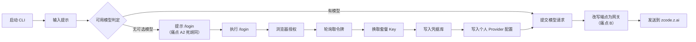
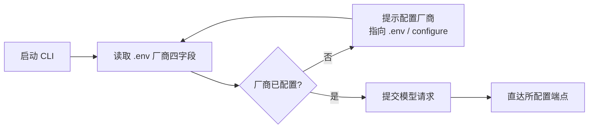

# 痛点拆解：移除登录态体系与 zcode.z.ai 运行时回连

> 核心痛点（一句话）：把 zcode 当**通用工具**用的使用者与维护者，因为代码里同时带着一整套**登录态体系**（命令面、OAuth 流程、凭据库、登录门禁）和一条**隐式的平台网关改写**，导致工具被迫需要一个账号概念、且即使用户只填了普通 API Key 也会被静默改道经 `zcode.z.ai` 转一手并接受平台侧套餐校验。
>
> 来源：`painpoints/pp8.md` ｜ 拆解时间：2026-09-22

---

## 0. 拆解前的一处事实订正（影响结论）

原始输入把两件事并列为一件：**"删登录"** 与 **"代码不和默认端点 `https://zcode.z.ai` 有任何关系"**。经代码核实，这两件事的**承载体不同、危险度也不同**：

|                  | "删登录" 的真实承载体                                                                                                                                           | "与 zcode.z.ai 有关" 的真实承载体                                                                                                                              |
| ---------------- | --------------------------------------------------------------------------------------------------------------------------------------------------------------- | -------------------------------------------------------------------------------------------------------------------------------------------------------------- |
| 位置             | `bootstrap/src/auth-login*.ts`、`cli/src/{login-command,tui-auth,command-center/login-flow}.ts`、`adapters/src/auth/{cli-oauth,coding-plan-api-key,browser}.ts` | `adapters/src/model/official-coding-plan-gateway.ts:22-31`、`config/provider/zcode-builtin.json:747/810/832/854`、`cli-oauth.ts:4`、`coding-plan-api-key.ts:4` |
| 性质             | **用户可见的产品面**（多出来的命令与文案）                                                                                                                      | **运行时网络行为**（静默改道 + 平台侧权益校验）                                                                                                                |
| 是否需登录才生效 | 是                                                                                                                                                              | **否** —— 普通 API Key 也会命中                                                                                                                                |

**关键事实**：`official-coding-plan-gateway.ts` 按「协议 + 主机 + 端口 + 路径」**精确匹配**两个官方端点，把请求改写为 `{endpoint}/api/v1/ultra[-zai]/anthropic/v1/messages`。本仓库当前 `.env` 配置的 `ZCODE_VENDOR_BASE_URL=https://open.bigmodel.cn/api/anthropic` 恰好命中第一条路由 —— 也就是说**此刻的模型流量已经在经 `zcode.z.ai` 转发**，与是否登录无关。**这才是"通用工具"承诺被破坏的实际位置**；删掉 `/login` 并不会让这一条消失。

另有三处易被误判的耦合，经核实**不构成**删除阻碍：

- `runtime-config.ts` 全文 305 行**不含任何 auth 引用**（纯 MCP / hooks / 模型选择合并），无需改动。
- `config-home/mcp.ts` 与 `zcode-protocol/mcp.ts` 都**不 import** `zcodeEndpoint.ts`，删登录不影响它们。
- 本仓库**没有任何 `*.test.ts` / `*.spec.ts`**（`test/` 下只有三个独立 `.mjs` 脚本，且均不涉及 auth）→ **登录/登出/凭据刷新当前零自动化覆盖**，任何删除都无测试兜底。

> 已与你确认的三项范围决策（下文据此展开）：
>
> 1. **删除范围**＝命令层 + 流程层（保留 MCP OAuth 与其共用的凭据库）。
> 2. **`zcodeEndpoint.ts`**＝保留文件，只摘登录专属导出。
> 3. **网关改写**＝断掉，请求直达所配置端点。

---

## 1. 痛点分支

- **痛点 A（登录态体系对通用工具是负担）**：使用者在使用一个不需要账号的通用工具时，因为命令面里带着 `/login`、`/logout`、`zcode login|logout`，因为启动链上带着"未登录即拦截所有非斜杠输入"的门禁，也因为凭据库、账号族、权益（entitled）这些概念渗透进了模型注册表，导致工具多出一整套与用途无关的账号语义。
  - **A1 命令面残留**：斜杠命令、CLI 子命令、帮助文案、保留名门禁四处各自独立登记，删一处不删其余会留下"帮助里还写着 `/login`，敲了却没反应"。
  - **A2 门禁判据错位**：判据并非"未登录"，而是**"模型注册表里没有任何可选模型"**（`create.ts:384-391`；`tui-login-state.ts:15` 读 `disabledReason`，而 `model-catalog-port.ts:76-81` 明确注明该字段**恒缺席**）。删掉 `/login` 后，该门禁的文案仍然指向一个已不存在的命令 → **死胡同**。
  - **A3 账号概念渗透**：凭据型 Provider 的 `entitled` 快照、账号族（`bigmodel` / `zai`）作为凭据层定位键、`standalone-account-provider-runtime` 的运行时请求头注入，使"能否出模型"与"是否有账号"绑定。
- **痛点 B（运行时经 zcode.z.ai 静默回连）**：使用者以为自己把请求发给了所配置的厂商，因为网关改写对官方端点精确命中，导致请求实际落到 `zcode.z.ai`，由平台完成套餐权益校验后再转发，且这一行为**不依赖登录态**、对用户不可见。

---

## 2. 词性拆解

### 2.1 名词（Entities）

| 实体       | 含义                                                                   | 角色 | 状态                      |
| ---------- | ---------------------------------------------------------------------- | ---- | ------------------------- |
| 用户       | 使用通用工具的人（不需要账号）                                         | 主体 | 持久                      |
| 厂商配置   | `.env` 四字段（VENDOR / BASE_URL / API_KEY / MODEL）解析后的确定性事实 | 客体 | 持久                      |
| 凭据       | 加密落盘的账号令牌或内联 API Key                                       | 客体 | 持久                      |
| 登录会话   | OAuth 流程产出的令牌集合（access / refresh / user）                    | 客体 | **临时**（有 TTL 与刷新） |
| 端点       | 一次模型请求实际发出的 origin                                          | 客体 | 持久                      |
| 模型请求   | 一次发往模型的 HTTP 调用                                               | 客体 | **临时**                  |
| 登录命令面 | `/login`、`/logout` 与 `zcode login\|logout` 构成的命令定义            | 客体 | 持久                      |

> 裁剪说明：`账号族`、`entitled 快照`、`保留名门禁`、`MCP OAuth 令牌` 未单列为业务核心实体 —— 前三者分别是"凭据""模型请求"的属性与派生判定，后者**不属于本痛点的删除范围**（见 5.1 隐含约束）。

### 2.2 动词（Actions）

按时间序排列（当前路径）：

| 动作                   | 触发     | 终结状态                                       | 时序 |
| ---------------------- | -------- | ---------------------------------------------- | ---- |
| 启动 CLI               | 用户主动 | 进入 TUI，加载 `.env` 与厂商配置               | #1   |
| 输入提示               | 用户主动 | 触发门禁判定                                   | #2   |
| 判定可用模型           | 系统被动 | 无可选模型 → 拦截；有 → 放行                   | #3   |
| 执行 `/login`          | 用户主动 | 打开授权页                                     | #4   |
| 轮询授权结果           | 系统被动 | 取得 access / refresh 令牌                     | #5   |
| 换取套餐 API Key       | 系统被动 | 取得 provider 级 Key                           | #6   |
| 写入凭据库             | 系统被动 | 凭据加密落盘（`~/.zcode/v2/credentials.json`） | #7   |
| 写入个人 Provider 配置 | 系统被动 | 注册表出现可选模型                             | #8   |
| 提交模型请求           | 用户主动 | 请求进入发送链                                 | #9   |
| **改写端点为网关**     | 系统被动 | 请求目标变为 `zcode.z.ai` ← **痛点 B**         | #10  |
| 发送请求               | 系统被动 | 返回响应                                       | #11  |
| 执行 `/logout`         | 用户主动 | 凭据清除                                       | #12  |

> 时序观察：**#10 位于 #11 之前、且与 #4–#8 无依赖**。这是痛点 A 与痛点 B 可以解耦、且必须分别拆除的形式化依据 —— 删掉 #4–#8 不会触动 #10。

### 2.3 形容词 / 副词（Rules）

| 限定词                   | 含义                                                               | 限定对象            |
| ------------------------ | ------------------------------------------------------------------ | ------------------- |
| **通用**（工具）         | 用途不绑定任何账号或厂商                                           | 整个工具的能力边界  |
| **不需要**               | 可从产品面移除，不损害通用用途                                     | 登录 / 鉴权 / 登出  |
| **不应该有任何关系**     | 零耦合；不仅是"默认值可覆盖"，而是不存在隐式回连                   | 代码 ↔ `zcode.z.ai` |
| **默认**（端点）         | 未显式配置即回连 —— **缺省值本身就是回连行为**                     | 端点解析            |
| **等**（命令）           | 命令面是**整体**，非单个 `/login`                                  | 登录命令面          |
| **加密**（凭据）         | 落盘为密文、0600、跨进程加锁 → **与 MCP OAuth 共用，构成删除边界** | 凭据                |
| **精确匹配**（网关路由） | 按协议+主机+端口+路径全等命中，不做后缀猜测                        | 端点改写            |
| **静默**（改道）         | 用户无感知，无日志、无提示                                         | 端点改写            |
| **未登录即拦截**         | 门禁规则；实际判据是"无可选模型"                                   | 提示输入            |

> 2.3 是本次痛点的富矿：**"默认"** 与 **"不应该有任何关系"** 直接冲突 —— 只要 `DEFAULT_ZCODE_ENDPOINT_ORIGIN` 存在且被用作缺省，就不满足"零耦合"；**"静默"** 与 **"精确匹配"** 共同解释了为什么这条回连长期未被发现。

---

## 3. 名词衍生：核心指标 & 数据结构

### 3.1 核心指标

| 指标                       | 计算方式                                                                                      | 业务意义                           | 度量频率 |
| -------------------------- | --------------------------------------------------------------------------------------------- | ---------------------------------- | -------- |
| **登录命令可达数**         | 命令注册表 + 子命令分派 + 帮助文案 + 保留名门禁中 `login`/`logout` 的出现处计数（目标 **0**） | 通用工具纯度：用户不会遇到账号概念 | 每次发版 |
| **零账号首请求成功率**     | 冷启动、仅填 `.env` 四字段、磁盘无任何账号凭据时，成功完成一次模型请求的比例（目标 **100%**） | 量化"开箱即用"，替代原来的登录前置 | 每次发版 |
| **请求经 zcode.z.ai 占比** | 网关改写命中数 ÷ 模型请求总数（目标 **0%**）                                                  | **直接度量痛点 B 是否真的断了**    | 日       |
| **门禁死胡同文案数**       | 提示文案中指向已删命令的条目数（目标 **0**）                                                  | 防止删命令后留下无出路提示         | 每次发版 |
| **门禁自助解决率**         | 门禁出现后，用户经 `/configure` 或改 `.env` 自行解决的比例                                    | 门禁是否指向了正确出路             | 周       |

> **反向测试**：
>
> - 「请求经 zcode.z.ai 占比」翻倍 → 负责人的第一反应是"谁又把网关改回去了？我们承诺过不回连" → 指标有效。
> - 「零账号首请求成功率」腰斩 → "新用户装完跑不通" → 指标有效。
> - 「门禁自助解决率」无意义时（无法回答翻倍后的反应）→ 说明门禁本身该被移除而非改写，见 §9。

### 3.2 数据结构

```yaml
VendorConfig: # 持久；.env 四字段解析后的确定性事实
  vendorId: string # 内置厂商 id 或 custom
  kind: coding-plan | api-key # coding-plan 型依赖凭据层（删登录后失去获取途径，见 §9）
  baseUrl: string
  model: string
  apiKey: string # 内联；api-key 型与自建端点才有

Credential: # 持久；加密落盘，与 MCP OAuth 共用同一文件
  scope: ref(CredentialScope)
  value: string # "enc:v1:" 前缀密文

CredentialScope: # 持久；区分登录态与 MCP —— 删除边界所在
  family: oauth-login | mcp # 删登录后仅剩 mcp
  owner: string

LoginSession: # 临时；OAuth 流程产物，隐含 TTL / 刷新 / 清理
  accessToken: string
  refreshToken: string
  expiresAt: string

EndpointRouting: # 持久；一次请求的实际落点判定
  providerEndpoint: string
  effectiveUrl: string
  viaGateway: boolean # 断掉改写后恒为 false（即指标"经 zcode.z.ai 占比"= 0 的观测点）

ModelRequest: # 临时；一次模型调用
  url: ref(EndpointRouting)
  headers: map
  model: string

LoginCommandSurface: # 持久；命令面定义（删登录后应不存在）
  name: string
  aliases: [string]
  registeredAt: [help | subcommand | reservedName]
```

> **临时实体提示**：`LoginSession` 与 `ModelRequest` 为临时实体，隐含 TTL / GC / 清理逻辑 —— 前者是删除的主要对象，后者是验证"不回连"的观测载体。

---

## 4. 动词衍生：业务流程

### 4.1 主流程（现状，含两处痛点）



### 4.2 主流程（目标态）



> 两图对照即本次拆除的验收基线：`F` 与 `M` 之间不再存在改写节点，`D→F→J` 整条登录链消失。

### 4.3 异常流程

| 触发点            | 失败场景                                                     | 系统响应                                                                                       |
| ----------------- | ------------------------------------------------------------ | ---------------------------------------------------------------------------------------------- |
| 厂商解析          | 四字段全空（删登录后这是门禁的**唯一**触发条件）             | 提示指向 `/configure` 与 `.env` 四字段，**不得**再出现 `/login`                                |
| 凭据库读取        | 磁盘残留 `oauth:bigmodel:*` / `oauth:zai:*` 登录键（老用户） | 忽略，不参与厂商解析，**不阻塞启动**（见 §9 待确认处置口径）                                   |
| `zcode configure` | baseUrl 命中 coding-plan 端点，但登录流程已删                | **明确报错**并给出手动 provider 配置指引，不静默写入半套配置                                   |
| 模型请求          | URL 命中官方端点（网关改写已断）                             | 原样直达 provider 端点；套餐权益校验交由 provider 侧，客户端不介入                             |
| MCP OAuth         | 依赖共用凭据库与 localhost 回调                              | **不受影响** —— 凭据 scope 保持独立，`localhost-callback.ts` 与 `shared-credentials.ts` 均保留 |
| 端点常量          | 登录专属导出被摘除后仍有引用                                 | 编译期即暴露（TS 报错），不进入运行时                                                          |

### 4.4 决策分支

- `if 配置了 ZCODE_VENDOR` → 用内置清单定位端点（端点由清单带出）
- `if 只配置了 BASE_URL` → 视为自建厂商，不做清单校验
- `if VENDOR 与 BASE_URL 二者端点不一致` → **报错**，不静默取其一（既有设计，需保持）
- `if 命中 coding-plan 型厂商且磁盘无凭据` → 提示改用 api-key 型或自建端点（新增分支，见 §9）
- `if 请求 URL 命中官方端点` → **目标态：原样发送**，不经网关

---

## 5. 形容词 / 副词衍生：潜在需求

### 5.1 隐含约束

- **"通用工具"** → 不引入账号概念：命令面与所有面向用户的文案中不得出现 `login` / `logout` / "登录" / "登出"。
- **"删除的时候包括 /login 等命令"** → **"等"字是整体量化**：命令面在四处独立登记（斜杠命令解析、CLI 子命令分派、i18n 帮助文案、保留名门禁 `isReservedZCodeSlashCommandName`）。删一处不删其余 = 残留。
- **"不应该有任何关系"** → 强于"默认值可覆盖"：**存在隐式缺省本身就是违反**。
- **"加密"（凭据）** → 删除**必须止步于 scope 边界**：`shared-credentials.ts` / `credential-cipher.ts` / `localhost-callback.ts` 为 MCP OAuth 共用，删除会连带打断 MCP 服务器登录。
- **原输入"如果有质疑和疑问可以问我"** → 触发本次拆解前的范围确认（已确认三项）。

### 5.2 边界场景

- **磁盘已有凭据的老用户**：`oauth:*` 与 `account-provider:*` 键仍在 `~/.zcode/v2/credentials.json`。
- **已登录用户的模型注册表**：`entitled` 快照驱动的凭据型 Provider 在删除后是否仍出模型。
- **`zcode configure` 的 coding-plan 分支**：`configureCodingPlanApiKey` 属登录流程，会随流程层一并消失，但它是**非登录**写入口径（`--api-key`）的一部分。
- **官方 MCP origin**：`zcode-protocol-entrypoint.ts:194-198` 仍以 `resolveRuntimeZCodeEndpointOrigin()` 作为可信 origin。
- **每个模型请求的 `HTTP-Referer`**：`zcode-source-headers.ts` 仍引用 `DEFAULT_ZCODE_ENDPOINT_ORIGIN`。
- **内置 provider 配置下载**：仍从 `{endpoint}/api/v1/client/configs` 拉取（`credentials: "omit"`，不依赖登录）。
- **插件市场**：使用 `cdn-zcode.z.ai`（**不同主机**，不由本文件派生），不在本次范围。
- **transcript 脱敏**：`app-submit.ts:293-300` 对 `/login *-api-key <secret>` 做掩码，命令删后成为死规则。

### 5.3 非功能性需求

- **性能**：断掉网关改写后请求链路**少一跳** —— 首字节延迟应可见下降（可作为拆除生效的旁证）。
- **可用性**：`zcode.z.ai` 不可用时，**不得**影响任何已配置厂商的请求（当前经网关则受影响）。
- **安全**：凭据库保持 AES-256-GCM 加密 + 0600 + 跨进程文件锁；**删除登录不得降级 MCP 凭据的加密强度**。
- **合规**：不再默认回连境外端点。
- **可观测**：需要一条"本次请求是否经网关"的**确定性信号**，用于把指标「请求经 zcode.z.ai 占比」验到 0%。
- **可维护性**：本仓库零单元测试，拆除需以**可执行的验收关卡**替代回归保障（见 F-007）。

---

## 6. 功能点拆解（Features）

### 6.1 痛点 A 的功能点

#### F-001: 移除登录命令面

| 字段         | 内容                                                                      |
| ------------ | ------------------------------------------------------------------------- |
| **功能描述** | 用户在使用通用工具时，不再看到、也无法调用任何登录/登出命令与相关帮助文案 |
| **痛点溯源** | 痛点 A / A1                                                               |
| **词性溯源** | 名词"登录命令面" + 动词"执行 `/login`" + 规则"等（命令）"                 |
| **依赖实体** | `LoginCommandSurface`、`VendorConfig`（回 3.2）                           |
| **依赖功能** | 无                                                                        |
| **优先级**   | **P0**                                                                    |
| **验证指标** | 登录命令可达数 = 0（回 3.1）                                              |

#### F-002: 重定位无模型门禁

| 字段         | 内容                                                                                                                      |
| ------------ | ------------------------------------------------------------------------------------------------------------------------- |
| **功能描述** | 当模型注册表没有任何可选模型时，提示用户去配置厂商（指向 `configure` 与 `.env` 四字段），而不是指向一个已不存在的登录命令 |
| **痛点溯源** | 痛点 A / A2                                                                                                               |
| **词性溯源** | 名词"登录命令面" + 规则"未登录即拦截" + 异常流程"门禁死胡同"                                                              |
| **依赖实体** | `VendorConfig`（回 3.2）                                                                                                  |
| **依赖功能** | F-001（命令面删除后才构成死胡同）                                                                                         |
| **优先级**   | **P0**                                                                                                                    |
| **验证指标** | 门禁死胡同文案数 = 0；门禁自助解决率（回 3.1）                                                                            |

#### F-003: 剥离登录流程与 OAuth 客户端

| 字段         | 内容                                                                                                                     |
| ------------ | ------------------------------------------------------------------------------------------------------------------------ |
| **功能描述** | 系统不再内置任何面向自身账号的授权流程（浏览器授权、轮询、令牌换 Key、凭据写入），厂商凭据只能来自用户显式提供的 API Key |
| **痛点溯源** | 痛点 A / A3                                                                                                              |
| **词性溯源** | 动词"轮询授权结果 / 换取套餐 Key / 写入凭据库" + 规则"不需要"                                                            |
| **依赖实体** | `LoginSession`（临时，随之消失）、`Credential`（回 3.2）                                                                 |
| **依赖功能** | F-001                                                                                                                    |
| **优先级**   | **P0**                                                                                                                   |
| **验证指标** | 零账号首请求成功率 = 100%（回 3.1）                                                                                      |

#### F-004: 收编凭据层为 MCP 专用

| 字段         | 内容                                                                                                            |
| ------------ | --------------------------------------------------------------------------------------------------------------- |
| **功能描述** | 凭据存储与加密能力继续服务于 MCP 服务器的 OAuth，但不再承载工具自身的账号令牌；登录态专属的凭据键被清出存储契约 |
| **痛点溯源** | 痛点 A / A3                                                                                                     |
| **词性溯源** | 名词"凭据" + 规则"加密的（与 MCP 共用）"                                                                        |
| **依赖实体** | `Credential`、`CredentialScope`（回 3.2）                                                                       |
| **依赖功能** | F-003                                                                                                           |
| **优先级**   | P1                                                                                                              |
| **验证指标** | MCP OAuth 凭据读写不受影响（负向断言：`mcp:oauth:*` 键仍可落盘与读取）                                          |

#### F-005: 保全非登录写入口径

| 字段         | 内容                                                                                                                              |
| ------------ | --------------------------------------------------------------------------------------------------------------------------------- |
| **功能描述** | 用户仍可用纯 API Key 方式完成厂商配置写入（含 `configure --api-key`），且当所选端点是账号型套餐端点时得到**明确指引**而非半套配置 |
| **痛点溯源** | 痛点 A / A3；异常流程"configure 命中 coding-plan 端点"                                                                            |
| **词性溯源** | 动词"写入个人 Provider 配置" + 规则"通用（工具）"                                                                                 |
| **依赖实体** | `VendorConfig`、`Credential`（回 3.2）                                                                                            |
| **依赖功能** | F-003、F-001                                                                                                                      |
| **优先级**   | P1                                                                                                                                |
| **验证指标** | 零账号首请求成功率 = 100%（覆盖 `configure` 路径，回 3.1）                                                                        |

### 6.2 痛点 B 的功能点

#### F-101: 断开网关端点改写

| 字段         | 内容                                                                                       |
| ------------ | ------------------------------------------------------------------------------------------ |
| **功能描述** | 用户配置的模型请求直接发往所配置厂商的端点，不再被静默改道至平台网关，也不经平台侧套餐校验 |
| **痛点溯源** | 痛点 B                                                                                     |
| **词性溯源** | 名词"端点" + 动词"改写端点为网关" + 规则"精确匹配 / 静默 / 默认（端点）"                   |
| **依赖实体** | `EndpointRouting`、`ModelRequest`（回 3.2）                                                |
| **依赖功能** | 无                                                                                         |
| **优先级**   | **P0**                                                                                     |
| **验证指标** | 请求经 `zcode.z.ai` 占比 = 0%（回 3.1）                                                    |

#### F-102: 摘除端点文件的登录专属导出

| 字段         | 内容                                                                                                                                                     |
| ------------ | -------------------------------------------------------------------------------------------------------------------------------------------------------- |
| **功能描述** | 端点解析模块只保留与模型访问、内置配置下载、诊断相关的公开面；登录授权与商务（OAuth origin / clientId、business、billing、share 回调）相关的导出不再存在 |
| **痛点溯源** | 痛点 B（输入第 3 行"不应该有任何关系"）                                                                                                                  |
| **词性溯源** | 名词"端点" + 规则"不应该有任何关系"                                                                                                                      |
| **依赖实体** | `EndpointRouting`（回 3.2）                                                                                                                              |
| **依赖功能** | F-003（调用方随流程层一并消失）                                                                                                                          |
| **优先级**   | P1                                                                                                                                                       |
| **验证指标** | 登录命令可达数 = 0（同源断言）；端点模块公开面无登录语义（回 3.1）                                                                                       |

#### F-103: 解除内置配置中的官方端点硬编码

| 字段         | 内容                                                                                             |
| ------------ | ------------------------------------------------------------------------------------------------ |
| **功能描述** | 内置厂商清单不再内置指向平台网关的模型端点，账号型套餐条目要么移除、要么改为不依赖平台网关的形态 |
| **痛点溯源** | 痛点 B                                                                                           |
| **词性溯源** | 名词"端点" + 规则"默认（端点）"                                                                  |
| **依赖实体** | `VendorConfig`、`EndpointRouting`（回 3.2）                                                      |
| **依赖功能** | F-101（改写断了之后这些端点才有意义去处理）                                                      |
| **优先级**   | P1                                                                                               |
| **验证指标** | 请求经 `zcode.z.ai` 占比 = 0%（回 3.1）                                                          |

### 6.3 清理与验证

#### F-006: 清理零调用登录残留

| 字段         | 内容                                                                                                    |
| ------------ | ------------------------------------------------------------------------------------------------------- |
| **功能描述** | 代码库中不再保留任何已有零调用者的登录/账号遗留（死导出、失效文案、冗余配置加载、仅登录用到的埋点字段） |
| **痛点溯源** | 痛点 A / A1（残留面）                                                                                   |
| **词性溯源** | 名词"登录命令面" + 规则"等（命令）"                                                                     |
| **依赖实体** | `LoginCommandSurface`、`LoginSession`（回 3.2）                                                         |
| **依赖功能** | F-003、F-004、F-102                                                                                     |
| **优先级**   | P2                                                                                                      |
| **验证指标** | 静态检查零错误；登录命令可达数 = 0（回 3.1）                                                            |

#### F-007: 建立「零账号可用」验收关卡

| 字段         | 内容                                                                                                             |
| ------------ | ---------------------------------------------------------------------------------------------------------------- |
| **功能描述** | 提供一条可执行验收：断言命令面无登录入口、断言模型请求无一经平台网关、断言仅凭 `.env` 四字段即可完成一次模型请求 |
| **痛点溯源** | 痛点 A + 痛点 B（复合来源）                                                                                      |
| **词性溯源** | 名词"厂商配置" + 规则"通用（工具）/ 不应该有任何关系"                                                            |
| **依赖实体** | `VendorConfig`、`EndpointRouting`、`ModelRequest`（回 3.2）                                                      |
| **依赖功能** | F-001、F-002、F-003、F-101（全部 P0 完成后才有稳定基线）                                                         |
| **优先级**   | P2                                                                                                               |
| **验证指标** | 上列五条指标全部达标（回 3.1）                                                                                   |

> **派生理由（§9 要求）**：本 Feature 为**复合来源** —— 由指标「请求经 zcode.z.ai 占比」+ 边界场景「本仓库零单元测试」+ 既有工程模式（`test/offline-acceptance.mjs` 的断网验收关卡）三者合成。之所以保留为独立 Feature 而非并入 P0：本痛点**没有任何自动化测试兜底**，拆除若不配可执行断言，回连会以静默方式复发（这正是它当初未被发现的原因）。

---

## 7. MVP 启动路径

> 说明：本输入含**两个独立痛点**，路径按 **P0 严重度跨痛点合流** —— 两个痛点的 P0 一并进入 Phase 1。

### Phase 1: MVP（建议 2-3 周）

- **目标**：通用工具不再要求账号概念，且模型请求不再静默回连平台网关 —— 两个核心痛点同时闭合
- **包含功能**：F-001、F-002、F-003、F-101
- **理由**：全部为 P0，均可独立或低依赖交付。F-101 与 F-001/002/003 **完全无耦合**（见 2.2 时序观察），可并行推进。F-002 必须与 F-001 同批 —— 否则会短暂出现"提示指向已删命令"的死胡同（指标 3.1 第 4 条即为此设）
- **验证指标**：登录命令可达数 = 0；门禁死胡同文案数 = 0；零账号首请求成功率 = 100%；请求经 `zcode.z.ai` 占比 = 0%
- **退出条件**：以上四条指标在**连续两次发版**中稳定达标；且手工验证"仅填 `.env` 四字段、磁盘无任何账号凭据"时冷启动可完成一次模型请求

### Phase 2: 增强（建议 +2 周）

- **目标**：收拢剩余耦合面与边界场景，补齐异常路径的明确指引
- **包含功能**：F-004、F-005、F-102、F-103
- **理由**：均依赖 Phase 1（F-102 依赖 F-003 的调用方先消失；F-005 依赖 F-003 决定 `configure` 分支形态）。覆盖边界场景「老用户磁盘残留凭据」「`configure` 的套餐端点分支」「内置清单官方端点」
- **验证指标**：零账号首请求成功率维持 100%；MCP OAuth 凭据链路无回归
- **退出条件**：MCP OAuth 登录/刷新手工走通一次；`configure --api-key` 对普通与自建端点均写入成功

### Phase 3: 完善（建议 +1 周）

- **目标**：清理死代码，并为"不回连"建立可执行防线
- **包含功能**：F-006、F-007
- **理由**：P2，且 F-007 需在 P0 全部落地、基线稳定后才可断言。解决本仓库零测试覆盖下"回连静默复发"的风险
- **验证指标**：验收关卡全绿；五项指标全部达标
- **退出条件**：`test/` 下新增关卡在 CI/本地一键可跑，且**故意注入一次网关改写后能失败**（防假绿）

> 阶段时长仅为参考 —— 决定进入下一阶段的是 **P0 是否全部完成 + 验证指标是否达标**，而非日历。

---

## 8. 衍生 Issue 建议

- [ ] Issue: **移除登录/登出命令面及其帮助文案**（源自：第 6.1 章 / Feature F-001 / 第 2.1 节"登录命令面"）
- [ ] Issue: **重定位无模型门禁的判据与文案**（源自：第 6.1 章 / Feature F-002 / 第 1 节痛点 A2、第 4.3 节异常流程）
- [ ] Issue: **剥离登录 OAuth 流程与凭据写入链**（源自：第 6.1 章 / Feature F-003 / 第 2.2 节时序 #4–#8）
- [ ] Issue: **断开官方端点的平台网关改写**（源自：第 6.2 章 / Feature F-101 / 第 2.3 节规则"静默 / 精确匹配"）

---

## 9. 待澄清

### 9.1 本次已确认的范围（无需再答，记录备查）

删除范围＝命令层 + 流程层（保留 MCP OAuth 及其共用凭据库）；`zcodeEndpoint.ts` 保留文件、只摘登录专属导出；网关改写断掉。

### 9.2 删除后仍需你决策的开放式问题

1. **coding-plan 型厂商的去留（本次未选"连厂商一并移除"，但会留下缺口）**。
   登录流程删除后，`ZCODE_VENDOR=bigmodel` / `zai` 这类**账号型套餐**厂商**失去取得凭据的唯一途径** —— 而它们目前是 `.env.example` 声明的**默认值**（裸 `bigmodel` 被映射为个人套餐）。三种处置口径：
   - (a) 保留清单条目，仅对"磁盘已有凭据"的老用户可用（新用户会走到 F-005 的报错指引）；
   - (b) 把默认值改为 api-key 型厂商（如 `bigmodel-standard`），账号型条目降为"仅老用户"；
   - (c) 移除账号型条目（即被否掉的第三选项）。
     **当前 MVP 路径按 (a) 展开**；若选 (b)，`.env.example` 与内置清单需同步调整，属 Phase 2。

2. **老用户磁盘残留凭据的处置口径**：`~/.zcode/v2/credentials.json` 中的 `oauth:bigmodel:*` / `oauth:zai:*` / `account-provider:*` 键 —— 静默忽略、启动时清理、还是写迁移说明？（影响 §4.3 第 2 行的异常响应）

3. **`DEFAULT_ZCODE_ENDPOINT_ORIGIN` 仍作为每个模型请求的 `HTTP-Referer` 发出** —— 这是输入第 3 行"不应该有任何关系"**尚未覆盖**的一处残余耦合（`zcode-source-headers.ts`）。是否也一并解除，还是仅保留"不作为请求目标"这一层？

4. **内置 provider 配置仍从 `{endpoint}/api/v1/client/configs` 下载**（`credentials: "omit"`，不依赖登录）。这算不算"与 zcode.z.ai 有关系"？若算，需要一条离线/自带的兜底来源。

5. **官方 MCP origin 仍由 `resolveRuntimeZCodeEndpointOrigin()` 决定**（`zcode-protocol-entrypoint.ts:194-198`）。端点默认值若变动，会**静默改变**官方 MCP 鉴权接受哪些 origin —— 是否纳入本次范围？

### 9.3 名词 / 动词 / 限定词的模糊处

- **名词**"鉴权"（原输入用词）：是指**面向工具自身账号**的鉴权（已确认为删除对象），还是也包含**模型请求的 provider 鉴权**（`Authorization` / `x-api-key` 注入，**必须保留**）？本次按前者理解，后者明确保留。
- **动词**"删除"：是删除**代码**，还是同时删除**用户磁盘上的既有凭据**？本次按"删除代码 + 忽略残留"理解（见 9.2 第 2 条）。
- **限定词**"通用工具"：指"不绑定账号"，还是"不绑定任何特定厂商"？本次按**不绑定账号**理解；若含后者，则内置厂商清单本身需重新设计（超出本次范围）。

> Next step:
>
> - 用 `/rice` 给第 6 章 Feature 打分排序（补齐 Effort 估时），据此复核第 7 章的 P0/P1/P2 是否站得住 —— 尤其 F-002 是否被低估（它是唯一防"死胡同"的功能）。
> - 对单个 P0 Feature 用 `/planning` 写实现方案；建议先做 **F-101** —— 它与其余三者零耦合、收益最直接，且能立刻用指标「请求经 zcode.z.ai 占比」验证。
> - 整体路径用 `/pre-mortem` 做风险扫描；重点扫描 9.2 第 1 条（coding-plan 缺口）与"零测试覆盖下的静默复发"。
