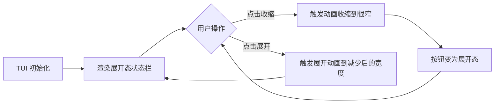

# 痛点拆解：右侧状态栏可收缩

> 核心痛点（一句话）：TUI 用户在使用 zcode 时，右侧状态栏占用固定宽度，在窄终端或需要更大编辑空间时无法收起，导致有效屏幕空间被浪费。
>
> 来源：`painpoints/pp12.md` ｜ 拆解时间：2026-09-23

## 1. 痛点分支

- 痛点 A：窄终端（如笔记本 13寸、垂直分屏）下，固定宽度的右侧状态栏挤占编辑区，阅读和编码空间不足。
- 痛点 B：用户在不同工作场景下需要动态切换界面布局，目前状态栏宽度静态固定，无法按需调整。
- 痛点 C：状态栏内容较多时（如长模型名、token 统计），压缩显示可以减少视觉干扰，用户更专注于主编辑区。

## 2. 词性拆解

### 2.1 名词（Entities）
| 实体 | 含义 | 角色 | 状态 |
|------|------|------|------|
| 右侧状态栏 | TUI 右侧的信息展示区域 | 客体 | 持久 |
| 收缩按钮 | 触发状态栏收起交互的控件 | 主体（用户操作对象） | 持久 |
| 展开按钮 | 触发状态栏展开交互的控件 | 主体（与收缩按钮为同一控件的两种状态） | 持久 |
| 编辑区 | TUI 主内容区域 | 客体 | 持久 |
| 屏幕空间 | 终端可视区域 | 上下文 | 临时 |

### 2.2 动词（Actions）
| 动作 | 触发 | 终结状态 | 时序 |
|------|------|----------|------|
| 减少宽度 | 用户主动或配置驱动 | 状态栏宽度收窄到目标值 | #1 |
| 收缩 | 用户点击按钮或快捷键 | 状态栏切换到收起态，宽度降至最小 | #2 |
| 展开 | 用户点击按钮或快捷键 | 状态栏切换到展开态，宽度恢复预设值 | #3 |
| 加上按钮 | 开发者新增 UI 元素 | 收缩/展开有了可见的操作入口 | #4 |

### 2.3 形容词 / 副词（Rules）
| 限定词 | 含义 | 限定对象 |
|--------|------|----------|
| 很窄 | 收缩后的目标宽度，保留极小信息量或仅图标 | 收缩态宽度 |
| 减少后的宽度 | 展开态的目标宽度，小于默认宽度 | 展开态宽度 |
| 固定 | 当前状态栏宽度不可调 | 宽度属性 |
| 动态 | 用户可按需切换 | 布局切换行为 |

## 3. 名词衍生：核心指标 & 数据结构

### 3.1 核心指标
| 指标 | 计算方式 | 业务意义 | 度量频率 |
|------|----------|----------|----------|
| 右侧状态栏宽度（px） | 渲染层实际像素值 | 直接反映空间占用 | 每次渲染 |
| 收缩耗时（ms） | 动画开始到结束的时间差 | 用户等待感 | 每次交互 |
| 按钮点击转化率 | 展开后点击收缩的比率 | 用户使用意愿 | 周 |
| 编辑区有效宽度（px） | 总宽 - 状态栏宽 - 左侧栏宽 | 用户实际可用空间 | 每次布局变化 |

### 3.2 数据结构
```yaml
StatusBarLayout:
  isCollapsed: boolean           # 当前是否处于收缩态
  expandedWidth: number          # 展开态宽度（px）
  collapsedWidth: number         # 收缩态宽度（px）
  animationDuration: number      # 动画时长（ms）

StatusBarEntry:
  type: 'model' | 'token' | 'custom'
  label: string
  visibleWhenCollapsed: boolean  # 收缩态下是否保留显示

LayoutState:
  currentWidth: number
  targetWidth: number
  transitionState: 'idle' | 'animating'
```

## 4. 动词衍生：业务流程

### 4.1 主流程


### 4.2 异常流程
| 触发点 | 失败场景 | 系统响应 |
|--------|----------|----------|
| 动画进行中用户再次点击 | 重复触发导致状态错乱 | 动画期间忽略再次点击 |
| 收缩已达最小宽度 | 按钮仍可点击但无可变化 | 按钮禁用态 |
| 终端过窄（宽 < 收缩宽 + 左侧栏） | 收缩无法实现 | 强制最小宽度保护 |
| 状态栏内容在收缩后仍需可见 | 重要信息被裁切 | 提供 tooltip 或 icon 模式 |

### 4.3 决策分支
- `if isCollapsed === true` → 显示展开按钮，状态栏宽度 = collapsedWidth
- `if isCollapsed === false` → 显示收缩按钮，状态栏宽度 = expandedWidth
- `if terminalWidth < expandedWidth + leftBarWidth` → 强制使用 collapsedWidth

## 5. 形容词 / 副词衍生：潜在需求

### 5.1 隐含约束
- 收缩后状态栏仍需保留**基础信息可见性**（如模型名称 icon），否则用户无法感知状态栏存在。
- 展开/收缩应有**平滑过渡动画**（非跳变），提升交互质感。
- 收缩宽度「很窄」意味着保留 **icon 模式**，全文字标签在收缩态下隐藏。

### 5.2 边界场景
- 极窄终端（< 80 列）：即使收缩后编辑区仍不足，需要考虑进一步隐藏左侧栏或降级显示。
- 鼠标/触摸两种交互方式：触摸场景下按钮热区需足够大。
- 快捷键触发：`Ctrl+B` 或类似绑定，供高级用户使用。

### 5.3 非功能性需求
- **性能**: 动画期间不阻塞主线程，布局重算在下一帧完成。
- **可用性**: 按钮状态（正常/禁用）在两种形态下均清晰可辨。
- **可访问性**: 按钮有 `aria-label`，屏幕阅读器可描述当前状态。
- **可观测**: 收缩/展开操作上报埋点，不含敏感信息。

## 6. 功能点拆解（Features）

### F-001: 状态栏宽度配置化
| 字段 | 内容 |
|------|------|
| **功能描述** | 将状态栏宽度从硬编码改为可配置，支持 `expandedWidth` 和 `collapsedWidth` 两个状态值 |
| **痛点溯源** | 痛点 B / 第 2 节 |
| **词性溯源** | 名词"右侧状态栏" + 动词"减少" |
| **依赖实体** | StatusBarLayout |
| **依赖功能** | 无 |
| **优先级** | P0 |
| **验证指标** | 右侧状态栏宽度（px） |

### F-002: 收缩/展开按钮交互
| 字段 | 内容 |
|------|------|
| **功能描述** | 在状态栏添加收缩/展开切换按钮，点击后在两种宽度之间平滑过渡 |
| **痛点溯源** | 痛点 A / 第 2 节 |
| **词性溯源** | 名词"收缩按钮" + 动词"收缩"/"展开" |
| **依赖实体** | StatusBarEntry, LayoutState |
| **依赖功能** | F-001 |
| **优先级** | P0 |
| **验证指标** | 按钮点击转化率 |

### F-003: 快捷键支持
| 字段 | 内容 |
|------|------|
| **功能描述** | 提供键盘快捷键（`Ctrl+B`）触发状态栏收缩/展开，与按钮行为一致 |
| **痛点溯源** | 痛点 A / 第 2 节 |
| **词性溯源** | 副词"动态" + 动词"收缩"/"展开" |
| **依赖实体** | LayoutState |
| **依赖功能** | F-002 |
| **优先级** | P1 |
| **验证指标** | 编辑区有效宽度（px） |

### F-004: 收缩态 icon 模式
| 字段 | 内容 |
|------|------|
| **功能描述** | 收缩态下状态栏内容切换为 icon 模式，hover 显示 tooltip，click 触发展开 |
| **痛点溯源** | 痛点 C / 第 2 节 |
| **词性溯源** | 形容词"很窄" + 名词"右侧状态栏" |
| **依赖实体** | StatusBarEntry |
| **依赖功能** | F-002 |
| **优先级** | P1 |
| **验证指标** | 编辑区有效宽度（px） |

### F-005: 布局边界保护
| 字段 | 内容 |
|------|------|
| **功能描述** | 当终端宽度不足时强制使用最小宽度，防止状态栏挤出编辑区 |
| **痛点溯源** | 痛点 A / 第 2 节 |
| **词性溯源** | 名词"屏幕空间" + 形容词"很窄" |
| **依赖实体** | LayoutState |
| **依赖功能** | F-001 |
| **优先级** | P2 |
| **验证指标** | 编辑区有效宽度（px） |

## 7. MVP 启动路径

### Phase 1: MVP（建议 1-2 周）
- **目标**：实现状态栏宽度的双态配置与按钮切换，完成核心闭环
- **包含功能**：F-001, F-002
- **理由**：F-001 是基础设施，F-002 是用户直接感知的交互，两者构成最小可用单元；收缩/展开的视觉反馈是痛点 A 的直接解法
- **验证指标**：编辑区有效宽度在展开态 ≥ 基线 × 0.8，收缩态 ≥ 基线 × 1.2
- **退出条件**：按钮点击可正常切换两种宽度态，动画流畅无卡顿

### Phase 2: 增强（建议 +1-2 周）
- **目标**：覆盖键盘用户和 icon 模式，提升不同场景下的可用性
- **包含功能**：F-003, F-004
- **理由**：F-003 覆盖键盘用户群体，F-004 提升收缩态的信息保留；两者独立，可并行
- **验证指标**：快捷键使用率 ≥ 20%（对按钮使用的占比）；icon 模式 tooltip 覆盖率 ≥ 90%
- **退出条件**：键盘用户可全程不接触鼠标完成收缩/展开切换

### Phase 3: 完善（建议 +1 周）
- **目标**：处理极端边界场景，完善可访问性和埋点
- **包含功能**：F-005 及可访问性/埋点
- **理由**：极窄终端是少数用户的长尾场景，优先级最低
- **验证指标**：窄终端（< 80 列）下编辑区仍保持可读宽度
- **退出条件**：边界保护触发时无控制台错误

## 8. 衍生 Issue 建议

- [ ] Issue: 实现状态栏宽度配置化（源自：第 6 章 / Feature F-001 / 第 2 节）
- [ ] Issue: 添加收缩/展开按钮并实现动画过渡（源自：第 6 章 / Feature F-002 / 第 2 节）
- [ ] Issue: 接入键盘快捷键 `Ctrl+B` 触发切换（源自：第 6 章 / Feature F-003 / 第 2 节）
- [ ] Issue: 收缩态切换 icon 模式并支持 tooltip（源自：第 6 章 / Feature F-004 / 第 2 节）

## 9. 待澄清

- **「减少后的宽度」具体是多少列或像素？** 当前未定义，需要与 UI 设计确认。
- **动画时长偏好**：0.2s / 0.3s / 0.5s？影响用户体验和实现复杂度。
- **收缩态是否保留任意信息？** 还是完全收起（仅显示 icon）？影响 F-004 的范围。
- **配置持久化**：宽度偏好是否写入用户本地配置（`~/.claude`）？影响数据 schema。
