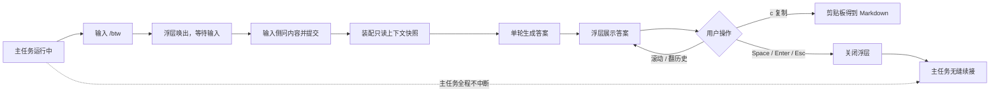

# 痛点拆解：运行中侧问（/btw 式浮层侧问）

> 核心痛点（一句话）：zcode 的终端用户在 **Agent 正在执行长任务**时，因为 **任何输入都会被写进主会话转录并冲击当前 turn**，导致 **想顺口确认一句就必须付出"污染上下文"或"打断任务"的代价，最终选择不问、带着不确定继续，直到下游返工才暴露**。
>
> 来源：`painpoints/pp9.md`（"我想要一个类似于 claude code 的 /btw 功能"）｜ 拆解时间：2026-09-22
>
> 范围澄清（来自用户确认）：
> - 可用时机：**主任务运行中也能用**
> - 记录归属：**完全不写入主会话，纯临时**
> - 工具能力：**不能使用工具，仅凭已有上下文回答，单轮**
> - MVP 交互：**浮层展示 + 关闭**、**上下滚动答案 / 左右翻历史侧问**、**c 复制答案为 Markdown**（`f` 转正为 fork 会话不在 MVP）

## 1. 痛点分支

- 痛点 A（上下文污染）：一次随口确认的问答会永久留在转录里，之后每一轮请求都要为它付费，并可能作为"真实需求"误导后续推理。
- 痛点 B（任务中断）：运行中提问必须排队等待或直接打断当前 turn，长任务的连续性被打断，重新进入状态的成本高。
- 痛点 C（疑问悬空）：不愿付代价就只能不问，用户带着误解继续执行，错误在更下游才暴露，返工成本远高于当初问一句。
- 痛点 D（答案无处安放）：即便在滚动输出里看到了答案，也无法留存或带出会话，看完即忘，下次还得再问一遍——而再问一遍就意味着痛点 A。

## 2. 词性拆解

### 2.1 名词（Entities）

| 实体 | 含义 | 角色 | 状态 |
|------|------|------|------|
| 用户 | 发起侧问的人 | 主体 | 持久 |
| 主会话（MainSession） | 当前对话的完整转录与其上下文预算 | 主体 | 持久 |
| 主任务（Main Turn） | 正在执行中的那一轮 Agent 工作 | 客体 | 临时 |
| 侧问（BtwEntry） | 一次 `/btw` 的提问 + 答案这一对 | 客体 | 临时 |
| 上下文快照（ContextSnapshot） | 侧问作答时读取的主会话只读切片 | 客体 | 临时 |
| 侧问浮层（Overlay） | 挂载在主转录之上、承载答案的显示层 | 客体 | 临时 |
| 侧问历史 | 本次会话内已发生的全部侧问，可左右翻阅 | 客体 | 临时 |

> 粒度说明：`Agent`、`prompt cache`、`工具集` 不是业务实体，是承载约束的运行环境，归入 2.3 限定词与第 5 章，不单列实体。

### 2.2 动词（Actions）

| 动作 | 触发 | 终结状态 | 时序 |
|------|------|----------|------|
| 运行主任务 | 系统主动 | 主任务进行中 | #1 |
| 唤出侧问（输入 `/btw`） | 用户主动 | 浮层出现，等待输入 | #2 |
| 输入侧问内容 | 用户主动 | 侧问草稿就绪 | #3 |
| 提交侧问 | 用户主动 | 主任务**不受影响**，侧问进入生成 | #4 |
| 装配上下文快照 | 系统被动 | 得到一份只读切片 | #5 |
| 生成答案 | 系统被动 | 得到单轮答案（或"无据"态） | #6 |
| 展示浮层 | 系统被动 | 答案可见 | #7 |
| 滚动答案 | 用户主动 | 浮层可视区移动，主转录滚动位置不变 | #8 |
| 翻阅历史侧问 | 用户主动 | 浮层切换到另一条侧问 | #9 |
| 复制答案 | 用户主动 | 剪贴板得到 Markdown 原文 | #10 |
| 关闭浮层 | 用户主动 | 浮层消失，焦点回到主输入框 | #11 |
| 丢弃侧问记录 | 系统主动 | 会话结束/重载后历史清空 | #12 |

> 注意 #4 与 #11 的定义：提交侧问**不得**改变主任务状态，关闭浮层**必须**把焦点还给主输入框。这两条是"不打断"落到动作层面的判据。

### 2.3 形容词 / 副词（Rules）

| 限定词 | 含义 | 限定对象 |
|--------|------|----------|
| 运行中 / 并行 | 主任务正在执行时也可发起 | 动作 #2 的可发起时机 |
| 不打断 | 侧问全程不改变主任务状态 | 动作 #4、#7、#11 |
| 不写入 / 纯临时 | 问答不进入转录、不进上下文预算 | 实体"侧问"的生命周期 |
| 会话内 | 历史侧问的作用域限于当前会话，重载即失效 | 实体"侧问历史"的范围 |
| 单轮 | 一次侧问只有一问一答，无追问 | 动作 #6 的轮数 |
| 无工具 | 不能读文件、跑命令、搜索 | 动作 #6 的能力边界 |
| 顺带 / 一句话 | 侧问的意图类型是轻量确认，不是探索性任务 | 动作 #3 的输入形态 |
| 低成本 | 复用主会话已有上下文前缀，成本接近"只付答案本身" | 动作 #6 的成本约束 |
| 浮层 / 即时 | 展示不占据主转录区、不改变其滚动位置 | 动作 #7 的展示方式 |
| Markdown 原文 | 复制的是答案语义原文，而非终端渲染结果 | 动作 #10 的输出格式 |

## 3. 名词衍生：核心指标 & 数据结构

### 3.1 核心指标

| 指标 | 计算方式 | 业务意义 | 度量频率 |
|------|----------|----------|----------|
| 侧问渗透率 | 发起过 `/btw` 的会话数 ÷ 总会话数 | 判断这是真需求还是"看起来不错"的功能；低于阈值说明唤出入口没被发现 | 周 |
| 人均侧问次数 | 侧问总条数 ÷ 发起过侧问的会话数 | 区分"偶尔一问"与"高频刚需"——决定历史翻阅/复制的投入是否值得 | 周 |
| 主任务中断率 | 侧问期间主 turn 被取消或中断的次数 ÷ 侧问总条数 | 应接近 0；这是"不打断"这条规则**唯一**的验证指标 | 周 |
| 侧问 P95 首字延迟 | 侧问提交 → 首字输出 的 P95 耗时 | 侧问是"顺手一问"，慢了就不会有人用；与主任务延迟分开度量 | 日 |
| 无据拒答率 | 回答中判定"当前上下文不含"的条数 ÷ 侧问总条数 | 过高说明侧问定位被误用（用户真正想要的是子会话/子代理） | 周 |
| 上下文节省量 | Σ(侧问问答 token) 中未进入后续请求的部分 | 这是"不写入"这条规则的收益证明，也是这个功能的存在理由 | 月 |
| 答案采纳率 | (按 `c` 复制 + 关闭后 10 分钟内未重复同类提问) ÷ 侧问总条数 | 答案是否真的解决了疑问；偏低说明答非所问 | 周 |

> **指标反向自检**：侧问渗透率腰斩 → 入口没被发现，或定位不准；主任务中断率翻倍 → "不打断"承诺破产，功能负价值，应立即回滚；无据拒答率翻倍 → 用户把侧问当子代理用了，需要引导或重新界定边界。

### 3.2 数据结构

```yaml
# ---------- 持久实体 ----------
MainSession:
  id: string
  transcript: Message[]        # 主会话转录；侧问永不写入此处
  status: running | idle       # 主任务是否正在执行

# ---------- 临时实体（TTL = 会话生命周期，重载即清） ----------
BtwEntry:
  id: string
  session: ref(MainSession)
  question: string             # 侧问原文
  answer: string | null        # 单轮答案，生成中为 null
  status: pending | streaming | done | refused | failed
  created_at: timestamp
  tokens: number               # 仅供成本统计；不得作为上下文回写主会话

# ---------- 临时实体（TTL = 答案生成完成即释放） ----------
ContextSnapshot:
  session: ref(MainSession)
  taken_at: timestamp
  transcript_offset: number    # 快照对应的转录位置；主任务此后继续前进不影响本次侧问
  readonly: true               # 只读，硬约束

# ---------- 临时实体（TTL = 浮层关闭） ----------
BtwOverlay:
  session: ref(MainSession)
  entries: ref(BtwEntry)[]     # 本次会话全部侧问，按时间排序（≤ 2.1 的"侧问历史"）
  cursor: number               # 左右翻阅指向的条目索引
  scroll: number               # 浮层内的滚动偏移；不影响主转录滚动位置
  focus: overlay | main        # 当前焦点归属
```

> 四类临时实体都带 TTL，各自隐含清理逻辑：`BtwEntry` 随会话销毁、`ContextSnapshot` 在答案产出后即可释放、`BtwOverlay` 在关闭时销毁且**必须**把 `focus` 交还 `main`。

## 4. 动词衍生：业务流程

### 4.1 主流程



### 4.2 异常流程

| 触发点 | 失败场景 | 系统响应 |
|--------|----------|----------|
| 唤出侧问 | 主任务正在流式写入转录，快照边界不稳定 | 以**提交时刻**的转录位置为快照边界；此后主任务新增的内容不并入本次侧问 |
| 提交侧问 | 侧问为空或仅空白 | 直接关闭浮层，不产生 `BtwEntry` |
| 提交侧问 | 用户在生成中再次提交 | 串行排队，按提交顺序可用左右键翻阅；不并发占用 |
| 生成答案 | 上下文不含所需信息 | 回答"当前上下文没有这部分信息"，并指引改用普通提问（普通提问才有工具能力）——即"无据拒答" |
| 生成答案 | 主任务在侧问期间结束 / 报错 / 被取消 | 侧问独立完成并展示；主任务的状态变化不改变侧问结论，反之亦然 |
| 生成答案 | 调用超时或失败 | 浮层展示失败态并保留问题原文，允许重试；失败不计入主会话 |
| 展示浮层 | 答案超出可视高度 | 允许上下滚动；浮层高度设上限，不覆盖主转录区 |
| 展示浮层 | 主任务弹出工具审批 / 提问面板 | 审批面板优先获得焦点；侧问浮层挂起，审批结束后恢复 |
| 关闭浮层 | `Esc` 同时是中断主任务的按键 | 仅当 `focus = overlay` 时 `Esc` 关闭浮层且**不冒泡**，绝不中断主任务 |
| 关闭浮层 | 浮层关闭后焦点未归还 | 硬性要求：焦点必须回到主输入框，否则用户的下一次输入会丢失 |
| 会话结束 / 重载 | 侧问历史丢失 | 预期行为；但需在唤出时明示"本次侧问不会保留"，避免用户误以为可回溯 |

### 4.3 决策分支

- `if 主任务 status = running` → 侧问走并行通道，主任务输出继续
- `if 主任务 status = idle` → 仍走同一条侧问通道，答案同样不写入主会话（即：侧问 ≠ 普通提问）
- `if 上下文快照不含答案依据` → 进入"无据"态，拒绝编造
- `if 侧问历史条数 = 0 或 1` → 左右键无操作，不报错
- `if 用户按 f`（MVP 未开放） → 提示该能力未开放，不静默失败
- `if 用户按 c` → 复制答案的 Markdown 原文（非终端渲染结果）
- `if 终端宽度低于阈值` → 浮层降级为全宽单栏，不截断答案

## 5. 形容词 / 副词衍生：潜在需求

### 5.1 隐含约束

- **"不写入"** ⇒ 需要一条与主转录**完全隔离**的上下文通道。侧问的问答既不能进系统提示、不能进 `/context` 统计、也不能出现在后续任何请求里。少任何一条，"不写入"就不成立。
- **"不打断 / 运行中"** ⇒ 侧问的生命周期必须与主 turn **双向解耦**：主 turn 的完成/报错/取消不连带终止侧问；侧问的任何操作也不改变主 turn 状态。输入焦点与中断信号需要分流。
- **"低成本"** ⇒ 侧问必须复用主会话已有的上下文前缀，且**不得改写该前缀**；否则主会话后续请求的缓存命中率下降，省下的上下文反过来变成更高的成本——这是这个功能最容易翻车的地方。
- **"无工具 / 单轮"** ⇒ 必须显式约束"无据即拒答"。没有工具的模型面对空白会倾向于用看似合理的猜测填补，而一个**看起来对但实际错**的侧问答案，比没有侧问更糟（用户会基于它做决策）。
- **"浮层"** ⇒ 不占用主转录的可视区域与滚动位置；侧问前后主转录的渲染状态必须一致（用户不会因为问了一句话就丢失当前阅读位置）。
- **"Markdown 原文"** ⇒ 复制的是语义原文，不是终端渲染结果；代码块需保留可用的格式（见第 9 章待澄清）。

### 5.2 边界场景

- 侧问历史条数为 0 / 1 / N 时左右键的行为差异
- 答案长度跨越一屏 / 十屏；极窄终端、极矮终端
- 主任务在侧问生成期间**恰好**结束 / 恰好报错 / 恰好弹出审批面板
- 用户在侧问生成中再次按 `/btw`
- 会话重载后再按左右键（历史已清空，应无操作而非报错）
- headless / 非 TTY 模式：没有可渲染的浮层，`/btw` 应如何表现
- 侧问与主任务同时产生输出时的顺序与归属（不能串台）

### 5.3 非功能性需求

- **性能**：侧问 P95 首字延迟显著低于主任务；且**不得**让主任务的输出出现停顿——主任务 token 流的间隔抖动在有无侧问时应无统计学差异。
- **可用性**：侧问的任何失败都不得影响主会话可用性；浮层关闭后主输入框焦点必须恢复。
- **安全 / 合规**：侧问**硬性**不得触发任何工具调用或写操作（无副作用保证）；侧问内容不进入会话历史、不随会话记录上传。
- **可观测**：侧问次数、耗时、无据拒答率、token 成本需可埋点；但埋点**不得记录侧问原文**——否则等同于"写入"。（与"不写入"存在张力，见第 9 章）

## 6. 功能点拆解（Features）

### F-001: 唤出侧问
| 字段 | 内容 |
|------|------|
| **功能描述** | 用户可在任意时刻（含主任务运行中）输入 `/btw` 唤出侧问输入浮层，并提交一条侧问 |
| **痛点溯源** | 痛点 B（任务中断）/ 核心痛点 |
| **词性溯源** | 名词"侧问" + 动词"唤出侧问/输入侧问内容/提交侧问" + 规则"运行中" |
| **依赖实体** | BtwEntry、BtwOverlay（回 3.2） |
| **依赖功能** | 无 |
| **优先级** | P0 |
| **验证指标** | 侧问渗透率、人均侧问次数（回 3.1） |

### F-002: 隔离上下文应答
| 字段 | 内容 |
|------|------|
| **功能描述** | 侧问基于主会话的一份只读快照作答，问答结果不回写主转录、不进上下文预算、不影响后续请求 |
| **痛点溯源** | 痛点 A（上下文污染）/ 核心痛点 |
| **词性溯源** | 名词"主会话/上下文快照" + 动词"装配上下文快照/生成答案" + 规则"不写入、单轮、低成本" |
| **依赖实体** | ContextSnapshot、BtwEntry（回 3.2） |
| **依赖功能** | F-001 |
| **优先级** | P0 |
| **验证指标** | 上下文节省量（回 3.1） |

### F-003: 运行中不打断
| 字段 | 内容 |
|------|------|
| **功能描述** | 侧问的完整生命周期与主任务双向解耦：提交、生成、展示、关闭均不改变主任务状态，关闭后主任务输出无缝续接 |
| **痛点溯源** | 痛点 B（任务中断）/ 核心痛点 |
| **词性溯源** | 动词"提交侧问/展示浮层/关闭浮层" + 规则"运行中、并行、不打断" |
| **依赖实体** | BtwOverlay.focus、MainSession.status（回 3.2） |
| **依赖功能** | F-001 |
| **优先级** | P0 |
| **验证指标** | 主任务中断率（回 3.1） |

### F-004: 浮层展示与关闭
| 字段 | 内容 |
|------|------|
| **功能描述** | 答案在叠加于主转录之上的浮层中展示，支持上下滚动长答案，Space/Enter/Esc 关闭并交还焦点 |
| **痛点溯源** | 痛点 B（任务中断）/ 痛点 C（疑问悬空） |
| **词性溯源** | 动词"展示浮层/滚动答案/关闭浮层" + 规则"浮层、即时" |
| **依赖实体** | BtwOverlay（回 3.2） |
| **依赖功能** | F-001、F-002 |
| **优先级** | P0 |
| **验证指标** | 侧问 P95 首字延迟、答案采纳率（回 3.1） |

### F-005: 无据拒答
| 字段 | 内容 |
|------|------|
| **功能描述** | 当主会话上下文不含侧问所需信息时，明确回答"上下文不含"并指引改用普通提问，不以猜测填补 |
| **痛点溯源** | 痛点 C（疑问悬空，且答案是错的比没有更糟） |
| **词性溯源** | 名词"上下文快照" + 规则"无工具、单轮" |
| **依赖实体** | ContextSnapshot（回 3.2） |
| **依赖功能** | F-002 |
| **优先级** | P0 |
| **验证指标** | 无据拒答率（回 3.1） |

### F-006: 翻阅侧问历史
| 字段 | 内容 |
|------|------|
| **功能描述** | 当前会话内可左右键在历次侧问之间切换，历史随会话结束清空 |
| **痛点溯源** | 痛点 D（答案无处安放）/ 痛点 C |
| **词性溯源** | 名词"侧问历史" + 动词"翻阅历史侧问" + 规则"会话内" |
| **依赖实体** | BtwOverlay.entries、BtwOverlay.cursor（回 3.2） |
| **依赖功能** | F-004 |
| **优先级** | P1 |
| **验证指标** | 人均侧问次数（回 3.1） |

### F-007: 复制答案为 Markdown
| 字段 | 内容 |
|------|------|
| **功能描述** | 按 `c` 将当前侧问答案以 Markdown 原文复制到剪贴板 |
| **痛点溯源** | 痛点 D（答案无处安放） |
| **词性溯源** | 动词"复制答案" + 规则"Markdown 原文" |
| **依赖实体** | BtwEntry.answer（回 3.2） |
| **依赖功能** | F-004 |
| **优先级** | P1 |
| **验证指标** | 答案采纳率（回 3.1） |

### F-008: 转正为 fork 会话
| 字段 | 内容 |
|------|------|
| **功能描述** | 按 `f` 将当前侧问的问答落地为一个继承主会话上下文的真实子会话 |
| **痛点溯源** | 痛点 C（疑问悬空 → 想要的不只是答案，而是继续探索） |
| **词性溯源** | 名词"侧问/主会话" + 动词"生成答案" + 规则"单轮"（**反向规则**：本条正是要解除"单轮"限制） |
| **依赖实体** | BtwEntry、MainSession（回 3.2） |
| **依赖功能** | F-002、F-004 |
| **优先级** | P2 |
| **验证指标** | 无据拒答率（该指标偏高时，F-008 才从 P2 升为 P0——它是"定位被误用"的正解） |

## 7. MVP 启动路径

### Phase 1: MVP（建议 3-4 周）
- **目标**：验证最小闭环——"运行中问一句、得到答案、主任务毫发无伤、上下文没被污染"
- **包含功能**：F-001, F-002, F-003, F-004, F-005
- **理由**：全部为 P0。F-001 是入口，F-002 与 F-005 共同定义"侧问 ≠ 普通提问"（隔离 + 无据拒答），F-003 与 F-004 交付"不打断"的体感。这五条缺任何一条，功能就退化成"一种更麻烦的普通提问"，失去存在理由
- **验证指标**（回 3.1）：侧问渗透率、主任务中断率、侧问 P95 首字延迟、上下文节省量
- **退出条件**：**主任务中断率 ≈ 0**（连续 2 周无侧问导致的中断），且侧问 P95 首字延迟低于主任务首字延迟，且上下文节省量为正——三条同时满足才进入 Phase 2

### Phase 2: 增强（建议 +3 周）
- **目标**：让答案"用得上、找得回"，覆盖痛点 D
- **包含功能**：F-006, F-007
- **理由**：依赖 Phase 1 的 F-004；属于体验增强，不影响闭环成立
- **验证指标**：人均侧问次数（≥ 2 才说明历史翻阅有价值）、答案采纳率
- **退出条件**：答案采纳率相比 Phase 1 提升 ≥ 20%

### Phase 3: 完善（建议 +4 周）
- **目标**：为"定位被误用"提供出口
- **包含功能**：F-008
- **理由**：P2。若 Phase 1/2 观测到无据拒答率持续偏高，说明用户真正需要的是子会话而非侧问，此时 F-008 应从 P2 直接提为 P0
- **验证指标**：无据拒答率、侧问渗透率
- **退出条件**：无据拒答率下降且侧问渗透率不降

> 阶段时长仅为参考；决定进入下一阶段的是"**P0 全部完成 + 验证指标达成**"，不是日历。

## 8. 衍生 Issue 建议

- [ ] Issue: 实现 `/btw` 侧问唤出入口（源自：第 4.1 章主流程 #2 / Feature F-001 / 第 2.2 节）
- [ ] Issue: 实现侧问的隔离上下文通道与只读快照（源自：第 5.1 节隐含约束"不写入" / Feature F-002 / 第 3.2 节 ContextSnapshot）
- [ ] Issue: 保证主任务在侧问全生命周期内不中断（源自：第 2.3 节规则"运行中/不打断" / Feature F-003 / 第 4.2 节"Esc 不冒泡"）
- [ ] Issue: 实现侧问答案浮层（展示 / 滚动 / 关闭并交还焦点）（源自：第 4.1 章主流程 #7 / Feature F-004 / 第 5.2 节窄终端边界）
- [ ] Issue: 实现无据拒答与改用普通提问的引导（源自：第 4.2 节"上下文不含" / Feature F-005 / 第 2.3 节规则"无工具"）

## 9. 待澄清

- **快照边界未定**：`ContextSnapshot` 是否包含系统提示与工具定义？是否包含历史工具调用结果（这些往往占上下文大头）？边界不同，"能回答什么"差别很大。
- **"不写入"与可观测冲突**：埋点若记录侧问原文，是否等同于写入？建议只记录条数、耗时、token 与"是否有据"，但这会让"答案采纳率"难以精确计算。
- **成本归属未定**：侧问是否计入用户用量额度、是否出现在 `/cost`？若不出现但实际产生费用，用户会困惑。
- **焦点冲突优先级未定**：侧问浮层与工具审批 / 提问面板同时出现时，第 4.3 节暂定审批优先——需用户确认。
- **`Esc` 语义待确认**：主任务运行中 `Esc` 通常是中断。浮层有焦点时劫持 `Esc` 是必要的，但与用户肌肉记忆冲突，需确认是否有更安全的关闭键组合。
- **并发侧问策略**：第 4.2 节暂定串行排队。是否允许丢弃最新一条？条数上限是多少？
- **无据拒答的判定标准**：由模型自评还是硬约束？自评会有漏网，硬约束会影响应答范围。
- **非 TTY / headless 行为**：无浮层可渲染时 `/btw` 应报错、降级为普通输出、还是不支持？
- **复制格式细节**：代码块是否附带语言标记？是否包含问题原文，还是仅答案？需要终端环境的实际验证。
- **P0 数量说明**：本章 5 个 P0 已是上限（F-001~F-005）。每一条被列为必需的理由是：缺 F-001 无入口；缺 F-002 则痛点 A 未解；缺 F-003 则痛点 B 未解；缺 F-004 则答案无处可见；缺 F-005 则答案可能错且用户不自知——比没有侧问更危险。故不做降级。

> Next step:
> - 用 `/rice` 给第 6 章 Feature 打分排序（补齐 Effort 估时），据此复核第 7 章的 P0/P1/P2 是否站得住。
> - 对单个 P0 Feature 用 `/planning` 写实现方案。
> - 整体路径用 `/pre-mortem` 做风险扫描。
