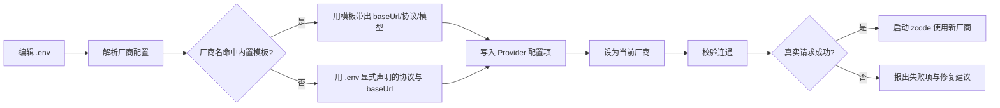

# 痛点拆解：换厂商要改 .env 就能用，而不是改内部配置

> **文档层级**：本文是**痛点分析**（问题是什么），不描述最终实现形态。
> 字段契约与实现以 [plan-vendor-config-write.md](plan-vendor-config-write.md) 为准——
> 实际落地为 **四字段**（VENDOR / BASE_URL / API_KEY / MODEL），本文 §3.2 的行文早于该决定。

> 核心痛点（一句话）：**要换大模型厂商的使用者** 在 **已跑通 BigModel 之后想换到另一家（Moonshot / DeepSeek / Qwen / 自建端点）** 时，因为 **厂商的 base url、api key、model 这套三元组没有以「配置」的形式落在 `.env` 里，而是隐藏在个人 Provider Config 与共享凭据库中、且写入入口只认 `bigmodel | zai` 两家**，导致 **换厂商必须绕过正常入口、手工构造内部配置文件，没有任何校验告诉他写对没有**。
>
> 来源：`painpoints/pp5.md` ｜ 拆解时间：2026-09-22
>
> 已确认前提：**一次只生效一个厂商** ｜ 范围是 **两者都要**——内置列表里有的自动匹配，不在列表里的（自建/私有部署）由用户显式声明协议类型。

## 1. 痛点分支

- 痛点 A：`.env` 目前只影响 endpoint 解析（`ZCODE_BASE_URL` 等），**厂商的 base url / key / model 不在 `.env` 里**——用户对"配置在哪"的心智模型与实际生效位置不一致。
- 痛点 B：写入入口只支持两家——`zcode configure` 的 `--provider` 只接受 `bigmodel | zai`（`apps/qcode-cli/packages/cli/src/run.ts` 的 `CODING_PLAN_PROVIDERS`），且走的是 `zhipu-account` + Coding Plan 专属链路，普通 api-key 厂商进不来。
- 痛点 C：**协议类型（api.type）无法在 `.env` 声明**——内置配置里存在三种协议 `anthropic-messages` / `openai-chat-completions` / `openai-responses`（`packages/provider/src/config/provider-data-schema.ts:4`），同一个 base url 配错协议就是直接不可用，而用户无从表达。
- 痛点 D：换厂商后**旧配置不会被取代**——当前生效的是个人 Provider Config 里的 `defaultModelSelection` 指向 `account:bigmodel-individual-coding-plan`；再配一家不会自动切过去，也没有"当前生效的是哪家"的可见性。
- 痛点 E：自定义厂商**没有模型清单可查**——内置厂商在 `builtinModelIds` 里带了模型列表（如 `bigmodel-api` 带 `GLM-5.3 / GLM-5.3-Flash`），自建端点没有等价来源，用户只能猜模型名。

## 2. 词性拆解

### 2.1 名词（Entities）

| 实体 | 含义 | 角色 | 状态 |
|------|------|------|------|
| 使用者 | 要换厂商的人 | 主体 | 持久 |
| `.env` 配置源 | 用户声明厂商三元组的唯一文件 | 客体 | 持久 |
| 厂商三元组 | base url + api key + model | 客体 | 持久 |
| 协议类型 | `anthropic-messages` / `openai-chat-completions` / `openai-responses` | 客体 | 持久 |
| Provider 配置项 | 个人 Provider Config 中的一条厂商记录 | 客体 | 持久 |
| 当前生效厂商 | `defaultModelSelection` 指向的那一条 | 客体 | 持久 |
| 内置厂商模板 | 随包分发的厂商预设（18+ 家，含 baseUrl/api/模型） | 客体 | 持久 |
| 切换结果 | 一次换厂商后的连通性判定 | 客体 | **临时**（进程级） |

> 保留 7 个业务核心实体。`协议类型`、`切换结果` 记为关键外围实体——前者是痛点 C 的载体，后者是一次性产物（无 TTL 需求，不落盘）。

### 2.2 动词（Actions）

| 动作 | 触发 | 终结状态 | 时序 |
|------|------|----------|------|
| 编辑 .env | 用户主动 | `.env` 中声明了目标厂商 | #1 |
| 解析厂商配置 | 系统被动 | 得到 base url / key / 协议 / 模型 | #2 |
| 匹配内置模板 | 系统被动 | 命中模板 或 判定为自定义厂商 | #3 |
| 写入 Provider 配置 | 系统被动 | 个人 Provider Config 中出现该厂商 | #4 |
| 设为当前厂商 | 系统被动 | `defaultModelSelection` 指向新厂商 | #5 |
| 校验连通 | 系统被动 | 得到可用 / 不可用结论 | #6 |
| 启动 zcode | 用户主动 | TUI 用新厂商工作 | #7 |
| 切回原厂商 | 用户主动 | 生效厂商回到上一条 | 旁路（反向） |

### 2.3 形容词 / 副词（Rules）

| 限定词 | 含义 | 限定对象 |
|--------|------|----------|
| **在 .env 中显式配置** | 用户唯一输入面是 `.env` | 配置源（最关键规则） |
| base url 和 model（原话） | 三元组里必须能表达 url 与模型 | 厂商三元组 |
| "api key 我看已经有了" | key 通道已通，本次不是重点 | 厂商三元组 |
| 其他大模型厂商 | 范围不限于智谱系 | Provider 配置项 |
| **一次只用一个** | 无需多厂商并存与热切换 | 当前生效厂商 |
| 内置列表里有的（隐含） | 已知厂商应免声明协议 | 内置厂商模板 |
| 自建端点要显式声明（隐含） | 未知厂商需用户补充协议类型 | 协议类型 |
| 换上去"也能用" | 以真实请求连通为验收，不是写入成功 | 切换结果 |
| 不破坏现有 Coding Plan 路径（隐含） | `bigmodel` 那条链路要继续可用 | 当前生效厂商 |
| 可重复执行（隐含） | 反复换厂商不能残留脏配置 | Provider 配置项 |

> 2.3 是本次差异化的核心：**"在 .env 中显式配置"** 与 **"一次只用一个"** 两条规则，决定了方案可以是"单活配置 + 由 .env 驱动"，而不必做多厂商管理与热切换。

## 3. 名词衍生：核心指标 & 数据结构

### 3.1 核心指标

| 指标 | 计算方式 | 业务意义 | 度量频率 |
|------|----------|----------|----------|
| 换厂商耗时 | 从改动 `.env` 到首次真实请求成功的墙钟时间 | 核心诉求的直接量化；反向测试：若从 2 分钟涨到 10 分钟，负责人会问"是不是又得手写内部配置了" | 每次切换 |
| 换厂商成功率 | 一次切换后 `zcode -p` 真实请求成功的比例 | 配置写入 ≠ 能用；反向测试：若降到 60%，说明校验缺失、错误被推迟到发请求才暴露 | 每次切换 |
| 需编辑字段数 | 为换一家厂商要动的最小配置项个数 | "只在 .env 配"的度量对立面；目标 ≤ 4（url/key/model/协议） | 每次切换 |
| 协议声明必要性 | 内置厂商中无需声明协议的比例 | 衡量"省事"程度；比例越低说明内置模板覆盖越差 | 每次切换 |
| 切换后残留项 | 切换后仍指向旧厂商的配置项个数 | 痛点 D 的量化；必须恒为 0 | 每次切换 |
| 配置可见性 | `doctor` 是否报出"当前生效厂商 + base url + 模型" | 痛点 D 的"可见性"；不可见即用户无法自查 | 每次自检 |

### 3.2 数据结构

```yaml
# .env 中的厂商声明（单活：只解析当前生效的这一组）
VendorConfig:
  vendorName: string        # 可选。命中内置模板时用它自动带出 baseUrl/api/模型
  baseUrl: string           # 必填。自建端点必须显式给出
  apiKey: string            # 必填。明文只进 .env（已 gitignore），不入日志
  apiType: enum             # anthropic-messages | openai-chat-completions | openai-responses
                            # 内置厂商可省略；自定义厂商必填
  model: string             # 必填。自定义厂商没有模型清单可查，必须显式给出

# 内置厂商模板（既有实体，本次只读取不新增）
BuiltinVendorTemplate:
  templateId: string        # 如 moonshot-kimi / deepseek / qwen-alibaba-model-studio-cn
  apiType: enum             # 模板自带
  baseUrl: string           # 模板自带
  builtinModelIds: [string] # 模板自带模型清单

# 写入个人 Provider Config 的一条记录（既有结构，见 packages/provider/src/config/provider-data-schema.ts）
ProviderEntry:
  providerId: string              # 自定义厂商需要稳定的 id
  providerName: string
  group: "standard-personal"      # 非智谱系厂商归此分组
  access:
    type: "api-key"
    apiKey: string                # 内联；不经过共享凭据库
  api:
    type: enum                    # 协议类型
    baseUrl: string
  personalModelIds: [string]      # 至少含用户指定的 model
  # 注意：个人层禁止 builtinModelIds（schema 会拒绝），模型必须写 personalModelIds

# 当前生效指针（既有结构）
ActiveProvider:
  defaultModelSelection:
    providerId: ref(ProviderEntry)
    modelId: string
  # 注意：现有实现里它指向 account:bigmodel-individual-coding-plan，
  # 切到普通 api-key 厂商后必须显式改写，否则仍走旧链路
```

> 说明：`切换结果` 为临时实体（进程级判定），不落盘、无 TTL 需求。

## 4. 动词衍生：业务流程

### 4.1 主流程



### 4.2 异常流程

| 触发点 | 失败场景 | 系统响应 |
|--------|----------|---------|
| 解析厂商配置 | `.env` 里没写 base url | 报出缺失键名，不写半成品配置 |
| 解析厂商配置 | 自定义厂商未声明协议类型 | 明确要求补 `apiType`，并列出三个可选值 |
| 匹配内置模板 | 厂商名写错/不认识 | 不静默按自定义处理；提示"未识别该厂商名，若为自建端点请显式声明 base url 与协议" |
| 写入 Provider 配置 | 已存在同 id 的旧记录 | 覆盖且保持幂等，不产生重复条目 |
| 设为当前厂商 | 旧的 Coding Plan 指针未清理 | 必须显式改写生效指针，避免"配了新的、跑的仍是旧的" |
| 校验连通 | base url 正确但 api key 无效 | 报鉴权失败（区别于网络不可达），回显厂商名与 base url，不回显 key |
| 校验连通 | base url 不可达 / DNS 失败 | 报网络层失败与目标地址，区分于鉴权失败 |
| 校验连通 | 协议类型配错（如 anthropic 端点写了 openai 协议） | 这是最高频的误配；错误信息需能把"协议类型"列为可疑项，而不是只报一句请求失败 |
| 校验连通 | 模型名不在厂商清单内 | 报出该厂商已知模型列表（内置厂商）或提示自建端点需自行确认模型名 |
| 切换回原厂商 | 原厂商凭据已被覆盖 | 允许重新配置；不回退到不可用状态 |

### 4.3 决策分支

- `if 厂商名命中内置模板` → 用模板的 baseUrl / apiType / 模型清单，用户只需填 key
- `if 厂商名未命中且已声明 base url + 协议` → 按自定义厂商写入
- `if 厂商名未命中且未声明协议` → 拒绝执行并给出协议三选一
- `if 配置里出现 google/gemini 之类` → 明确报"不支持：当前仅支持 anthropic-messages / openai 两种协议族"（内置模板里没有 Google，属已知盲区）
- `if 切换后 doctor 报出生效厂商仍是旧的` → 视为切换失败，非静默通过

## 5. 形容词 / 副词衍生：潜在需求

### 5.1 隐含约束

- "在 .env 中显式配置" → 隐含**配置必须有单一可见来源**：用户改 `.env` 后无需理解个人 Provider Config、凭据库等内部结构。
- "一次只用一个" → 隐含**单活语义**：写入时必须替换生效指针，且要保证旧记录不会继续被选中。
- "换上去也能用" → 隐含**连通性校验**是交付的一部分，而不是"写入成功即完成"。
- "api key 我看已经有了" → 隐含**已有 Coding Plan 链路不能被打断**：`bigmodel` 那条 `zhipu-account` 路径要同时保持可用（它不是 api-key 型，走的存储也不同）。
- 可重复执行 → 隐含**幂等**：反复换厂商不产生重复 Provider 条目、不残留旧指针。

### 5.2 边界场景

- **协议类型边界（最高频误配）**：同一个 base url 在不同协议下都"看起来合理"，配错只在发请求时暴露。这是本痛点最可能反复发生的地方。
- **厂商清单边界**：内置模板没有 Google/Gemini 等厂商；`openai-responses` 协议族在自定义场景下是否可用需确认。
- **模型清单边界**：内置厂商有清单，自建端点没有——"model 写不对"是仅次于协议的失败源。
- **凭据存储边界**：Coding Plan key 存共享凭据库（`~/.zcode/v2/credentials.json`），普通 api-key 内联在个人 Provider Config（`~/.zcode/v2/provider_config.json`）。两套存储并存，切换时要避免"key 还在旧位置、配置已指向新厂商"的半切换态。
- **工作目录边界**：`.env` 由 cwd 逐级向上查找，仓库外启动不加载——换厂商配置在仓库外不生效（与上一个痛点的遗留张力同源）。

### 5.3 非功能性需求

- **性能**：换厂商的校验应能在数秒内给出结论，不能要求用户先起 TUI 再试。
- **可用性**：任一步失败都不得留下半切换状态（既不指向旧厂商、也不指向新厂商）。
- **安全 / 合规**：api key 只进 `.env` 与本地配置，权限受限；安装脚本、日志、`doctor` 输出一律只列键名不回显值。
- **可观测**：`doctor` 需要能报出"当前生效厂商 + base url + model + 协议类型"，让"配了但没生效"当场可见。

## 6. 功能点拆解（Features）

### F-001: 声明厂商配置
| 字段 | 内容 |
|------|------|
| **功能描述** | 让 `.env` 能表达一组厂商配置（base url / api key / 协议 / model），并作为切换厂商的唯一输入面 |
| **痛点溯源** | 痛点 A / 核心痛点 |
| **词性溯源** | 名词"`.env` 配置源"+"厂商三元组" + 动词"编辑 .env" + 规则"在 .env 中显式配置" |
| **依赖实体** | VendorConfig |
| **依赖功能** | 无 |
| **优先级** | P0 |
| **验证指标** | 需编辑字段数、换厂商耗时（回 3.1） |

### F-002: 写入厂商配置项
| 字段 | 内容 |
|------|------|
| **功能描述** | 把 `.env` 中的厂商声明写成个人 Provider Config 里的一条记录（含内联 key、base url、协议、模型），重复执行幂等 |
| **痛点溯源** | 痛点 A / 痛点 B |
| **词性溯源** | 名词"Provider 配置项" + 动词"写入 Provider 配置" + 规则"其他大模型厂商" |
| **依赖实体** | ProviderEntry |
| **依赖功能** | F-001 |
| **优先级** | P0 |
| **验证指标** | 换厂商成功率、切换后残留项（回 3.1） |

### F-003: 切换生效厂商
| 字段 | 内容 |
|------|------|
| **功能描述** | 写入后显式把当前生效指针指向新厂商，并保证旧指针不残留，避免"配了新的、跑的仍是旧的" |
| **痛点溯源** | 痛点 D |
| **词性溯源** | 名词"当前生效厂商" + 动词"设为当前厂商" + 规则"一次只用一个" |
| **依赖实体** | ActiveProvider、ProviderEntry |
| **依赖功能** | F-002 |
| **优先级** | P0 |
| **验证指标** | 切换后残留项、配置可见性（回 3.1） |

### F-004: 校验厂商连通
| 字段 | 内容 |
|------|------|
| **功能描述** | 换厂商后执行一次真实请求校验，区分「鉴权失败 / 网络不可达 / 协议不匹配 / 模型不存在」并给出对应修复方向 |
| **痛点溯源** | 痛点 C / 核心痛点（"换上去也能用"） |
| **词性溯源** | 名词"切换结果" + 动词"校验连通" + 规则"换上去也能用" |
| **依赖实体** | 切换结果、VendorConfig |
| **依赖功能** | F-002、F-003 |
| **优先级** | P0 |
| **验证指标** | 换厂商成功率（回 3.1） |

### F-005: 暴露当前厂商
| 字段 | 内容 |
|------|------|
| **功能描述** | 在 `doctor` 自检中报出当前生效厂商、base url、协议类型与模型，使"配了但没生效"当场可见 |
| **痛点溯源** | 痛点 D |
| **词性溯源** | 名词"当前生效厂商" + 动词"校验连通" + 规则"在 .env 中显式配置"（可见性诉求） |
| **依赖实体** | ActiveProvider、ProviderEntry |
| **依赖功能** | F-003 |
| **优先级** | P0 |
| **验证指标** | 配置可见性（回 3.1） |

### F-006: 匹配内置厂商模板
| 字段 | 内容 |
|------|------|
| **功能描述** | `.env` 只写厂商名时，自动带出该厂商的 base url、协议类型与模型清单，用户只需补 key |
| **痛点溯源** | 痛点 C（协议表达）+ 痛点 E（模型清单） |
| **词性溯源** | 名词"内置厂商模板" + 动词"匹配内置模板" + 规则"内置列表里有的" |
| **依赖实体** | BuiltinVendorTemplate |
| **依赖功能** | F-001、F-002 |
| **优先级** | P1 |
| **验证指标** | 协议声明必要性（回 3.1） |

### F-007: 回退到上一厂商
| 字段 | 内容 |
|------|------|
| **功能描述** | 换厂商失败或想切回时，能一步回到上一个可用厂商，而不必重新配置整组参数 |
| **痛点溯源** | 痛点 D（切换的可靠性与可逆性） |
| **词性溯源** | 动词"切回原厂商"（反向动作） |
| **依赖实体** | ActiveProvider、ProviderEntry |
| **依赖功能** | F-003 |
| **优先级** | P2 |
| **验证指标** | 换厂商耗时、切换后残留项（回 3.1） |

### F-008: 校验自建端点模型名
| 字段 | 内容 |
|------|------|
| **功能描述** | 自建端点没有模型清单，写入前对用户给出的 model 做一次可用性探测，把"模型名写错"从运行时失败提前到配置期 |
| **痛点溯源** | 痛点 E |
| **词性溯源** | 名词"模型" + 动词"校验连通" + 规则"自建端点要显式声明" |
| **依赖实体** | VendorConfig、切换结果 |
| **依赖功能** | F-004 |
| **优先级** | P2 |
| **验证指标** | 换厂商成功率（回 3.1） |

> 功能数量说明：8 个，处于单痛点默认上限内。其中 F-007、F-008 为 P2，可按资源裁剪。

## 7. MVP 启动路径

### Phase 1: MVP（建议 1-2 周）
- **目标**：验证"改 `.env` 换任意厂商 → 真实请求成功"这条最小闭环成立，不依赖内置模板也能跑通
- **包含功能**：F-001, F-002, F-003, F-004, F-005
- **理由**：五个 P0 构成一次完整切换的最小完备集——能声明（F-001）、能落地（F-002）、能认准生效对象（F-003）、能证明可用（F-004）、能自查（F-005）。先做自建端点路径而不是模板匹配，是因为**显式声明涵盖全部厂商**（内置模板只是它的省事封装），把能力面先做满。
- **验证指标**：换厂商成功率、需编辑字段数、切换后残留项（回 3.1）
- **退出条件**：连续切换到 3 家不同厂商（含至少 1 个自建端点与 1 个 `openai-chat-completions` 协议厂商），每次 `zcode -p` 均真实成功；切换后 `doctor` 报出的生效厂商与实际一致；`bigmodel` 的原有 Coding Plan 链路仍可用

### Phase 2: 增强（建议 +1 周）
- **目标**：把已知厂商的配置量降到最低
- **包含功能**：F-006
- **理由**：依赖 Phase 1 的写入链路；覆盖面是内置列表里的 18+ 家厂商，免去用户查 base url 与协议
- **验证指标**：协议声明必要性、需编辑字段数（回 3.1）
- **退出条件**：写入内置列表中的厂商名时，`.env` 只需提供厂商名与 key 即可完成切换

### Phase 3: 完善（建议 +1 周）
- **目标**：补齐反向路径与自建端点的失败前置
- **包含功能**：F-007, F-008
- **理由**：均为体验完善项，不影响主闭环成立
- **验证指标**：换厂商耗时、换厂商成功率（回 3.1）
- **退出条件**：失败切换可一步回退且不残留；模型名写错能在配置期被识别

## 8. 衍生 Issue 建议

- [ ] Issue: 在 .env 中定义厂商配置字段并解析校验（源自：第 6 章 / Feature F-001 / 第 3.2 节 VendorConfig）
- [ ] Issue: 把厂商声明写入个人 Provider Config 且幂等（源自：第 6 章 / Feature F-002 / 第 4.2 节异常流程）
- [ ] Issue: 切换生效厂商并清理旧指针（源自：第 6 章 / Feature F-003 / 第 1 章痛点 D）
- [ ] Issue: 换厂商后执行真实请求连通校验并区分失败类型（源自：第 6 章 / Feature F-004 / 第 4.2 节异常流程）
- [ ] Issue: 在 doctor 中暴露当前生效厂商与端点（源自：第 6 章 / Feature F-005 / 第 3.1 节配置可见性）

## 9. 待澄清

- **`openai-responses` 协议在自定义厂商下是否可用**：内置模板里 `openai` / `xai` 用的是该协议，但个人 api-key 配置走这条协议是否同样成立需要验证。若不成立，自定义厂商实际只能在两种协议里选，F-001 的可选值需要相应收窄。
- **`group: "standard-personal"` 是否适用于全部非智谱厂商**：内置的 Moonshot/DeepSeek/Qwen 模板走的是 `api-key` + 各自 baseUrl，但它们是否应归入 `standard-personal` 分组、还是需要独立分组，会影响 TUI 里的厂商展示与排序。
- **Coding Plan 与新厂商的共存语义**：确认了"一次只用一个"，但 `bigmodel` Coding Plan 走的是 `zhipu-account` + 共享凭据库这条完全不同的链路。切换到 api-key 厂商时，旧的 Coding Plan 凭据是保留还是清理，会影响 F-003 的"清理旧指针"边界。（倾向保留凭据、只改生效指针，避免用户切回时还要重新登录——需确认。）
- **`.env` 变量命名**：是走通用键（`ZCODE_VENDOR_BASE_URL` 等），还是按厂商前缀（`MOONSHOT_API_KEY`）？已确认"两者都要"意味着可能需要两套：内置厂商用厂商前缀键，自定义厂商用通用键。这直接影响 F-001 的字段设计。
- **`.env` 不在仓库树内时不生效**：与上一个痛点同源的遗留张力；换厂商配置在仓库外启动时读不到，是否需要显式路径入口待定。
- **P0 数量为 5，处于上限**：F-001 ~ F-005 每一项去掉后闭环都不成立（不能声明 / 不落地 / 不认生效对象 / 不能证明可用 / 不能自查），非分摊结果。若必须压缩 MVP，唯一可讨论的是把 F-005 并入 F-004 的输出来交付。

> Next step:
> - 用 `/rice` 给第 6 章 Feature 打分排序（补齐 Effort 估时），据此复核第 7 章的 P0/P1/P2 是否站得住。
> - 对 F-001 用 `/planning` 写实现方案——`.env` 字段设计是对外契约，且第 9 章里"通用键 vs 厂商前缀键"的取舍还没定，值得先落地。
> - 整体路径用 `/pre-mortem` 做风险扫描。
